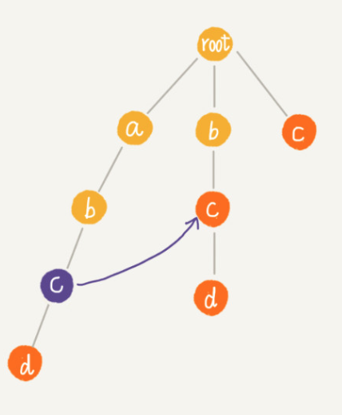
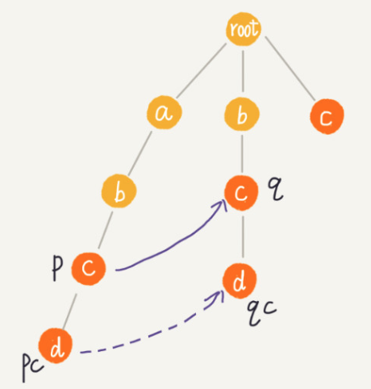
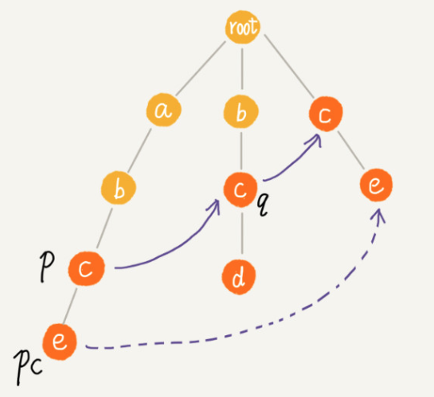
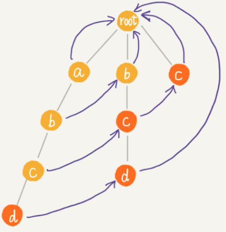

#### AC自动机
- AC自动机，全称Aho-Corasick算法
- AC自动机实际上就是在Trie树之上，加了类似KMP的next数组。只不过此处的next数组是构建在树上
- 构建失败指针
  - 
    - 从root走到紫色节点形成的字符串abc
    - 然后用abc，跟所有模式串前缀匹配最长可匹配后缀子串，就是箭头指的bc模式串
    - 字符串abc的后缀子串有两个bc，c
      - 我们拿它们与其他模式串匹配，如果某个后缀子串可以匹配某个模式串的前缀，那我们就把这个后缀子串叫做`可匹配后缀子串`
      - bcd字符串的前缀子串为: b、bc 、bcd
      - `可匹配后缀子串`为 bc
    - 然后从`可匹配后缀子串`中，找出最长的一个，就是讲到的`最长可匹配后缀子串`
    - 上图将紫色节点的失败指针指向那个`最长可匹配后缀子串`对应的模式串的前缀的最后一个节点
  - p == q && pc == qc
    - 
    - p 的失败指针指向q。q是p的`最长可匹配后缀`
    - 然后看节点p的子节点pc对应的字符，是否也可以在节点q的子节点中找到
    - 如果找到了节点q的一个子节点qc，对应的字符跟节点pc对应的字符相同，则将节点pc的失败指针指向节点pc
  - p == q && pc != qc
    - 
    - p 的失败指针指向q。q是p的`最长可匹配后缀`
    - 如果节点q中没有子节点的字符等于节点pc包含的字符
    - 那么需要重新查找`最长可匹配后缀`
    - 如果是KMP的next数组那么，当前字符不符合`最长可匹配后缀`，那么就要找`次最长可匹配后缀`，然后重复这个过程
    - 所以找到了root - c 这个`次最长匹配后缀`
    - 设置pc的失败指针为e
  - 失败指针最终的模样
    - 
- 问题
  - 代码中如何体现 p == q && pc == qc, p == q && pc != qc
    - 代码通过广度搜索，对trie树的每一层进行扫描，然后比较每一层的值在它的失败指针中是否能找到， p == q && pc == qc的体现也正好如此
    - p == q && pc != qc则体现在，如果这个失效指针的列表里的值都不匹配，那么继续找下一个指针，这个过程一直循环，直到找到或者失败
  - kmp 的next数组与AC自动机的失败指针异同？
    - 同
      - kmp next数组 也是通过 `p == q && pc == qc` 和 `p == q && pc != qc`的方式进行构建的
    - 异
      - kmp 的最长可匹配后缀，是单个字符串之间比较。而AC自动机，则需要和多个字符串比较
- 时间复杂度
  - Trie树构建
    - 时间复杂度: O(m * len)
    - len 表示敏感词的平均长度
    - m 表示敏感词的个数
  - 构建失败指针
    ```
    void buildFailurePointer() 
        {
            queue<AcNode*> Q;
            root->fail = NULL;
            Q.push(root);
            
            while (!Q.empty()) {
                // 广度优先遍历
                AcNode *p = Q.front();
                Q.pop();
                if (p != NULL) {
                    // 将其孩子逐个加入列队
                    for (int i = 0 ; i < MAX_NUM; i++) {
                        AcNode *pc = p->children[i];
                        if (pc == NULL) continue;
                        if (p == root) {
                            pc->fail = root;                 // 第一层的节点fail总是指向root
                        } else {
                            AcNode *q = p->fail;            // 第二层以下的节点，其fail是在另一分支上
                            while (q != NULL) {
                                // 遍历它的孩子，看它们有没有与当前孩子相同字符的节点
                                AcNode *qc = q->children[pc->data - 'a'];
                                if (qc != NULL) {
                                    pc->fail = qc;
                                    break;
                                }
                                q = q->fail;
                            }

                            if (q == NULL) {
                                pc->fail = root;
                            }
                        }
                        Q.push(pc);
                    }
                }
            }
        }
    ```
    - 假设Trie树中总节点个数为k
    - 每个节点构建失败指针.最耗时部分为while 中的 q = q->fail.每次运行一次这个语句，q指向节点的深度都会减少1
    - 树的高度也不会超过len。所以单个节点构建失败指针的时间复杂度:O(len)
    - 总时间复杂度:O(k * len)
#### 各个字符串匹配算法的特点和适用场景
- 单模式串匹配
  - BF: 简单场景，主串和模式串都不太长, O(m*n)
  - RK: 字符集范围不要太大且模式串不要太长， 否则hash值可能冲突，O(n)
  - naive-BM: 模式串最好不要太长（因为预处理较重），比如IDE编辑器里的查找场景； 预处理O(m*m), 匹配O(n)， 实现较复杂，需要较多额外空间.
  - KMP: 适合所有场景，整体实现起来也比BM简单，O(n+m)，仅需一个next数组的O(n)额外空间；但统计意义下似乎BM更快，原因不明.
- 多模式串匹配
  - naive-Trie: 适合多模式串公共前缀较多的匹配(O(n*k)) 或者 根据公共前缀进行查找(O(k))的场景，比如搜索框的自动补全提示
  - AC自动机: 适合大量文本中多模式串的精确匹配查找, 可以到O(n).
#### 参考资料
- [AC自动机学习笔记-1（怎么造一台AC自动机?）](https://www.cnblogs.com/sclbgw7/p/9260756.html)
- [AC自动机](https://zhuanlan.zhihu.com/p/80325757)