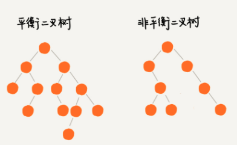

#### 平衡二叉查找树
- 定义
  - 二叉树中任意一个节点的左右子树的高度相差不能大于1
  - 完全二叉树，满二叉树都是平衡二叉树。但是非完全二叉树也可能是平衡二叉树
  - 
- 平衡
  - 其实就是让整棵树左右看起来比较`对称`，比较`平衡`
  - 不要出现左子树很高，右子树很矮的情况
  - 这样就能让整棵树的高度相对来说低一些，相应插入，删除，查找的操作效率高一些

#### 资料参考
- [AVL树(二)之 C++的实现](https://www.cnblogs.com/skywang12345/p/3577360.html)
- [浅谈算法和数据结构: 八 平衡查找树之2-3树](https://www.cnblogs.com/yangecnu/p/Introduce-2-3-Search-Tree.html)
- [平衡查找树（2-3-4 树）](https://www.cnblogs.com/gaochundong/p/balanced_search_tree.html)
- [2-3查找树的插入与删除](https://blog.csdn.net/Hello_World_LVLcoder/article/details/72615092)