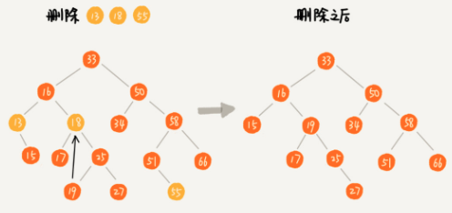

#### 二叉查找树(Binary Search Tree)
- 定义
  - 二叉查找树要求，在树中的任意一个节点，其左子树中的每个节点的值，都要小于这个节点的值
  - 而右子树节点的值都大于这个节点的值
  - 
- 二叉查找树的删除操作
  - 
  - 第一种情况，如果要删除的节点没有子节点，我们只需要直接将父节点中，指向要删除节点的指针置为NULL。如图中的删除节点55
  - 第二种情况，如果要删除的节点只有一个子节点（只有左子节点或者右子节点），我们只需要更新父节点中，指向要删除节点的指针，让它指向要删除节点的子节点就可以来。比如图中的删除节点13
  - 第三种情况，如果要删除的节点右两个子节点，就比较复杂来。我们需要找到这个节点的右子树中的最小节点，把它替换到要删除的节点上。然后再删除这个最小的节点，因为最小节点肯定没有左子节点（如果有左子节点，那就不是最小节点），所以，我们可以应用上面两条规则来删除这个最小节点。比如图中的删除节点18
- 时间复杂度
  - 
  - 不管操作是插入，删除还是查找，时间复杂度其实都跟树的高度成正比，也就是O(height)
  - 如何求一棵树包含n个节点的完全二叉树的高度？
    - 树的高度就等于最大层数减一，为了方便计算，转换成层来表示
    - 从图中可以看出，包含n个节点的完全二叉树中，第一层包含1个节点，第二层包含2个节点，第三层包含4个节点，依次类推，下面一层节点个数是上一层的2倍，第K层包含的节点个数就是 2 ^ (K - 1)
    - 不过，对于完全二叉树来说，最后一层的节点个数有点不遵守上面的规律。它包含的节点个数在1个到2 ^ (L - 1)个之间(假设最大层数L)
    - 如果我们把每一层的节点个数加起来就是总的节点个数n。那么n满足这样一个关系
      - n >= 1 + 2 + 4 + 8 + ... + 2 ^ (L - 2) + 1
      - n <= 1 + 2 + 4 + 8 + ... + 2 ^ (L - 2) + 2 ^ (L - 1)
      - 等比公式计算
        ```
          到倒数第二层的节点：1 + 2 + 4 + 8+ .. + 2 ^ (L - 2)
          最后一层的节点树最少1个,最多 2 ^ (L - 1) - 1个
          等比公式: Sn = a1 * (1 - q ^n) / (1 - q)

          n >= 1 + 2 + 4 + 8 + ... + 2 ^ (L - 2) + 1 = 2 ^ (L - 1)
          n <= 1 + 2 + 4 + 8 + ... + 2 ^ (L - 2) + 2 ^ (L - 1) = 2 ^ L - 1

          n >= 2 ^ (L - 1)
          
          n <= 2 ^ L - 1
          n + 1 <= 2 ^ L

          logn >= L - 1;

          log(n + 1) <= L
          logn + 1 >= L
        ```

    - 借助等比数列的求和公式，我们可以计算出，L的范围是[log2(n + 1), log2n + 1]
    - 完全二叉树的层数小于等于 log2n + 1,也就说，完全二叉树的高度小于等于log2n
  
#### 既然有了这么高效的散列表，使用二叉树的地方是不是都可以替换成散列表？有什么地方是散列做不了，必须要有二叉树来做的？
- 数据无序
  - 散列表中的的数据是无序存储的，如果要输出有序的数据，需要先排序。
  - 而对于二叉查找树来说，我们只需要中序遍历，就可以在O(n)的时间复杂度内，输出有序的数据结构
- 扩容耗时
  - 散列表扩容耗时多，而且当遇到散列冲突时，性能不稳定，尽管二叉查找树的性能不稳定
  - 但是最常用的平衡二叉查找树性能非常稳定，时间复杂度稳定在O(logn)
- 哈希冲突
  - 尽管散列表的查找等操作的时间复杂度是常量级，但因为哈希冲突存在，这个常量不一定比logn 小
  - 所以，实际的查找速度可能不一定比O(logn)快
  - 加上哈希函数的耗时，也不一定就比平衡二叉树的效率高
- 构造复杂
  - 散列表的构造比二叉查找树要复杂，需要考虑的东西很多
  - 比如散列函数的设计，冲突解决方法，扩容，缩容等
  - 平衡二叉查找树只需要考虑平衡性这一个问题，而且这个问题的解决方案比较成熟，固定
- 装载因子
  - 为了避免过多的散列冲突，散列表装载因子不能太大，特别是基于开放寻址解决冲突的散列表，不然会造成一定的存储空间的浪费
