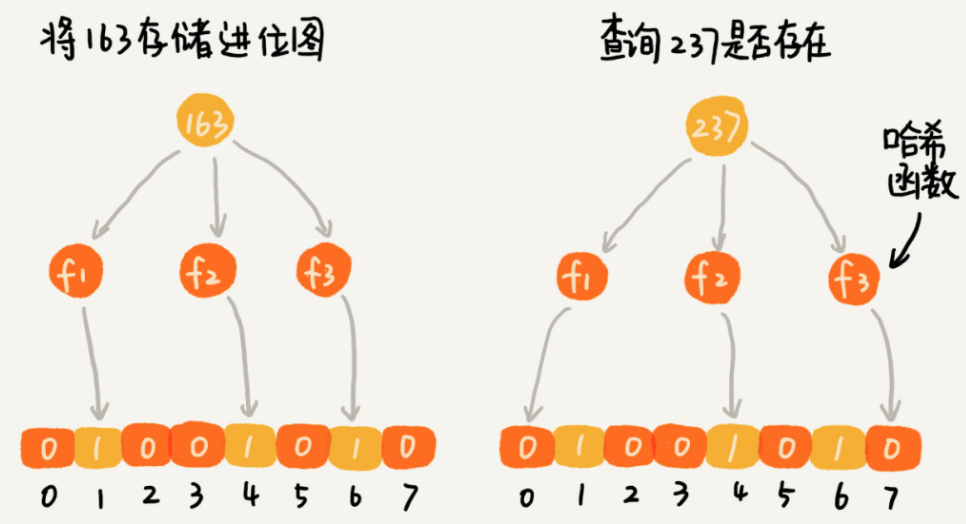
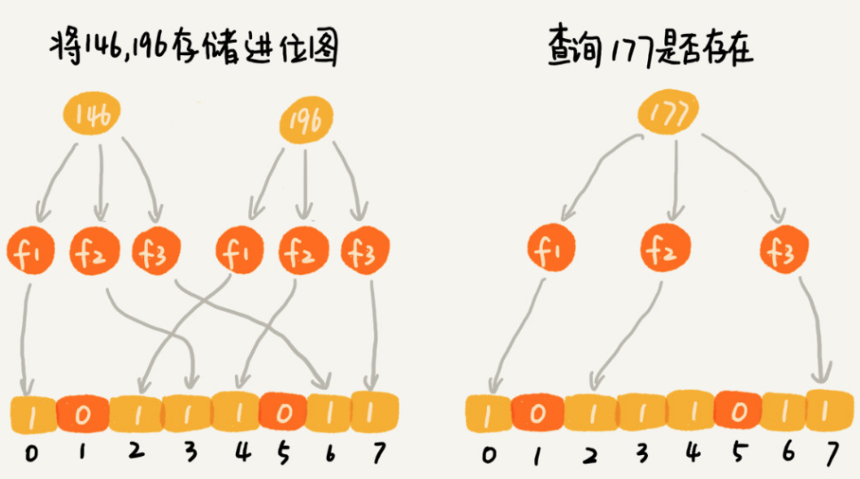

#### 布隆过滤器(Bloom Filter)
- 问题
  - 如果用散列表存储这1千万的数据，数据是32位的整型数，也就是需要4个字节的存储空间，那总共至少需要40MB的存储空间
  - 如果是位图(BitMap), 数字范围在1到1亿之间，只需要1个2进制位，也就是12MB左右的存储空间
  - 那么如果数字范围很大，比如上面的问题，数字范围不是1到1亿，而是1到10亿，那位图大小就是10亿个二进制位，也就是120MB大小，消耗空间，不降反增？
- 布隆过滤器的作用
  - 问题
    - 数据个数是1千万，数据范围是1亿到10亿
  - 作用
    - 仍然使用一个1亿个二进制大小的位图，然后通过哈希函数，对数字进行处理，然后落在这1到1亿范围内
    - 比如我们把哈希函数设计成f(x) = x % n, 其中， x表示数字，n表示位图的大小(1亿)。也就是数字跟位图的大小进行取模求余
  - 冲突解决
    - 哈希函数会存在冲突问题，1亿零一和1两个数字，经过刚才取模求余的哈希函数处理后，最后结果都是，怎么区分存储的是1亿零一，还是 1
    - 问题解决
      - 使用K个哈希函数，对同一个数字进行求哈希值，那会得到K个不同的哈希值，我们分别记作X1, X2, X3, .... Xk.
      - 我们把这K个数字作为位图中的下标，将对应的BitMap[X1], BitMap[X2], BitMap[X3], ..., BitMap[Xk]都设置为true，也就是说，用K个二进制位，来表示一个数字的存在
      - 当要查询某个数字是否存在的时候，同样用K个哈希函数，对这个数字求哈希值，分别得到Y1, Y2, Y3,....YK.我们看这个K个哈希值，对应位图中的数值是否都为true，如果都是true，则说明，这个数字存在。如果有其中任意一个不为true，那么说明数字不存在
      - 
  - 数据误判
    - 对于两个不同的数字来说，经过一个哈希函数处理之后，可能会产生相同的哈希值
    - 但是经过K个哈希函数处理之后，K个哈希值都相同的概率就非常低
    - 尽管采用K个哈希函数之后，两个数字哈希冲突的概率降低了，但是，这种处理方式又带来了新的问题，那就是容易误判
    - 
    - 误判的特点
      - 它只会对存在的情况有误判。如果某个数字经过布隆过滤器不存在，那说明数字真的不存在，不会发送误判
      - 如果某个数字经过布隆过滤器判断存在，这个时候才会有可能误判，有可能并不存在
    - 不过，只要调整哈希函数的个数，位图大小跟要存储数字的个数之间的比例，那就可以将这种误判的概率降到非常低

#### 参考资料
- [漫画：Bitmap算法 整合版](https://mp.weixin.qq.com/s/xxauNrJY9HlVNvLrL5j2hg)
- [C++位图详解（BitMap）](https://blog.csdn.net/archyli/article/details/78573362)
- [海量数据处理--位图（BitMap）](https://blog.csdn.net/xxpresent/article/details/56488881)
- [数学之美：布隆过滤器](https://zhuanlan.zhihu.com/p/72378274)
- [大量数据去重：Bitmap和布隆过滤器(Bloom Filter)](https://blog.csdn.net/zdxiq000/article/details/57626464)
- [十七道海量数据处理面试题与Bit-map详解](https://blog.csdn.net/v_july_v/article/details/6685962)