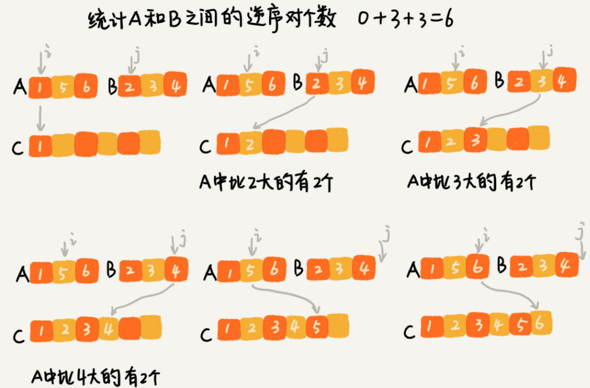
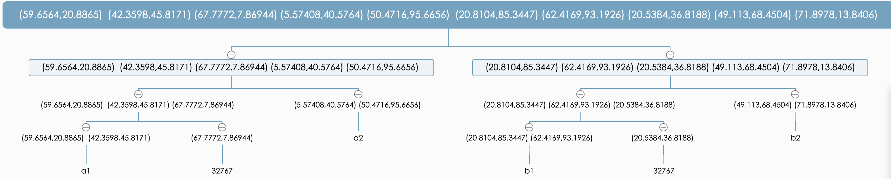

#### 分治算法(divide and conquer)
- 分治算法的思想
  - 核心思想其实就是四个字，`分而治之`
  - 就是将原问题划分为n个规模较小，并且结构与原问题相似的子问题，递归解决这些子问题，然后再合并其结果，就得到原问题的解
- 分治的递归实现
  - 分解：将原问题分解成一系列子问题
  - 解决：递归求出各个子问题，若子问题足够小，则直接求解
  - 合并：将子问题的结果合并成原问题
- 分治算法适用场景
  - 原问题与分解成的小问题具有相同的模式
  - 原问题分解成的子问题可以独立求解，子问题之间没有相关性
  - 具有分解终止条件，当问题足够小时，可以直接求解
  - 可以将子问题合并成原问题，而这个合并操作的复杂度不能太高，否则起不到减小算法总体复杂度的效果
- 分治算法案例
  - 求逆序数
    - 假设有n个数据，期待数据从小到大排列，那完全有序的数据的有序度就是`n(n - 1) / 2`,逆序度等于0.相反，倒序排列的数据的有序度就是0，逆序度就是`n(n - 1) /2`
    - 那么如何求正常情况下，数组的逆序度?
    - 
    - 通过分治思想。把数组分成两半A1, A2,分别计算A1和A2的逆序对个数K1,K2
    - 然后再计算A1 与 A2之间的逆序对个数K3
    - 那么这个数组的逆序对就是, K1 + K2 + k3
- 分治思想在海量数据处理中的应用
  - 给10GB的订单文件排序按照金额排序，但是机器内存只有，2-3G
  - 可以将海量的数据划分为多个小`数据集合`,单独载入某个小`数据集合`，然后再将小`数据集合`合并成大`数据集合`

#### 最近点问题
- 以 demo_closest_point_2.cpp 为例子
- 分治图
  - 
- 点计算规则
  - 1个点,返回无穷大
  - 2个点，直接计算距离 (欧式距离: 两点间的直线距离)
  - 大于两个点，就要拆分
  - 最后要取最小的值
- 寻找距离最短的两个点
  - 寻找点x的值要小于子区间最小值
    - 子区间最小值意味，最小距离的点x在这个区间里
  - 寻找两个点y的距离是否小于子区间最小值
    - 由上一个规则得到，最小距离区间集合
    - 最小距离区间集合之间的坐标y的差小于子区间的值，存在最小距离
      - 因为 两个坐标x已经通过排序确定大小且小于子区间最小值
      - 现在，两个坐标的y也通过排序，确定顺序，并且如果两个坐标y之差小于子区间的值，意味着这两个坐标可能会是最小距离
      - 更新子区间的最小值，以判断是否有更小的距离
#### 参考资料
- [分治应用--最近点对问题 & POJ 3714](https://blog.csdn.net/qq_21201267/article/details/94592900)
- [《算法分析与设计》之Closest Pair of Points Problem（最近点对问题](https://blog.csdn.net/u013522065/article/details/44810915)