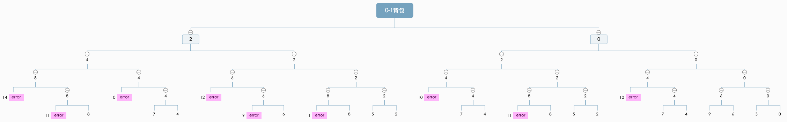
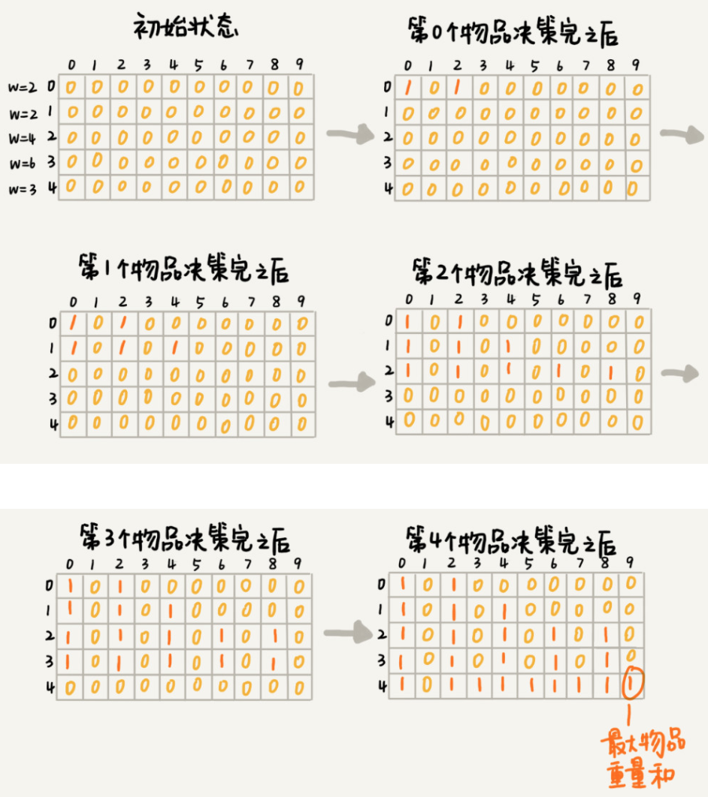
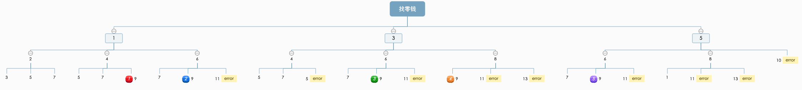
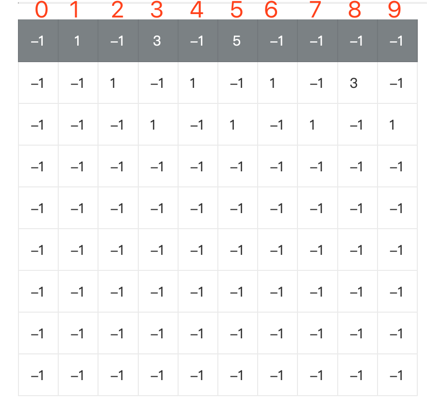

#### 一个模型三个特征
- 一个模型
  - 它是指动态规划适合解决的问题的模型
  - 也可以定义为“多阶段决策最优解模型”(决策树)
- 三个特征
  - 最优子结构
    - 最优子结构指的是，问题的最优解包含子问题的最优解
    - 反过来说的是，可以通过子问题的最优解，推导出问题的最优解
    - 如果把最优子结构，对应到前面定义的动态规划问题模型上，可以理解为，后面阶段的状态可以通过前面阶段的状态推导出来
  - 无后效性
    - 无后效性有两层含义
      - 第一层含义，在推导后面阶段的状态的时候，只关心前面阶段的状态值，不关心这个状态是怎么一步一步推导出来的
      - 第二层含义，某阶段状态一旦确定，就不受之后阶段决策影响
  - 重复子问题
    - 不同的决策序列，到达某个相同的阶段时，可能会产生重复的状态

#### 贪心，分治 回溯，动态规划的关系
- 贪心，回溯，动态规划可以归为一类，而分治单独作为一类
- 前三个算法解决问题的模型，都可以抽象成多阶段决策最优解模型
- 分治算法
  - 而分治算法解决的问题尽管大部分也是最优解问题，但是，大部分都不能抽象成多阶段决策模型
- 回溯算法
  - 回溯算法是个“万金油”。基本上能用的动态规划，贪心解决的问题，都可以用回溯算法解决
  - 回溯相当于穷举搜索。穷举所有情况，然后对比得到最优解
  - 回溯算法的时间复杂度非常高，是指数级别的，只用来解决小规模数据的问题。对于大规模数据的问题，用回溯算法解决的执行效率就很低了
- 动态规划
  - 尽管动态规划比回溯算法高效，但是，并不是所有问题，都可以用动态规划来解决
  - 能使用动态规划解决的问题，需要满足三个特征
    - 最优子结构
    - 无后效性
    - 重复子问题
  - 在重复子问题这一点上，动态规划和分治算法的区分非常明显
    - 分治算法要求分割成的子问题，不能有重复子问题
    - 动态规划相反，动态规划之所以高效，就是因为回溯算法实现中存在大量的子问题
- 贪心算法
  - 贪心算法实际上是动态规划算法的一种特殊情况。它解决问题起来更加高效，代码实现也更加简洁
  - 它能解决的问题需要满足三个条件
    - 最优子结构
    - 无后效性
    - 贪心选择性
  - 贪心选择性
    - 通过局部最优的选择，能产生全局的最优选择
    - 每一个阶段，都选择当前看起来最优的决策，所有阶段的决策完成之后，最终由这些局部最优解构成全局最优解

#### 例子
##### 0-1背包
- 以 demo_knapsack_1.c 为例子为例子
- 回溯图
  - 
- 状态转移图
  - 
- 疑问
  - 为什么上一层的状态会影响下一层 ？
    - 由回溯图可知，从上一层到下一层，是一个决策的过程
    - 根据上一层的状态，下一层也会产生N个决策结果
    - 决策结果 = 上一层的决策 + 本层决策
    - 然后，我们需要获取最优的决策结果
  - 在回溯图中会有分支的概念，动态规划的状态转移图分支是如何体现 ？
    - 从状态转移图可知，会把上一层的状态继承，然后这一层再重新决策
    - 这就类似，回溯图的某个节点的决策结果，必须依赖上一层的节点才有
    - 同时，可以看出，回溯图中的每一层的结果都在状态装图上记上了`1`
  - 状态转移怎样记录最优解 ？
    - 继承上一层的结果。然后本层，需要加上的物品的重量进行计算
    - 本层每个格子的计算，就相当于回溯图一个分支的计算
    - 然后从最后一层中就可以找到最优解

##### 找零钱
- 状态转移表方法
  - 思路
    - 回溯算法实现
    - -> 定义状态
    - -> 画递归树
    - -> 找重复子问题
    - -> 画状态转移表
    - -> 根据递推关系填表
    - -> 将填表过程翻译成代码
  - 以 demo_minCoins_1.c 和 demo_minCoins_2.c 为例子
  - 回溯图
    - 
  - 状态转移表
    - 
- 状态转移方程法
  - 思路
    - 找最优子结构
    - 写状态转移方程
    - 将状态转移方程翻译成代码
  - 以 demo_minCoins_3.c 和 demo_minCoins_4.c 为例子
  - 状态转移方程
    - f(n) = 1 + min(f(n - 1) + f(n - 3) + f(n - 3))