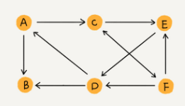
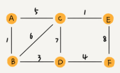
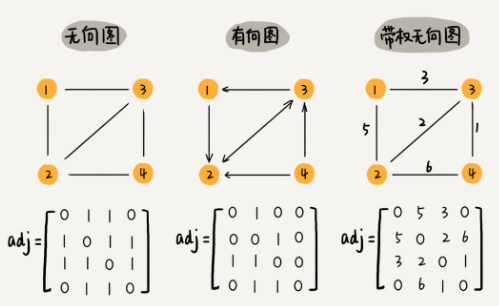
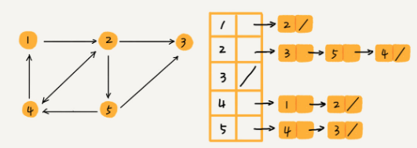

#### 图的类别
- 无向图
  - 
  - 顶点(vertex)
    - 图中的元素就叫做`顶点`
  - 边(edge)
    - 图中的一个顶点可以与任意其他顶点建立连接关系，我们把这种建立的关系叫做`边`
  - 度(degree)
    - 以微信举例，可以把每个用户看作一个顶点。如果两个用户之间互为好友，那么就在两者之间建立一条边
    - 其中，每个用户有多少好友，对应图中，就叫做顶点的`度`。就是跟顶点相连接的边的条数
- 有向图
  - 
  - 入度(In-degree)
    - 顶点的`入度`，表示有多少边指向这个顶点
    - 对应到微博的例子，入度就表示有多少粉丝
  - 出度(Out-degree)
    - 顶点的`出度`，表示有多少条边是以这个顶点为起点指向其他顶点
    - 对应到微博的例子，出度就表示关注来多少人
- 带权图
  - 
  - 在带权图中，每条边都有一个`权重(weigth)`, 我们可以通过这个权重来表示QQ好友间的亲密度

#### 邻接矩阵存储方法
- 邻接矩阵(Adjacency Matrix)
  - 
  - 优点
    - 邻接矩阵的存储方式简单，直接
    - 因为基于数组，所以在获取两个顶点的关系时，就非常高效来
    - 邻接矩阵存储图的另外一个好处是方便计算。比如求解最短路径时候，会提到一个`Floyd-Warshall` 算法，就是利用矩阵循环相乘若干次得到结果
  - 缺点
    - 如果我们存储的是`稀疏图(Sparse Matrix)`, 也就是说，顶点很多，但每个顶点的边并不多，那么邻接矩阵的存储方法就更加浪费空间来
    - 比如，微信有好几亿的用户，对应到图上就是好几亿的顶点
    - 但是每个用户的好友并不会喝多，一般也就是三五百个而已。如果用邻接矩阵来存储，那绝大部分的存储空间都被浪费了
- 邻接表(Adjacency List)
  - 
  - 邻接矩阵存储起来比较浪费空间，但是使用起来比较节省时间。相反，邻接表存储起来比较节省空间，但是用起来比较耗时间
  - 缺点
    - 以图中的例子，如果要确定，是否存在一条从顶点2到顶点4的边，那就要遍历顶点2对应的那条链表，看链表中是否存在顶点4.而且链表的存储方式对缓存不友好
    - 而且邻接表的的链表过长，对查询也很不友好
      - 为了提高查找效率，把链表替换成红黑树，跳表，散列表等

#### 参考资料
- [图的基本算法（BFS和DFS）](https://www.jianshu.com/p/70952b51f0c8)
- [图 | 存储结构：邻接矩阵及C语言实现](https://blog.csdn.net/liupeifeng3514/article/details/83753435)
- [图的邻接表存储 c实现](https://blog.csdn.net/linxinyuluo/article/details/6847851)