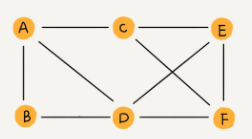
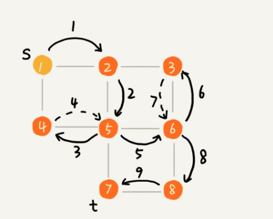

#### 图的类别
- 无向图
  - 
  - 顶点(vertex)
    - 图中的元素就叫做`顶点`
  - 边(edge)
    - 图中的一个顶点可以与任意其他顶点建立连接关系，我们把这种建立的关系叫做`边`
  - 度(degree)
    - 以微信举例，可以把每个用户看作一个顶点。如果两个用户之间互为好友，那么就在两者之间建立一条边
    - 其中，每个用户有多少好友，对应图中，就叫做顶点的`度`。就是跟顶点相连接的边的条数
- 有向图
  - 
  - 入度(In-degree)
    - 顶点的`入度`，表示有多少边指向这个顶点
    - 对应到微博的例子，入度就表示有多少粉丝
  - 出度(Out-degree)
    - 顶点的`出度`，表示有多少条边是以这个顶点为起点指向其他顶点
    - 对应到微博的例子，出度就表示关注来多少人
- 带权图
  - 
  - 在带权图中，每条边都有一个`权重(weigth)`, 我们可以通过这个权重来表示QQ好友间的亲密度

#### 邻接矩阵存储方法
- 邻接矩阵(Adjacency Matrix)
  - 
  - 优点
    - 邻接矩阵的存储方式简单，直接
    - 因为基于数组，所以在获取两个顶点的关系时，就非常高效
    - 邻接矩阵存储图的另外一个好处是方便计算。比如求解最短路径时候，会提到一个`Floyd-Warshall` 算法，就是利用矩阵循环相乘若干次得到结果
  - 缺点
    - 如果我们存储的是`稀疏图(Sparse Matrix)`, 也就是说，顶点很多，但每个顶点的边并不多，那么邻接矩阵的存储方法就更加浪费空间来
    - 比如，微信有好几亿的用户，对应到图上就是好几亿的顶点
    - 但是每个用户的好友并不会喝多，一般也就是三五百个而已。如果用邻接矩阵来存储，那绝大部分的存储空间都被浪费了
- 邻接表(Adjacency List)
  - 
  - 邻接矩阵存储起来比较浪费空间，但是使用起来比较节省时间。相反，邻接表存储起来比较节省空间，但是用起来比较耗时间
  - 缺点
    - 以图中的例子，如果要确定，是否存在一条从顶点2到顶点4的边，那就要遍历顶点2对应的那条链表，看链表中是否存在顶点4.
    - 但链表的存储方式对缓存不友好
    - 而且邻接表的的链表过长，对查询也很不友好
      - 为了提高查找效率，把链表替换成红黑树，跳表，散列表等

#### 广度优先搜索(BFS)
- 广度优先搜索（Breadth-First-Search），我们平常都把简称为 BFS
- 直观地讲，它其实就是一种“地毯式”层层推进的搜索策略，即先查找离起始顶点最近的，然后是次近的，依次往外搜索
- 
- V 表示顶点，E表示边的个数
- 时间复杂度
  - 最坏情况,终止顶点t离起始顶点s很远，需要遍历完整整个图才能找到
  - 这个时候，每个顶点都要进出一遍队列，每个边也都会被访问一次
  - 所以，BFS的时间复杂度是O(V + E)
  - 当然，对于一个连通图来说，也就是说一个图中的所有顶点是连通的，E肯定是要大于等于V - 1，所以BFS的时间复杂度可以简单写为 O(E)
- 空间复杂度
  - BFS空间消耗主要是几个辅助变量 visited数组，queue队列, prev数组
  - 这三个存储空间大小不会超过顶点的个数，所以是O(V)

#### 深度优先搜索(DFS)
- 深度优先搜索（Depth-First-Search），简称 DFS。最直观的例子就是“走迷宫”
- 假设你站在迷宫的某个岔路口，然后想找到出口.你随意选择一个岔路口来走，走着走着发现走不通的时候，你就回退到上一个岔路口，重新选择一条路继续走，直到最终找到出口。这种走法就是一种深度优先搜索策略。
- 
- 搜索的起始顶点是 s，终止顶点是 t，我们希望在图中寻找一条从顶点 s 到顶点 t 的路径。如果映射到迷宫那个例子，s 就是你起始所在的位置，t 就是出口。
- 这里面实线箭头表示遍历，虚线箭头表示回退。从图中我们可以看出，深度优先搜索找出来的路径，并不是顶点 s 到顶点 t 的最短路径。
- 实际上，深度优先搜索用的是一种比较著名的算法思想，回溯思想
- 时间复杂度
  - 每条边最多会被访问两次，一次是遍历，一次是回退。所以，图上的DFS的时间复杂度是O(E), E表示个数
- 空间复杂度
  - DFS 的消耗内存主要是 visited, stack数组。visited, stack数组的大小跟顶点的个数V成正比，所以总的空间复杂度O(V)

#### Dijkstra 算法
- 迪杰斯特拉(Dijkstra) 算法是典型最短路径算法，用于计算一个节点到其他节点的最短路径
- 它的主要特点是以起始点为中心向外层扩展(广度优化搜索思想)，直到扩展为止
- 其中的最小堆优先级队列，采用了贪心的思想。从小到大排列
- 图例
  - 以demo_dijkstra_1.cpp为例子
  - 

#### 参考资料
- [图的基本算法（BFS和DFS）](https://www.jianshu.com/p/70952b51f0c8)
- [图 | 存储结构：邻接矩阵及C语言实现](https://blog.csdn.net/liupeifeng3514/article/details/83753435)
- [图的邻接表存储 c实现](https://blog.csdn.net/linxinyuluo/article/details/6847851)
- [拓扑排序~C语言完整代码](https://blog.csdn.net/weixin_43268636/article/details/89741174)
- [拓扑排序(一)之 C语言详解](https://www.cnblogs.com/skywang12345/p/3711489.html)
- [拓扑排序算法及C语言实现](http://data.biancheng.net/view/43.html)
- [拓扑排序的两种实现：Kahn算法和dfs算法](https://blog.csdn.net/qinzhaokun/article/details/48541117)
- [Dijkstra算法(一)之 C语言详解](https://www.cnblogs.com/skywang12345/p/3711512.html)
- [Dijkstra’s shortest path algorithm | Greedy Algo-7](https://www.geeksforgeeks.org/dijkstras-shortest-path-algorithm-greedy-algo-7/)
