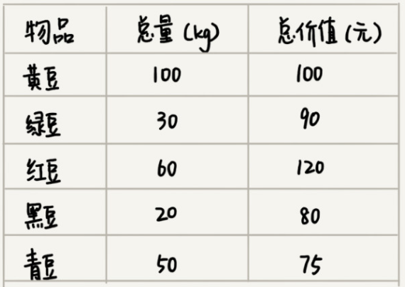

#### 贪心算法
- 贪心算法
  - 着眼当下最优解，寻求整体最优或近似最优解。虽然最终解未必是最优解，但也提供了一种可行的办法
- 背包问题
  - 
  - 假设有一个可以容纳100kg物品的背包，可以装各种物品
  - 有以上5种豆子，每种豆子的总量和总价值都各不相同。为了让背包中所装载物品的总价值最大，如何选择在背包中装那些豆子？每种豆子又该装多少？
  - 只要先算一算每个物品的单价，按照单价由高到到低依次来装就好了，单价从高到低排列，依次是:黑豆、绿豆、红豆、青豆、黄豆
  - 所以，可以往背包里装20kg黑豆、30kg绿豆、50kg红豆
- 解析
  - (1). 当我们看到这类问题，首先要联想到贪心算法
    - 针对一组数据，定义了限制值和期望值
    - 希望从中选出几个数据，在满足限制值的情况下，期望值最大
    - 类比刚刚的例子，限制值就重量不能超过100kg，期望值就是物品的总价格
    - 这组数据就是5种豆子。从中选出一部分，满足重量不超过100kg，并且总价值最大
  - (2). 尝试看下这个问题是否可以用贪心算法解决
    - 每当选择当前情况下，在对限制值同等贡献的情况下，对期望值贡献最大的数据
  - (3). 举几个例子看下贪心算法产生的结果是否是最优的
  
#### 例子
- 分糖
  - 寻找当前，单位大小能满足最多孩子的糖果
- 找零
  - 寻找当前，单位张数价值最大的纸币
- 霍夫曼编码
  - 寻找当前，单位长度所有表示最多信息的字符
  
#### 思考题
- 在一个非负数整数a中，我们希望从中移除k个数字，让剩下的数字值最小，如何选择移除哪k个数字呢?
  - 有最高位开始，比较低一位数字，如高位大，移除
  - 若高位小，则向右移一位继续比较两个数字，直到高位小于低位则移除。循环k次
  - 例子
    - 4556847594546 移除5位
    - -> 455647594546
    - -> 45547594546
    - -> 4547594546
    - -> 444594546
  - 贪心算法的理解就是能用“越…越…”造句的解法，比如这一题，越是位高的越先移除；

#### 参考资料
- [霍夫曼编码（Huffman Coding）](https://blog.csdn.net/xgf415/article/details/52628073)
- [Huffman编码C语言实现](https://blog.csdn.net/weixin_41966757/article/details/80024313)
- [哈夫曼压缩与解压缩](https://blog.csdn.net/weixin_38214171/article/details/81626498)
- [哈夫曼编解码压缩解压文件—C++实现](https://www.cnblogs.com/evenleee/p/11932122.html)
- [深入解析数据压缩算法](https://blog.csdn.net/fanyun_01/article/details/80211799)
- [基于哈夫曼编码的压缩解压程序（C 语言）](https://www.cnblogs.com/keke2014/p/3857335.html)
- [三类基于贪心思想的区间覆盖问题](https://www.cnblogs.com/acgoto/p/9824723.html)
- [LZ77压缩](https://blog.csdn.net/lf_2016/article/details/60342859)