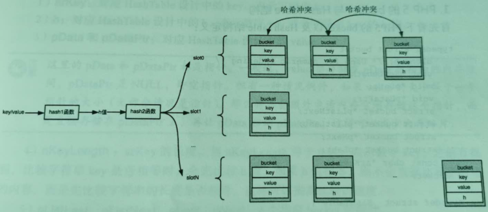
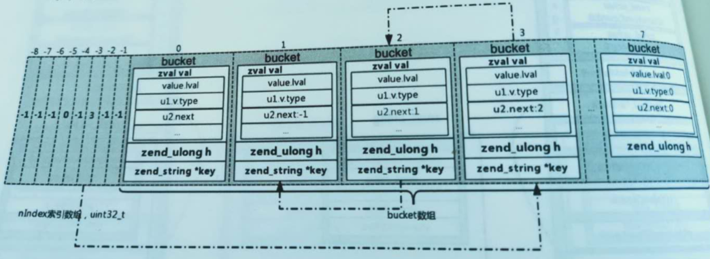
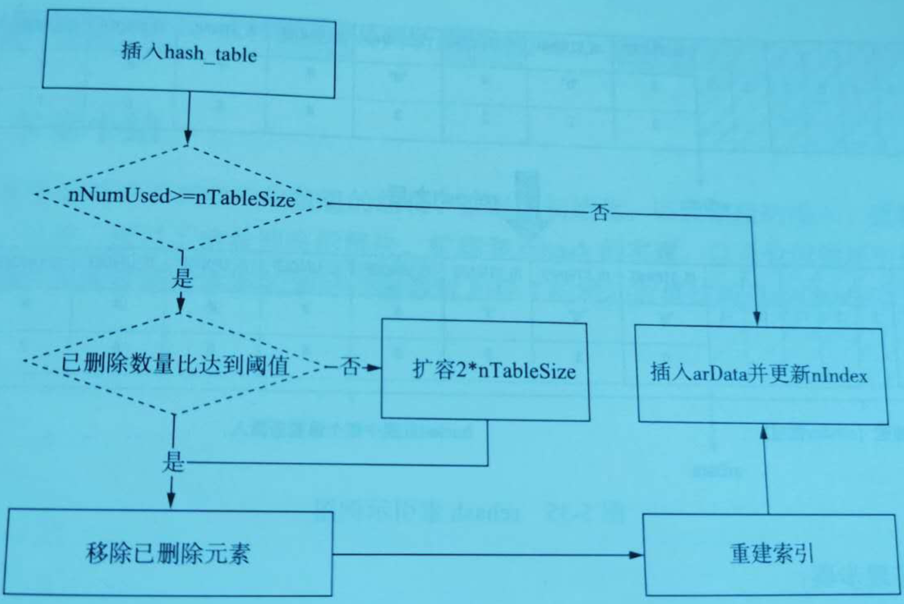
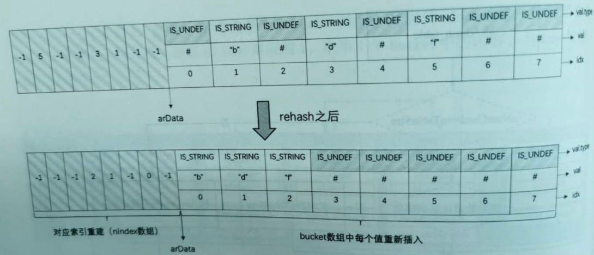

### PHP: HashTable
#### 前提
- PHP版本：php7.0.29
- 使用到的文件
  - php-src/Zend/zend_types.h
  - php-src/Zend/zend_hash.h
  - php-src/Zend/zend_hash.c
  - php-src/Zend/zend_string.h
- 本文 是《PHP7底层设计和源码实现》第5章 数组的实现，学习笔记
#### 功能分析
##### 整体结构
- 
  - bucket 里面增加h字段，h代表的是数字key(packe array 模式下，直接是数组下标)
  - 哈希函数拆分为 hash1函数和hash2函数。hash1 将key映射为h值，hash2将h值映射为slot的缩影值
  - key字段作为字符串key，不再表示数字key
##### 数据结构
###### bucket结构分析
```
// Bucket: 散列表中存储的元素
typedef struct _Bucket {
	zval              val;  // 存储的具体value，这里嵌入一个zval，而不是一个指针
	zend_ulong        h;    // key 根据times 33 计算得到的哈希值，或者是数值索引编号
	zend_string      *key;  // 存储元素的key
};
```
- 参数说明
  - val 参数
    - 对应HashTable设计中的value。始终是zval类型
    - zval结构
		```
		struct _zval_struct {
			zend_value        value;			/* 表明zval类型 */
			union {
				struct {
					ZEND_ENDIAN_LOHI_4(
						zend_uchar    type,			/* active type */
						zend_uchar    type_flags,
						zend_uchar    const_flags,
						zend_uchar    reserved)	    /* call info for EX(This) */
				} v;
				uint32_t type_info;
			} u1;
			union {
				uint32_t     var_flags;
				uint32_t     next;                 /* 用来解决哈希冲突 */
				uint32_t     cache_slot;           /* 运行时缓存 */
				uint32_t     lineno;               /* 对于zend_ast_zval存行号 */
				uint32_t     num_args;             /* EX(This) 参数个数*/
				uint32_t     fe_pos;               /* foreach 位置 */
				uint32_t     fe_iter_idx;          /* foreach 游标的标记 */
			} u2;
		};
  		```	
    - 每个zval类型16个字节
    - h 参数
      - 对应HashTable设计中的h，表示数字key或者字符串key的h值
    - key 参数
      - 对应HashTable设计中的key，表示字符串的key
      - zend_string结构
    	```
    	struct _zend_string {
    		zend_refcounted_h gc;	/* 8字节，内嵌的gc，引用计数及字符串类别存储*/
    		zend_ulong        h;   /* hash值，8字节，字符串的哈希值 */
    		size_t            len;	/* 8字节，字符串的长度*/
    		char              val[1]; /*柔性数数组，占1位，字符串的值存粗的位置*/
    	};

    	typedef struct _zend_refcounted_h {
    		uint32_t         refcount;			/* gc,整块占用8字节 */
    		union { // 4字节
    			struct {
    				ZEND_ENDIAN_LOHI_3(
    					zend_uchar    type,	/* 等同于zval的u1.v.type*/
    					zend_uchar    flags,    /* 字符串的类型数据 */
    					uint16_t      gc_info)  /* 垃圾回收标记颜色用 */
    			} v;
    			uint32_t type_info;
    		} u;
    	} zend_refcounted_h;
    	```
    	- zend_string是一种带有字符串长度，h值，gc信息的字符串数组的包装，提升了性能和空间效率
- bucket 的类型
  - 未使用bucket
    - 最初所有的bucket都是未使用的状态
  - 有效bucket
    - 存储着有效的数据(key, val, h),当进行插入时，会选择一个未使用bucket，这样该bucket就变成了有效bucket
    - 更新操作只能发生在有效bucket上，更新后，仍然是有效bucket
  - 无效bucket
    - 当bucket上存储的数据被删除时，有效bucket就会变成无效bucket
- bucket类型间的转换
  - 在内存分布上有效bucket和无效bucket会交替分布，但都在未使用bucket的前面
  - 插入的时候永远在未使用bucket上进行
  - 当由于删除等操作，导致无效bucket非常多，而有效bucket很少时，会对整个bucket数组进行rehash操作，这样，稀疏的有效bucket就会变得连续和紧密
  - 部分无效bucket会被重新利用而变为有效bucket
  - 还有一部分有效bucket和无效bucket会被释放出来，重新变成未使用bucket
  - 

###### HashTable结构分析
```
// HashTable 结构
typedef struct _zend_array HashTable;
struct _zend_array {
	zend_refcounted_h gc;
	union {
		struct {
			ZEND_ENDIAN_LOHI_4(
				zend_uchar    flags,
				zend_uchar    nApplyCount,
				zend_uchar    nIteratorsCount,
				zend_uchar    reserve)
		} v;
		uint32_t flags;
	} u;
	uint32_t          nTableMask;   // 哈希值计算掩码，等于nTableSize的负值(nTableMask = -nTableSize)
	Bucket           *arData;   // 存储元素数组，指向第一个Bucket
	uint32_t          nNumUsed; // 已用Bucket数
	uint32_t          nNumOfElements;   // 哈希表有效元素数
	uint32_t          nTableSize;   // 哈希表总大小，为2的n次方
	uint32_t          nInternalPointer;
	zend_long         nNextFreeElement; // 下一个可能的数值索引，如: arr[] = 1; arr["a"] = 2;arr[] = 3; 则nNextFreeElement = 2
	dtor_func_t       pDestructor;
};
```
- 参数说明
  - gc 参数
    - 引用计数相关 
    - 在PHP7中，引用计数不再是zval的字段，而是被设计在zval的value字段所指向的结构体中
  - argData 参数
    - 实际的存储容器
    - 通过指针指向一段连续的内存，存储着bucket数组
  - nTableSize 参数
    - HashTable 的大小
    - 表示 arData指向的bucket数组的大小，即所有bucket的数量
    - 最小值未8
    - 最大值在32位系统中是0x40000000(2 ^ 30)，在64位系统中0x80000000(2 ^ 31)
  - nNumUsed 参数
    - 指向已使用bucket的数量，包括有效bucket和无效bucket的数量
    - 在bucket数组中，下标从0 ~ (nNumUsed - 1)的bucket都属于已使用bucket
    - 而下标为nNumUsed ~ (nTableSize - 1)的bucket都属于未使用bucket
  - nNumOfElements 参数
    - 有效bucket的数量
    - 该值总是小于或等于nNumUsed
  - nTableMask 参数
    - 掩码。一般为-nTableSize
  - nInternalPointer 参数
    - HashTable的全局默认游标
  - nNextFreeElement 参数
    - HashTable的自然key
    - 自然key是指HashTable的应用语义是纯数组时，插入元素无须指定key，key会以nNextFreeElement的值为准
    - 例如
      - 该字段初始值为0
      - $a[] = 1，实际上是插入到key等于0的bucket上
      - 然后nNextFreeElement会递增1，代表下一个自然插入的元素的key是1
  - pDestructor 参数
    - 析构函数
    - 当bucket元素被更新或被删除时，会对bucket的value调用该函数
    - 如果value是引用计数的类型，那么会对value应用计数减1，进而引发可能的gc
  - u 联合体
    - 占用4个字节。可以存储一个uint32_t类型的flags
    - 也可以存储由4个unsigned char 组成的结构体v
    - u.v.flags 参数
      - 用各个bit来表达HashTable的各种标记
      - 共有下面6中flag，分别对应 u.v.flags的第1位到6位
  		```
  		#define HASH_FLAG_PERSISTENT       (1<<0)	// 是否使用持久化内存（不使用内存池）
  		#define HASH_FLAG_APPLY_PROTECTION (1<<1)	// 是否开启递归遍历保护
  		#define HASH_FLAG_PACKED           (1<<2)	// 是否是packed array
  		#define HASH_FLAG_INITIALIZED      (1<<3)	// 是否初始化
  		#define HASH_FLAG_STATIC_KEYS      (1<<4)	// 标记HashTable的Key是否为long key
  		#define HASH_FLAG_HAS_EMPTY_IND    (1<<5)	// 是否存在空的间接val
  		```
    - u.v.nApplyCount 参数
      - 递归遍历计数
      - 为了解决循环引用导致的死循环问题
      - 当对某个数组进行某种递归操作时，在递归调入栈之前将nApplyCount加1，递归调出栈之后将nApplyCount减1
      - 当循环引用出现时，递归调用会不断入栈，当nApplyCount增加到一定阀值时，不再继续递归下去，返回一个合法的值，并打印"recursion detected"之类的warning或者error日志
      - 这个阀值一般不大于3
    - u.v.nIteratorsCount 参数
      - 迭代器计数
      - PHP中每一个foreach语句都会在全局变量EG中创建一个迭代器
      - 迭代器包含正在遍历的HashTable和游标信息
      - 该字段记录了runtime正在迭代当前的HashTable的迭代器的数量
    - u.v.consistency 参数
      - 成员用于调试目的
  		```
  		#define HT_OK					0x00	// 正常状态，各种数据完全一致
  		#define HT_IS_DESTROYING		0x40	// 正在删除所有的内容，包括arBuckets本身
  		#define HT_DESTROYED			0x80	// 已删除，包括arBuckets本身
  		#define HT_CLEANING				0xc0	// 正在清除所有的arBuckets执行的内容，但不包括arBuckets本身
  		```
- 为什么HashTable 掩码(nTableMask)是负数?
  - PHP7在分配bucket数据内存的时候，在bucket数组的前面额外多申请内存
  - 这段内存是一个索引数组(也加索引表)，数组里面的每个元素代表一个Slot,存储着每个slot链表的第一个bucket在bucket数组中的下标
  - 索引表的默认值：-1
  - 为了实现逻辑链表，由于bucket元素的val是zval，PHP7通过bucket.val.u2.next表达链表中下一个元素在数组中的下标
  - 


##### HashTable 初始化
###### 初始化一：为HashTable分配内存，初始化HashTable各个字段
- 例如: $arr = array();
- 初始化流程
    - 申请内存
		```
		(ht) = (HashTable *)emalloc(sizeof(HashTable));
		```
    - 调用_zend_hash_init
		```
		static const uint32_t uninitialized_bucket[-HT_MIN_MASK] = {HT_INVALID_IDX, HT_INVALID_IDX};

		ZEND_API void ZEND_FASTCALL _zend_hash_init(HashTable *ht, uint32_t nSize, dtor_func_t pDestructor, zend_bool persistent ZEND_FILE_LINE_DC)
		{
			GC_REFCOUNT(ht) = 1;	// 设置引用计数
			GC_TYPE_INFO(ht) = IS_ARRAY; 	// 7 类别设置成数组
			ht->u.flags = (persistent ? HASH_FLAG_PERSISTENT : 0) | HASH_FLAG_APPLY_PROTECTION | HASH_FLAG_STATIC_KEYS;
			ht->nTableSize = zend_hash_check_size(nSize);   // 能包含nSize的最小2 ^ n的数字最小值 8
			ht->nTableMask = HT_MIN_MASK;	// -2，默认是packed array
			HT_SET_DATA_ADDR(ht, &uninitialized_bucket);    // ptr偏移到arrData地址
			ht->nNumUsed = 0;
			ht->nNumOfElements = 0;
			ht->nInternalPointer = HT_INVALID_IDX;
			ht->nNextFreeElement = 0;
			ht->pDestructor = pDestructor;
		}
		```
- 参数说明
  - nTableSzie = 8
    - 因为HashTable 内部的arBuckets的大小是2的n次方，并且最小是8，最大值为0x8000000
  - u.vflags = 18
	```
	#define HASH_FLAG_PERSISTENT       (1<<0)
	#define HASH_FLAG_APPLY_PROTECTION (1<<1)
	#define HASH_FLAG_PACKED           (1<<2)
	#define HASH_FLAG_INITIALIZED      (1<<3)
	#define HASH_FLAG_STATIC_KEYS      (1<<4)
	#define HASH_FLAG_HAS_EMPTY_IND    (1<<5)
	```
    - flag = 18 = HASH_FLAG_STATIC_KEYS | HASH_FLAG_APPLY_PROTECTION
    - 而flag & HASH_FLAG_INITIALIZED 等于0说明，该数组尚未完成真正的初始化，即尚未为arData分配内存
  - 设置nNumberUsed, nNumOfElement为0
    - 因为现在还没有使用任何数据元素
  - 设置nInternalPointer为-1
    - 表示尚未设置全局遍历游标
  - 设置nNextFreeElement 为 0
    - 表示数组的自然key从0开始
  - 设置nTableSize
    - 如果传递的nSize 不是 2 ^ n，会通过zend_hash_check_size函数计算大于等于nSize的最小的 2 ^ n
    - 例如 nSize = 10, 那么最终ht->nTableSize取值为16
  - nTableMask = -2
    - 表示索引表大小为2
    - packed array的索引表未使用到，即nTableMask永远等于-2

###### 初始化二：为bucket数组分配内存，修改HashTable某些字段
- 例如: $arr[] = 'foo';
- 流程
  - 调用 zend_hash_real_init_ex
	```
	static void zend_always_inline zend_hash_real_init_ex(HashTable *ht, int packed)
	{
		HT_ASSERT(GC_REFCOUNT(ht) == 1);
		ZEND_ASSERT(!((ht)->u.flags & HASH_FLAG_INITIALIZED));
		// packed: h < ht->nTableSize, h = 0, ht->nTableSize 默认为8
		if (packed) {	// packed array 初始化
			/* 为arData分配内存, 并把arData的指针偏移指向buckets数组的首地址*/
			HT_SET_DATA_ADDR(ht, pemalloc(HT_SIZE(ht), (ht)->u.flags & HASH_FLAG_PERSISTENT));
			// 修改flags为 已经初始化并且为packed array
			(ht)->u.flags |= HASH_FLAG_INITIALIZED | HASH_FLAG_PACKED;
			// nIndex置为无效标识-1，arData[-1], arrData[-2] = -1
			HT_HASH_RESET_PACKED(ht);
		} else {	// 普通哈希表的初始化
			/*
				掩码nTableMask为nTableSize的负数，即nTableMask = -nTableSize, 因为nTableSize 等于 2 ^ n，所以nTableMask二进制位右侧全部为0，也就保证了nIndex落在数组索引范围之内(|nIndex| <= nTableSize)
			*/
			(ht)->nTableMask = -(ht)->nTableSize;
			HT_SET_DATA_ADDR(ht, pemalloc(HT_SIZE(ht), (ht)->u.flags & HASH_FLAG_PERSISTENT));
			(ht)->u.flags |= HASH_FLAG_INITIALIZED;
			if (EXPECTED(ht->nTableMask == -8)) {
				Bucket *arData = ht->arData;

				HT_HASH_EX(arData, -8) = -1;
				HT_HASH_EX(arData, -7) = -1;
				HT_HASH_EX(arData, -6) = -1;
				HT_HASH_EX(arData, -5) = -1;
				HT_HASH_EX(arData, -4) = -1;
				HT_HASH_EX(arData, -3) = -1;
				HT_HASH_EX(arData, -2) = -1;
				HT_HASH_EX(arData, -1) = -1;
			} else {
				HT_HASH_RESET(ht);	// 调用memset函数把所有内存设置成无符号整型的-1
			}
		}
	}
	```
- 参数说明
  - HashTable的arData被真正地分配内存
    - 并且按最小值8分配了8个bucket的存储空间
  - flags = 30
    - flags = 30 = HASH_FLAG_STATIC_KEYS | HASH_FLAG_APPLY_PROTECTION | HASH_FLAG_PACKED | HASH_FLAG_INITIALIZED
    - 说明当前HashTable.arData已经被初始化完毕，并且当前HashTable是packed array
  - nTableMask = -2
    - 因为是packed array
  - h = 0
    - $arr[] 对于首次插入，h 等于0
    - packed array 插入到bucket数组的第一个位置(下标为0)
  - bucket 里面内嵌了 zval
  - nNumUsed = 1
    - 由于bucket数组是连续分配的内存，nNumUsed = 1代表了已经使用了1个bucket
    - 那就是arData[0]这个bucket
  - nNumOfElements = 1
    - 表示当前HashTable中有一个有效元素arData[0]
  - nInternalPointer = 0
    - 遍历下标，表示遍历HashTable时从arData[0]开始
  - nNextFreeElement = 1
    - 自然下标，下次自然序插入时, h值为1

###### packed array 和 hash array 的区别
- packed array
  - 例如：$a = array(1, 2, 3); // 纯数组
  - 特性和约束
    - key 全部数字key
    - key 按插入顺序排列，仍然是递增的
    - 每一个key-value对的存储位置都是非常确定的，都存储在bucket数组的第key个元素上
    - packed array 不需要索引数组
  - 
- hash array
  - 例如：$b = array('x' => 1, 'y' => 2, 'z' => 3);
  - 说明
    - hash array 依赖数组来维护每个slot链表中首元素在bucket中的下标
    - 拿key 为 x举例，字符串x的h值是9223372036854953501，它与nTableMask(-8)做位或运算之后，结果是-3
    - 然后到索引数组上去查询-3这个slot值，得到该slot链表首元素在bucket数组的下标为0
  - 

##### Hash 算法
````
static zend_always_inline zend_ulong zend_inline_hash_func(const char *str, size_t len)
{
	register zend_ulong hash = Z_UL(5381);

	/* variant with the hash unrolled eight times */
	for (; len >= 8; len -= 8) {
		hash = ((hash << 5) + hash) + *str++;
		hash = ((hash << 5) + hash) + *str++;
		hash = ((hash << 5) + hash) + *str++;
		hash = ((hash << 5) + hash) + *str++;
		hash = ((hash << 5) + hash) + *str++;
		hash = ((hash << 5) + hash) + *str++;
		hash = ((hash << 5) + hash) + *str++;
		hash = ((hash << 5) + hash) + *str++;
	}
	switch (len) {
		case 7: hash = ((hash << 5) + hash) + *str++; /* fallthrough... */
		case 6: hash = ((hash << 5) + hash) + *str++; /* fallthrough... */
		case 5: hash = ((hash << 5) + hash) + *str++; /* fallthrough... */
		case 4: hash = ((hash << 5) + hash) + *str++; /* fallthrough... */
		case 3: hash = ((hash << 5) + hash) + *str++; /* fallthrough... */
		case 2: hash = ((hash << 5) + hash) + *str++; /* fallthrough... */
		case 1: hash = ((hash << 5) + hash) + *str++; break;
		case 0: break;
EMPTY_SWITCH_DEFAULT_CASE()
	}

	/* Hash value can't be zero, so we always set the high bit */
#if SIZEOF_ZEND_LONG == 8
	return hash | Z_UL(0x8000000000000000);
#elif SIZEOF_ZEND_LONG == 4
	return hash | Z_UL(0x80000000);
#else
# error "Unknown SIZEOF_ZEND_LONG"
#endif
}
````
- PHP的Hash采用的是目前最为普遍的DJBX33A (Daniel J. Bernstein, Times 33 with Addition)
- 算法的核心思想就是:
  -  hash(i) = hash(i-1) * 33 + str[i]
- PHP中并没有使用直接乘33, 而是采用了: hash << 5 + hash
##### 映射函数
- 映射函数(散列函数)是散列表的关键部分，它将key 与 value 建立映射关系,一般映射函数可以根据key的哈希值与Bucket数组大小取模得到
  - 即 key->h % ht->nTableSize
  - PHP的做法： nIndex = key->h | nTablesMask
- nTablesMask  为 nTableSize 的负数，即：nTablesMask = -nTableSize 
- 因为 nTableSize 等于 2 ^ n, 所以nTablesMask二进制右侧全部为0，也就保证了nIndex 落在数组索引的范围之内([-n, -1])
  - 11111111 11111111 11111111 11111000	-8
  - 11111111 11111111 11111111 11111001	-7
  - 11111111 11111111 11111111 11111010	-6
  - 11111111 11111111 11111111 11111011	-5
  - 11111111 11111111 11111111 11111100	-4
  - 11111111 11111111 11111111 11111101	-3
  - 11111111 11111111 11111111 11111110	-2
  - 11111111 11111111 11111111 11111111	-1

##### HashTable 插入
###### 情景分析
- 例子1: $arr[] = 'foo'; // 默认为packed array
  - 流程
    - 调用 zend_hash_init 函数，进行hashtable的初始化
      - 初始化为packed array 模式
    -  调用 _zend_hash_next_index_insert 函数将uninitialized_zval插入到HashTable中
       -  然后将字符串foo(zend string 类型)拷贝到对应的zval中
   - 调用函数分析
     - _zend_hash_next_index_insert
       - _zend_hash_next_index_insert 会调用 _zend_hash_index_add_or_update_i
		```
		/**
		* @description 向数值索引哈希表的尾部插入数据
		* @param HashTable* ht 待操作的哈希表
		* @param zval* pData 待保存的数据
		* @return: zval*
		*/
		ZEND_API zval* ZEND_FASTCALL _zend_hash_next_index_insert(HashTable *ht, zval *pData ZEND_FILE_LINE_DC)
		{
			return _zend_hash_index_add_or_update_i(ht, ht->nNextFreeElement, pData, HASH_ADD | HASH_ADD_NEXT ZEND_FILE_LINE_RELAY_CC);
		}
		```
  	 - _zend_hash_index_add_or_update_i
		```
		static zend_always_inline zval *_zend_hash_index_add_or_update_i(HashTable *ht, zend_ulong h, zval *pData, uint32_t flag ZEND_FILE_LINE_DC)
		{
			uint32_t nIndex;
			uint32_t idx;
			Bucket *p;

			IS_CONSISTENT(ht);
			HT_ASSERT(GC_REFCOUNT(ht) == 1);

			if (UNEXPECTED(!(ht->u.flags & HASH_FLAG_INITIALIZED))) {	//  检测hash table 是否初始化
				CHECK_INIT(ht, h < ht->nTableSize);
				if (h < ht->nTableSize) {
					p = ht->arData + h;
					goto add_to_packed;
				}
				goto add_to_hash;
			} else if (ht->u.flags & HASH_FLAG_PACKED) {	// hash table 为 packed array
				// 使用已有的bucket
				if (h < ht->nNumUsed) {
					p = ht->arData + h;
					// p 不是要删除的bucket
					if (Z_TYPE(p->val) != IS_UNDEF) {
						if (flag & HASH_ADD) {
							return NULL;
						}
						if (ht->pDestructor) {
							ht->pDestructor(&p->val);
						}
						ZVAL_COPY_VALUE(&p->val, pData);
						if ((zend_long)h >= (zend_long)ht->nNextFreeElement) {
							ht->nNextFreeElement = h < ZEND_LONG_MAX ? h + 1 : ZEND_LONG_MAX;
						}
						return &p->val;
					} else { /* we have to keep the order :( */
						goto convert_to_hash;
					}
				} else if (EXPECTED(h < ht->nTableSize)) {
					p = ht->arData + h;
				} else if ((h >> 1) < ht->nTableSize &&
						(ht->nTableSize >> 1) < ht->nNumOfElements) {
					zend_hash_packed_grow(ht);
					p = ht->arData + h;
				} else {
					goto convert_to_hash;
				}

		add_to_packed:
				HANDLE_BLOCK_INTERRUPTIONS();
				/* incremental initialization of empty Buckets */
				if ((flag & (HASH_ADD_NEW|HASH_ADD_NEXT)) == (HASH_ADD_NEW|HASH_ADD_NEXT)) {
					ht->nNumUsed = h + 1;	// nNumUsed(实际bucket)增加 h + 1
				} else if (h >= ht->nNumUsed) {
					// h 大于 nNumUsed: 意味着，这个是新插入的数据
					if (h > ht->nNumUsed) {
						Bucket *q = ht->arData + ht->nNumUsed;	// 指针移动到 ht->arData + ht->nNumUsed 位置
						while (q != p) {
							ZVAL_UNDEF(&q->val);	// 把val设置为 is_undef(标记为无效bucket)
							q++;
						}
					}
					ht->nNumUsed = h + 1;
				}
				ht->nNumOfElements++;
				if (ht->nInternalPointer == HT_INVALID_IDX) {
					ht->nInternalPointer = h;
				}
				zend_hash_iterators_update(ht, HT_INVALID_IDX, h);
				if ((zend_long)h >= (zend_long)ht->nNextFreeElement) {
					ht->nNextFreeElement = h < ZEND_LONG_MAX ? h + 1 : ZEND_LONG_MAX;
				}
				// packey array。h 不需要 h | nTableSize
				p->h = h;
				p->key = NULL;
				// 把pData 赋值到 val中
				ZVAL_COPY_VALUE(&p->val, pData);

				HANDLE_UNBLOCK_INTERRUPTIONS();

				return &p->val;

		convert_to_hash:
				// 扩容，并且进行rehash
				zend_hash_packed_to_hash(ht);
			} else if ((flag & HASH_ADD_NEW) == 0) {
				p = zend_hash_index_find_bucket(ht, h);
				if (p) {
					if (flag & HASH_ADD) {
						return NULL;
					}
					ZEND_ASSERT(&p->val != pData);
					HANDLE_BLOCK_INTERRUPTIONS();
					if (ht->pDestructor) {
						ht->pDestructor(&p->val);
					}
					ZVAL_COPY_VALUE(&p->val, pData);
					HANDLE_UNBLOCK_INTERRUPTIONS();
					if ((zend_long)h >= (zend_long)ht->nNextFreeElement) {
						ht->nNextFreeElement = h < ZEND_LONG_MAX ? h + 1 : ZEND_LONG_MAX;
					}
					return &p->val;
				}
			}

			ZEND_HASH_IF_FULL_DO_RESIZE(ht);		/* If the Hash table is full, resize it */

		add_to_hash:
			HANDLE_BLOCK_INTERRUPTIONS();
			idx = ht->nNumUsed++;	// nNumUsed++为bucket下标
			ht->nNumOfElements++;	// 有效的bucket个数增加1
			if (ht->nInternalPointer == HT_INVALID_IDX) {
				ht->nInternalPointer = idx;
			}
			zend_hash_iterators_update(ht, HT_INVALID_IDX, idx);
			if ((zend_long)h >= (zend_long)ht->nNextFreeElement) {
				ht->nNextFreeElement = h < ZEND_LONG_MAX ? h + 1 : ZEND_LONG_MAX;
			}
			p = ht->arData + idx;	// 指针移动到 ht->arData + idx位置
			p->h = h;
			p->key = NULL;
			nIndex = h | ht->nTableMask;	// nIndex为slot位置
			// // 把pData 赋值到 val中
			ZVAL_COPY_VALUE(&p->val, pData);
			// 哈希冲突处理，把p->val.u2.next 设置为 slot位置
			Z_NEXT(p->val) = HT_HASH(ht, nIndex);
			// 把slot位置的内容设置为 idx
			HT_HASH(ht, nIndex) = HT_IDX_TO_HASH(idx);
			HANDLE_UNBLOCK_INTERRUPTIONS();

			return &p->val;
		}
		```
- 例子2: $arr['a'] = 'bar'
  - 流程
    - 首先调用zend_hash_find根据 key = 'a'查找,查找不到对应的key
    - 然后通过zend_hash_add_new把uninitialized_zval插入到HashTable中
    - 如果此时是packed array，需要调用zend_hash_packed_to_hash进行转换
  - 函数解析
	- zend_hash_find
		```
		ZEND_API zval* ZEND_FASTCALL zend_hash_find(const HashTable *ht, zend_string *key)
		{
			Bucket *p;

			IS_CONSISTENT(ht);

			p = zend_hash_find_bucket(ht, key);
			return p ? &p->val : NULL;
		}
		```
	- zend_hash_find_bucket
		```
		static zend_always_inline Bucket *zend_hash_find_bucket(const HashTable *ht, zend_string *key)
		{
			zend_ulong h;
			uint32_t nIndex;
			uint32_t idx;
			Bucket *p, *arData;
			// key 通过 zend_string_hash_val获得
			h = zend_string_hash_val(key);
			arData = ht->arData;
			// slot 位置
			nIndex = h | ht->nTableMask;
			// slot 里的内容
			idx = HT_HASH_EX(arData, nIndex);
			// idx不为空
			while (EXPECTED(idx != HT_INVALID_IDX)) {
				// arData 中寻找idx下标的bucket
				p = HT_HASH_TO_BUCKET_EX(arData, idx);
				// 找到对应的值
				if (EXPECTED(p->key == key)) { /* check for the same interned string */
					return p;
				} else if (EXPECTED(p->h == h) &&
					EXPECTED(p->key) &&
					EXPECTED(ZSTR_LEN(p->key) == ZSTR_LEN(key)) &&
					EXPECTED(memcmp(ZSTR_VAL(p->key), ZSTR_VAL(key), ZSTR_LEN(key)) == 0)) {
					return p;
				}
				idx = Z_NEXT(p->val);
			}
			return NULL;
		}
		```
	- zend_hash_add_new
    	- 最后是调用_zend_hash_add_or_update_i
- 例子3: $arr[2] = 'abc'
  - 流程
    - 首先使用 zend_hash_index_find函数根据h = 2来查找，查找不到的话
    - 调用zend_hash_index_add_new 将其插入HashTable中去
  - 函数分析
    - zend_hash_index_find
		```
		ZEND_API zval* ZEND_FASTCALL zend_hash_index_find(const HashTable *ht, zend_ulong h)
		{
			Bucket *p;

			IS_CONSISTENT(ht);
			// hash table 是否是packed array
			if (ht->u.flags & HASH_FLAG_PACKED) {
				// 查找的值，小于hash table 实际的bucket
				if (h < ht->nNumUsed) {
					p = ht->arData + h;
					// p 不是被标记删除的数据
					if (Z_TYPE(p->val) != IS_UNDEF) {
						return &p->val;
					}
				}
				return NULL;
			}
			// 如果是hash array就使用 zend_hash_index_find_bucket
			p = zend_hash_index_find_bucket(ht, h);
			return p ? &p->val : NULL;
		}
		```
	- zend_hash_index_add_new
    	- 最后调用 _zend_hash_index_add_or_update_i
- 例子4: $arr[] = 'xyz'
  - 流程
    - 调用_zend_hash_next_index_insert
    - 对于h，使用的是ht->nNextFreeElement
    - 如此时ht->nNextFreeElement == 3, 同样传入 h = 3调用zend_hash_index_find_bucket查找
    - 查找不到的话，进行插入
  - 函数分析
    - _zend_hash_next_index_insert
      - 最后调用 _zend_hash_index_add_or_update_i
    - zend_hash_index_find_bucket
		```
		static zend_always_inline Bucket *zend_hash_index_find_bucket(const HashTable *ht, zend_ulong h)
		{
			uint32_t nIndex;
			uint32_t idx;
			Bucket *p, *arData;

			arData = ht->arData;
			// 获取slot位置
			nIndex = h | ht->nTableMask;
			// 获取 slot的内容
			idx = HT_HASH_EX(arData, nIndex);
			// idx 不为空
			while (idx != HT_INVALID_IDX) {
				// 断言，idx小于 ht->nTableSize
				ZEND_ASSERT(idx < HT_IDX_TO_HASH(ht->nTableSize));
				// 获取 arrData下标处的内容
				p = HT_HASH_TO_BUCKET_EX(arData, idx);
				// h相等，且key不为空。意味着是hash array类型
				if (p->h == h && !p->key) {
					return p;
				}
				// 不然，需要选择p的冲突链表里的next值
				idx = Z_NEXT(p->val);
			}
			return NULL;
		}
		```
- 例子5: $arr['a'] = 'foo'
  - 流程
    - 调用zend_hash_find_bucket，通过 key = a查找，通过zend_string_hash_val可以计算 h值
    - 然后通过 nIndex = h | ht->nTableMask , nIndex = -2, 而-2位置对应1，找到arData的第1个位置，判断key是否等于'a',然后将对应的值改为'foo'，并做优化
  
##### HashTable 哈希冲突解决
- 说明
  - PHP7 hash array 的做法，把每个冲突的idx存储在bucket的zval.u2.next中
  - 插入的时候把老的value存储的地址(idx)放到新value的next中，再把新value的存储地址更新到索引数组
  - 通过 zval.u2.next的值，就可以形成一条隐藏的链表
- 例如
  - 
  - 1). 插入第1个bucket，对应nIdex为-3，那么此时nIndex = -3的位置值为1
  - 2). 若此时插入第2个bucket，与第1个冲突，也就是对应的nIndex也为-3
    - 所以，令nIndex = -3的位置值为2，同时将第2个bucket中zval里面的u2.next值置为1
    - 这样，在查找第1个bucket的key对应的nIndex时，找到第2个bucket，校验key值不同，会取u2.next对应的1，取第1个bucket中的内容，与key校验一致，则返回
  - 3). 若此时插入第3个bucket，与第1个和第2个冲突，那么用同样的方式，令nIndex = -3的位置值为3，同时将第3个bucket中zval里面的u2.next值置为2

##### HashTable 扩容和rehash操作
- 扩容和rehash整体流程流程
  - hash array 的容量分配的是固定的，初始化每次申请的是2 ^ n的容量，容量最小值为 2 ^ 3，最大值为0x8000000
  - 当容量足够时候，直接执行插入操作
  - 当容量不够时候(nNumUsed >= nTableSize)
    - 检查已删除元素所占的比例，假如达到阀值(ht->nNumUsed - ht->nNumOfElements > (ht->nNumOfElements >> 5))
    - 则将已删除元素从HashTable中移除，并重建索引
    - 如果未到阀值，则要进行扩容操作，新的容量扩大到当前的大小的2倍(2 * nTableSzie),将当前bucket数组复制到新的空间，然后重建索引
  - 重建完索引后，有足够的空余空间再执行插入操作
  - 
- 重建索引的过程
  - rehash对应源码中的zend_hash_rehash(ht)方法
  - rehash的主要功能就是HashTable bucket数组中标识为IS_UNDEF的数据剔除，把有效数据重新聚合到bucket数组并更新插入索引表
  - rehash不重新申请内存，整个过程是在原有结构上做聚合调整
  - 
    - 具体步骤
      - 重置所有Index数组为-1
      - 初始化两个bucket类型的指针p, q,循环遍历bucket数组
      - 每次循环, p++，遇到第一个IS_UNDEF， q =p;继续循环数组
      - 当再一次遇到一个正常数据时，把正常数据拷贝到q指向的位置，q++
      - 直到遍历完数据，更新nNumUsed等计数
- 代码分析
  - zend_hash_packed_to_hash
	```
	ZEND_API void ZEND_FASTCALL zend_hash_packed_to_hash(HashTable *ht)
	{
		// 把当前的hash table 设置为旧hash table
		void *new_data, *old_data = HT_GET_DATA_ADDR(ht);
		Bucket *old_buckets = ht->arData;

		HT_ASSERT(GC_REFCOUNT(ht) == 1);
		HANDLE_BLOCK_INTERRUPTIONS();
		ht->u.flags &= ~HASH_FLAG_PACKED;
		// 申请2倍的内存
		new_data = pemalloc(HT_SIZE_EX(ht->nTableSize, -ht->nTableSize), (ht)->u.flags & HASH_FLAG_PERSISTENT);
		ht->nTableMask = -ht->nTableSize;
		// 修改ht内存指向
		HT_SET_DATA_ADDR(ht, new_data);
		// 复制旧数据到新hash table
		memcpy(ht->arData, old_buckets, sizeof(Bucket) * ht->nNumUsed);
		// 释放旧数据
		pefree(old_data, (ht)->u.flags & HASH_FLAG_PERSISTENT);
		// 重建索引
		zend_hash_rehash(ht);
		HANDLE_UNBLOCK_INTERRUPTIONS();
	}
	```
  - zend_hash_rehash
	```
	ZEND_API int ZEND_FASTCALL zend_hash_rehash(HashTable *ht)
	{
		Bucket *p;
		uint32_t nIndex, i;

		IS_CONSISTENT(ht);

		// 有效bucket为0
		if (UNEXPECTED(ht->nNumOfElements == 0)) {
			// hash table 还没有初始化
			if (ht->u.flags & HASH_FLAG_INITIALIZED) {
				ht->nNumUsed = 0;
				HT_HASH_RESET(ht);
			}
			return SUCCESS;
		}

		// 把slot 数组设置为-1
		HT_HASH_RESET(ht);
		i = 0;
		p = ht->arData;
		// 全部都是有效bucket
		if (ht->nNumUsed == ht->nNumOfElements) {
			// 重建slot索引
			do {
				nIndex = p->h | ht->nTableMask;
				Z_NEXT(p->val) = HT_HASH(ht, nIndex);
				HT_HASH(ht, nIndex) = HT_IDX_TO_HASH(i);
				p++;
			} while (++i < ht->nNumUsed);
		} else {
			do {
				// 如果是要剔除的数据
				if (UNEXPECTED(Z_TYPE(p->val) == IS_UNDEF)) {
					uint32_t j = i;
					Bucket *q = p;
					/**
					* 初始化两个bucket类型的指针p, q,循环遍历bucket数组
					* 每次循环, p++，遇到第一个IS_UNDEF， q =p;继续循环数组
					* 当再一次遇到一个正常数据时，把正常数据拷贝到q指向的位置，q++
					* 直到遍历完数据，更新nNumUsed等计数
					*/
					// 迭代计数器为0
					if (EXPECTED(ht->u.v.nIteratorsCount == 0)) {
						
						while (++i < ht->nNumUsed) {
							p++;
							if (EXPECTED(Z_TYPE_INFO(p->val) != IS_UNDEF)) {
								ZVAL_COPY_VALUE(&q->val, &p->val);
								q->h = p->h;
								nIndex = q->h | ht->nTableMask;
								q->key = p->key;
								Z_NEXT(q->val) = HT_HASH(ht, nIndex);
								HT_HASH(ht, nIndex) = HT_IDX_TO_HASH(j);
								if (UNEXPECTED(ht->nInternalPointer == i)) {
									ht->nInternalPointer = j;
								}
								q++;
								j++;
							}
						}
					} else {
						uint32_t iter_pos = zend_hash_iterators_lower_pos(ht, 0);

						while (++i < ht->nNumUsed) {
							p++;
							if (EXPECTED(Z_TYPE_INFO(p->val) != IS_UNDEF)) {
								ZVAL_COPY_VALUE(&q->val, &p->val);
								q->h = p->h;
								nIndex = q->h | ht->nTableMask;
								q->key = p->key;
								Z_NEXT(q->val) = HT_HASH(ht, nIndex);
								HT_HASH(ht, nIndex) = HT_IDX_TO_HASH(j);
								if (UNEXPECTED(ht->nInternalPointer == i)) {
									ht->nInternalPointer = j;
								}
								if (UNEXPECTED(i == iter_pos)) {
									zend_hash_iterators_update(ht, i, j);
									iter_pos = zend_hash_iterators_lower_pos(ht, iter_pos + 1);
								}
								q++;
								j++;
							}
						}
					}
					ht->nNumUsed = j;
					break;
				}
				nIndex = p->h | ht->nTableMask;
				Z_NEXT(p->val) = HT_HASH(ht, nIndex);
				HT_HASH(ht, nIndex) = HT_IDX_TO_HASH(i);
				p++;
			} while (++i < ht->nNumUsed);
		}
		return SUCCESS;
	}
	```

##### 参考资料
- 《PHP7底层设计和源码实现》
- 《PHP7内核剖析》
- [PHP中的Hash算法](http://www.laruence.com/2009/07/23/994.html) 
