#### 堆
- 堆是一个完全二叉树
  - 完全二叉树的要求，除了最后一层，其他层的节点个数都是满的，最后一层的节点都靠左排列
- 堆中每一个节点的值都必须大于等于(或小于等于)其子树中每个节点的值
  - 堆中每个节点的值都大于等于(或者小于等于)其左右子节点的值
#### 最大堆
- 结点的键值小于等于其父结点的键值
- 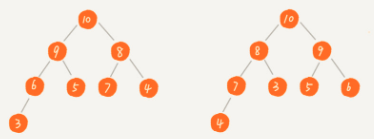

#### 最小堆
- 结点的键值大于等于其父结点的键值
- 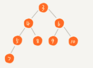

#### 已知父结点
- 一
  - 左孩子结点: 2 * 父结点 + 1
  - 右孩子结点: 2 * 父结点 + 2
- 二
  - 左孩子结点: 2 * 父结点
  - 右孩子结点: 2 * 父结点 + 1

#### 已知孩子结点
- 一
  - 父结点: 孩子结点 - 1 / 2
- 二
  - 父结点: 孩子结点 / 2

#### 堆化(heapify)
- 堆化实际上有两种，`从下往上` 和 `从上往下`
  - `从下往上`
    - 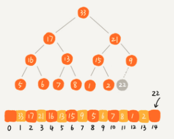
    - 就是顺着节点所在的路径，向上或者向下，对比，然后交换
    - 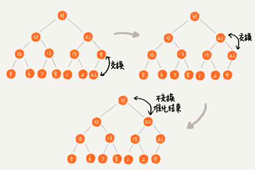
    - 让新插入的节点与父节点对比大小。如果不满足子节点小于等于父节点的大小关系，就互换两个节点
    - 一直重复这个过程，直到父子节点之间满足刚说的哪种大小关系
  - `从上往下`
    - 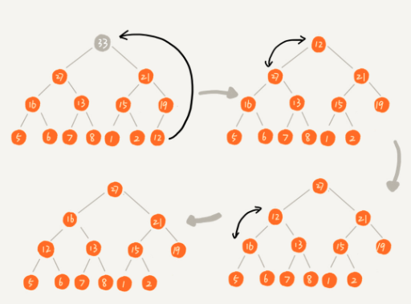
    - 把最后一个节点放到堆顶，然后利用同样的父子节点对比的方法
    - 对于不满足父子节点大小关系的，互换两个节点，并且重复进行这个过程，直到父子节点之间满足大小关系为止
  - 时间复杂度
    - 一个包含n个节点的完全二叉树，树的高度不会超过log2n
    - 堆化的过程是顺着节点所在路径比较的，所以堆化的时间复杂度跟树的高度成正比，也就是O(logn)
    - 插入数据和删除堆顶元素的主要逻辑是堆化，所以，往堆中插入一个元素和删除堆顶元素的时间复杂度都是O(logn)

#### 如何基于堆实现排序
- 时间复杂度: O(nlogn)
- 建堆
  - 堆排序是原地排序，不借助另一个数组，就在原数组上操作
  - 第一种，在堆中插入一个元素的思路
    - 通过`从下往上`的插入方式，把n个数据插入数组中，形成堆
  - 第二种，与第一种相反
    - 是从后往前处理数组，并且每个数据都是`从上往下`堆化
    - 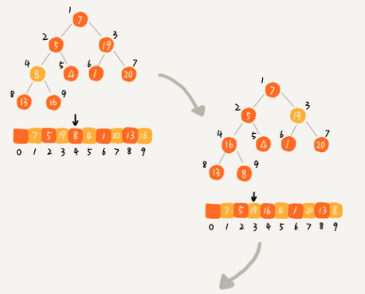
    - 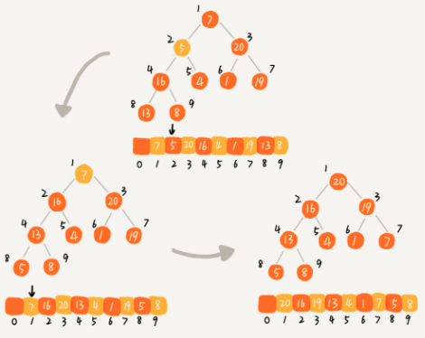
  - 代码实现
    - 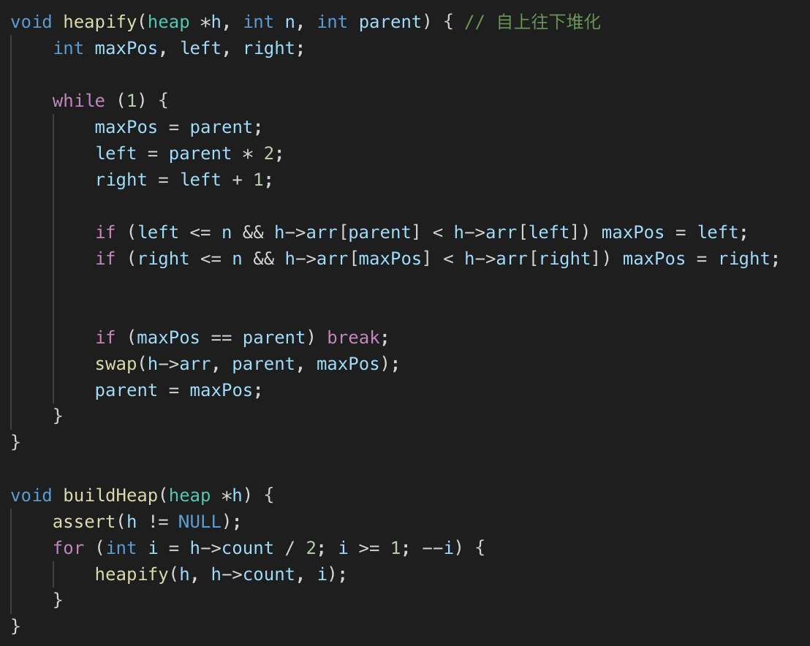
    - 这段代码里，从下标 n / 2 开始到1的数据进行堆化
    - 下标 n / 2 +1 到 n 的节点是叶子节点，必须要堆化
  - 时间复杂度
    - 每个节点堆化的时间复杂度是O(logn), 那么 n / 2 + 1的总时间复杂度是 O(nlogn)?
    - 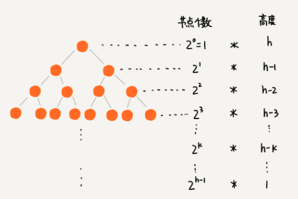
    - 求和公式
      - 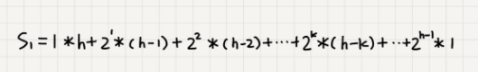
      - 求解
        - 把公式左右都乘以2，得S2， 然后 S2 - S1 = S
        - 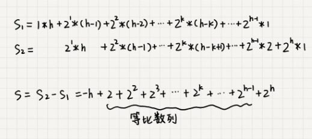
        - 求解等比数列
        - 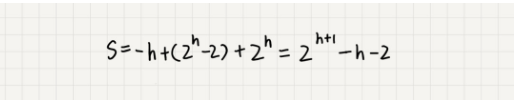
        - 因为 h = log2n ,代入公式S，得到S = O(n)
    - 所以，建堆时间复杂度为：O(n)
- 排序
  - 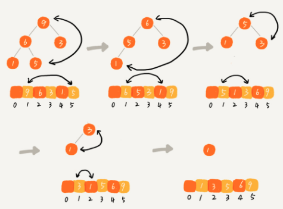
  - 时间复杂度
    - 整个堆排序的过程，都只需要极个别临时存储空间，所以堆排序是原地排序算法
    - 堆排序包括建堆和排序两个操作，建堆过程的时间复杂度是 O(n)，排序过程的时间复杂度是 O(nlogn)，所以，堆排序整体的时间复杂度是 O(nlogn)
    - 堆排序不是稳定的排序算法，因为在排序的过程，存在将堆的最后一个节点跟堆顶节点互换的操作，所以就有可能改变值相同数据的原始相对顺序