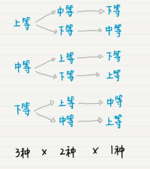
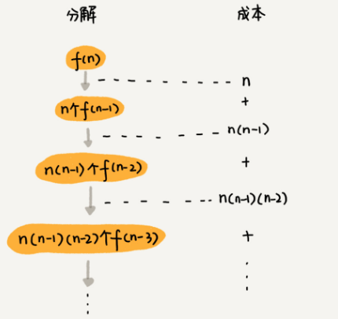

#### 排列
- 从 n 个不同的元素中取出 m (1 <= M <= n) 个不同的元素，按照一定的顺序排成一列，这个过程就作`排列`

#### 全排列
- 当 m = n 这种特殊情况出现时候，比如说，在田忌赛马的故事中，田忌的三匹马必须全部出战，这就是`全排列`(All Permutation)

#### 重复排列和不重复排列
- 如果选择出的这m个元素可以有重复的，这样的排列就是为了`重复排列`(Permutation with Repetition) ，否则就是`不重复排列`(Permutation without Repetition)
  - 

#### 全排列时间复杂度分析
- 比如 1， 2， 3，这样3个数据，有下面几种排列
    ```
    1, 2, 3
    1, 3, 2
    2, 1, 3
    2, 3, 1
    3, 1, 2
    3, 2, 1
    ```
- 递归实现
```
// 交换
void swap (int &a, int &b) {
    int temp;
    temp = a;
    a = b;
    b = temp;
}

// 全排列递归算法
void Perm(int list[], int k, int m)
{
    // list 数组存放排列的数，k表示层，代表第几个数，m表示数组的长度
    if (k == m) {
        // k == m 表示到达最后一个数，不能再交换，最终排列的数需要输出
        for (int i = 0; i <= m; i++) {
            cout << list[i] << " ";
        }
        cout << endl;
    } else {
        for (int i = k; i <= m; i++) {
            swap(list[i], list[k]);
            Perm(list, k + 1, m);
            swap(list[i], list[k]);
        }
    }
}

int main (void) {
    int a[] = {1, 2, 3, 4};
    int m = 3;
    Perm(a, 0, m);
}
```
- 时间复杂度
  - 
  - 第一层分解有n次交换操作
  - 第二层有n个节点，每个节点分解需要 n - 1次交换所以第二层总的交换次数是 n * (n - 1)
  - 第三层有 n * (n - 1) 个节点，每个节点需要分解需要 n - 2次交换，所以第三层总的交换次数是 n * (n - 1) * (n - 2)
  - 以此类推，第k层总的交换次数 n * (n - 1) * (n - 2) * .... * (n - k + 1)。最后一次交换次数就是 n * (n - 1) * (n - 2) * ... * 2 * 1。每一层交换次数之和就是总的交换次数
- 求和公式
  - n + n * (n - 1) + n * (n - 1) * (n - 2) + ... + n * (n - 1) * (n - 2) * ... * 2 * 1
  - 最后一个数 n * (n - 1) * (n - 2) * ... * 2 * 1等于 n!.而前面的 n - 1个数都小于最后一个数，所以，总和肯定小于 n * n!
  - 也就是说，全排列的递归算法的时间复杂度大于O(n!)，小于O(n * n!)