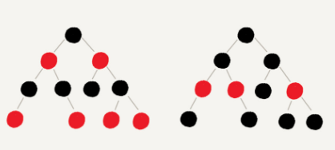
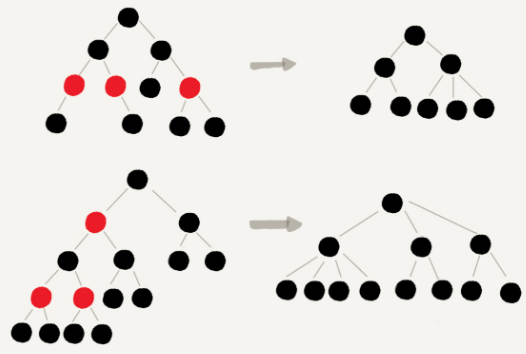

#### 红黑树
- 
- 特征
  - 根节点是黑色的
  - 每个叶子节点都是黑色的空节点(NIL), 也就是说，叶子节点不存储数据
  - 任何相邻的节点都不能同时为红色，也就是说，红色节点是被黑色节点隔开的
  - 每个节点，从该节点到达其可达叶子节点的所有路径，都包含相同数目的黑色节点

#### 为什么说红黑树是“近似平衡”的？
- `平衡`的意思可以等价为性能不退化
- `近似平衡`就是等价为性能不会退化太厉害
- 二叉查找树很多操作的性能都跟树的高度成正比。一颗极其平衡的二叉树(满二叉树或完全二叉树)的高度大约是log2n,所以，如果要证明红黑树是近似平衡的，只需要分析，红黑树的高度是否比较稳定地趋近log2n就好了
- 红黑树高度分析
  - 
  - 如果，把红色节点从红黑树中去掉，那单纯包含黑色节点的红黑树的高度是多少？
    - 红色节点删除之后，有些节点就没有父节点了，它们会直接拿这些节点的祖父节点(父节点的父节点)作为父节点。所以，之前的二叉树就会变成四叉树
    - 前面红黑树的定义有一条：`从任意节点到可达的叶子节点的每个路径包含相同数目的黑色节点`。从四叉树中取出某些节点，放到叶节点位置，四叉树就变成完全二叉树。所以，仅包含黑色节点的四叉树的高度，比包含相同节点个数的完全二叉的高度还要笑
    - 完全二叉树的高度近似log2n,这里的四叉“黑树”的高度要低于完全二叉树，所以去掉红色节点的“黑树”的高度也不会超过log2n
    - 原红黑树中。红色节点不能相邻，也就说，有一个红色节点就要至少有一个黑色节点，将它跟其他红色节点隔开。红色树中包含最多黑色节点的路径不会超过log2n,所以加入红色节点之后，最长路径不会超过2log2n也就是说`红黑树的高度近似2log2n`

#### 资料参考
- [红黑树(四)之 C++的实现](https://www.cnblogs.com/skywang12345/p/3624291.html)
- [五分钟搞定什么是红黑树](http://www.360doc.com/content/18/0904/19/25944647_783893127.shtml)
- [[Data Structure] 数据结构中各种树](https://www.cnblogs.com/maybe2030/p/4732377.html#_label4)
- [教你初步了解红黑树](https://blog.csdn.net/v_JULY_v/article/details/6105630)
- [经典算法研究系列：五、红黑树算法的实现与剖析](https://blog.csdn.net/v_JULY_v/article/details/6109153)
- [一步一图一代码，一定要让你真正彻底明白红黑树](https://blog.csdn.net/v_JULY_v/article/details/6124989)
- [清晰理解红黑树的演变---红黑的含义](https://www.cnblogs.com/tiancai/p/9072813.html)