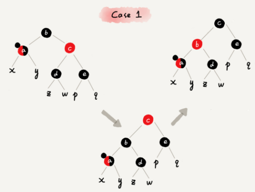

#### 红黑树
- 
- 特征
  - [1] `根节点是黑色的`
  - [2] `每个叶子节点都是黑色的空节点(NIL), 也就是说，叶子节点不存储数据`
  - [3] `任何相邻的节点都不能同时为红色，也就是说，红色节点是被黑色节点隔开的`
  - [4] `每个节点，从该节点到达其可达叶子节点的所有路径，都包含相同数目的黑色节点`

#### 为什么说红黑树是“近似平衡”的？
- `平衡`的意思可以等价为性能不退化
- `近似平衡`就是等价为性能不会退化太厉害
- 二叉查找树很多操作的性能都跟树的高度成正比
  - 一颗极其平衡的二叉树(满二叉树或完全二叉树)的高度大约是log2n
  - 所以，如果要证明红黑树是近似平衡的，只需要分析，红黑树的高度是否比较稳定地趋近log2n就好了
- 红黑树高度分析
  - 
  - 如果，把红色节点从红黑树中去掉，那单纯包含黑色节点的红黑树的高度是多少？
    - 红色节点删除之后，有些节点就没有父节点了，它们会直接拿这些节点的祖父节点(父节点的父节点)作为父节点。所以，之前的二叉树就会变成四叉树
    - 前面红黑树的定义有一条：`从任意节点到可达的叶子节点的每个路径包含相同数目的黑色节点`。从四叉树中取出某些节点，放到叶节点位置，四叉树就变成完全二叉树。所以，仅包含黑色节点的四叉树的高度，比包含相同节点个数的完全二叉的高度还要笑
    - 完全二叉树的高度近似log2n,这里的四叉“黑树”的高度要低于完全二叉树，所以去掉红色节点的“黑树”的高度也不会超过log2n
    - 原红黑树中。红色节点不能相邻，也就说，有一个红色节点就要至少有一个黑色节点，将它跟其他红色节点隔开。红色树中包含最多黑色节点的路径不会超过log2n,所以加入红色节点之后，最长路径不会超过2log2n也就是说`红黑树的高度近似2log2n`

#### 红黑树操作项
- 左旋(rotate left)
  - 左旋全称，围绕某个节点的左旋
  - 
  - `X的右子节点`成为`X的父节点`。也即X成为`左子节点`
- 右旋(rotate right)
  - 右旋全称，围绕某个节点的右旋
  - 
  - `X的左子节点`成为`X的父节点`。也即X成为`右子节点`
- 插入操作的平衡调整
  - 红黑树规定，插入的节点必须是红色。二叉查找树中新插入的节点都是放在叶子节点上
    - 如果插入节点的父节点是黑色，那什么都不用做，它仍然满足红黑树的定义
    - 如果插入的节点是根节点，那直接改变它的颜色，把它变成黑色
  - 如果存在违背红黑树的定义，就需要`左右旋转`和`改变颜色`做调整
  - 红黑树的平衡调整过程是一个迭代的过程
    - 把正在处理的节点叫做`关注节点`
    - `关注节点`会随着不停迭代处理，而不断发生变化。最开始的`关注节点`就是新插入的节点
  - 插入平衡调整策略
    - `CASE 1`: 如果关注节点a，它的叔叔节点d是红色
      - 
      - 操作策略
        - 将关注节点a的父节点b, 叔叔节点d的颜色都设置成黑色
        - 将关注节点a的祖父节点c设置成红色
        - 关注节点变成a的祖父节点c
        - 跳到`CASE 2` 或 `CASE 3`
      - 策略说明
        - a 和 b都是`红色`，违背了`特征[3]`. 把b设置成`黑色`以解决问题
        - b 从 `红色`变成了`黑色`，违背了`特征[4]`.所以要把c设置`红色`
        - 因为a,c都改变了颜色。导致 d节点分支的黑色节点总数减少了1，违背了`特征[4]`.所以d要变成`黑色`
    - `CASE 2`: 如果关注节点是a，它的叔叔节点d是黑色，关注节点a是其父节点b的右子节点
      - 
      - 操作策略
        - 关注节点变成节点a的父节点b
        - 围绕新的关注节点b左旋
        - 跳到`CASE 3`
      - 策略说明
        - 处理红黑树的核心思想：将`红色`的节点移到根节点，然后将根节点设为`黑色`
        - 所以要不断将破坏红黑树特性的红色节点上移。即通过左旋将a`上移`
        - 如果a变成了`根节点`，可以直接变`黑色`.如果不是根节点，就需要切换关注节为b
        - 处理问题准则
          - 需要从下至上(由叶到根)方向处理
          - 必须先解决`子节点`的问题，再解决`父节点`问题
    - `CASE 3`: 如果关注节点是a，它的叔叔节点d是黑色，关注节点a是其父节点b的子节点
      - 
      - 操作策略
        - 围绕关注节点a的祖父节点c右旋
        - 将关注节点a的父节点b，兄弟节点c的颜色互换
        - 调整结束
      - 策略说明
        - c从来看，因为 b 和 a都是`红色`,违背了`特征[4]`. 所以，以c为支点右旋
        -  b 和 a都是`红色`，违背了`特征[3]`. 所以 b 要变成`黑色`
        -  因为 b为黑色，导致 d节点分支的黑色节点总数加1.违背了特征`[4]`.设置c为红色
  - 删除平衡调整
    - 删除平衡调整分两步
      - 针对删除节点初步调整. 初步调整只是保证整棵红黑树在一个节点删除之后，仍能满足最后一条的定义要求，也就是`特征[4]`
      - 针对关注节点进行二次调整，让它满足`特征[3]`
    - 针对删除节点初步调整
      -  删除简述
        - 被删除节点没有儿子，即为叶节点。那么，直接将该节点删除就OK了
        - 被删除节点只有一个儿子。那么，直接删除该节点，并用该节点的唯一子节点顶替它的位置
        - 被删除节点有两个儿子
          - 先找出它的后继节点，然后把‘它的后继节点的内容’复制给‘该节点的内容’，之后，删除‘它的后继节点’
      - `CASE 1`: 如果要删除的节点是a, 它只有一个子节点b
        - 
        - 删除节点a，并且把节点替换到a的位置，这一部分操作跟普通的二叉查找树的删除操作一样
        - 节点a只能是`黑色`，节点b也只能是`红色`，其他情况均不符合红黑树的定义。这种情况下，我们把节点b改成`黑色`
        - 调整结束，不需要进行二次调整
      - `CASE 2`: 如果要删除的节点a有两个非空子节点，并且它的后继节点就是节点a的右子节点c
        - 
        - 如果节点a的后继节点就是右子节点c，那右子节点肯定没有左子树。我们把节点a删除，并且将节点c替换到节点a的位置。这一部分操作跟普通的二叉树的删除操作无异
        - 然后把节点c的颜色设置为跟节点a相同的颜色
        - 如果节点c是`黑色`，为了不违法红黑树的`特征[4]`,我们给节点c的右子节点d多加一个`黑色`，这个时候节点d就成了`“红 - 黑”` 或`"黑 - 黑"`
        - 这个时候，关注节点变成了节点d，第二步的调整操作就会针对关注节点来做
      - `CASE 3`: 如果要删除的是节点a，它有两个非空子节点，并且节点a的后继节点不是右子节点
        - 
        - 找到后继节点d，并将它删除，删除后继节点d的过程参照`CASE 1`
        - 将节点a替换成后继节点d
        - 把节点d的颜色设置为跟节点a相同的颜色
        - 如果节点d是`黑色`，为了不违法`特征[4]`,我们给节点d的右子节点c多加一个`黑色`，这个时候节点c就变成了`"红 - 黑"` 或者 `"黑 - 黑"`
        - 这个时候，关注节点变成了节点c，第二步的调整操作就会针对关注节点来做
    - 针对关注节点进行二次调整
      - 经过初步调整之后，关注节点变成了“红 - 黑” 或者 "黑 - 黑"
      - `CASE1`: 如果关注节点是a，它的兄弟节点c是红色
        - 
        - 围绕关注节点a的父节点b左旋
        - 关注节点a的父节点b和祖父节点c交换颜色
        - 关注节点不变
        - 继续从四种情况中选择合适的规则来调整
      - `CASE 2`: 如果关注节点是a，它的兄弟节点c是黑色，并且节点c的左右子节点d，e都是黑色
        - 
        - 将关注节点a的兄弟节点c的颜色变成`红色`
        - 从关注节点a中去掉一个`黑色`，这个时候节点a就是单纯的`红色`或者`黑色`
        - 给关注节点a的父节点b添加一个`黑色`，这个时候节点b就变成来`“红-黑”` 或者`"黑 - 黑"`
        - 关注节点从a变成其父节点b
        - 继续从四种情况中选择符合的规则来调整
      - `CASE 3`: 如果关注节点是a，它的兄弟节点c是黑色，c的左子节点d是红色，c的右子节点e是黑色
        - 
        - 围绕关注节点a的兄弟节点c右旋
        - 节点c和节点d交换颜色
        - 关注节点不变
        - 跳转到`CASE 4`,继续调整
      - `CASE 4`: 如果关注节点a的兄弟节点c是黑色，并且c的右子节点是红色的
        - 
        - 围绕关注节点a的父节点b左旋
        - 将关注节点a的兄弟节点c的颜色，跟关注节点a的父节点b设置成相同的颜色
        - 将关注节点a父节点b的颜色设置为`黑色`
        - 从关键节点a中去掉一个`黑色`，节点a变成单纯的`红色`或`黑色`
        - 将关注节点a的叔叔节点e设置为`黑色`
        - 调整结束

#### 资料参考
- [红黑树(四)之 C++的实现](https://www.cnblogs.com/skywang12345/p/3624291.html)
- [五分钟搞定什么是红黑树](http://www.360doc.com/content/18/0904/19/25944647_783893127.shtml)
- [[Data Structure] 数据结构中各种树](https://www.cnblogs.com/maybe2030/p/4732377.html#_label4)
- [教你初步了解红黑树](https://blog.csdn.net/v_JULY_v/article/details/6105630)
- [经典算法研究系列：五、红黑树算法的实现与剖析](https://blog.csdn.net/v_JULY_v/article/details/6109153)
- [一步一图一代码，一定要让你真正彻底明白红黑树](https://blog.csdn.net/v_JULY_v/article/details/6124989)
- [清晰理解红黑树的演变---红黑的含义](https://www.cnblogs.com/tiancai/p/9072813.html)
- [红黑树(一)之 原理和算法详细介绍](https://www.cnblogs.com/skywang12345/p/3245399.html)
- [从2-3树到 红黑树](https://blog.csdn.net/fei33423/article/details/79132930)
- [Red/Black Tree](https://www.cs.usfca.edu/~galles/visualization/RedBlack.html)