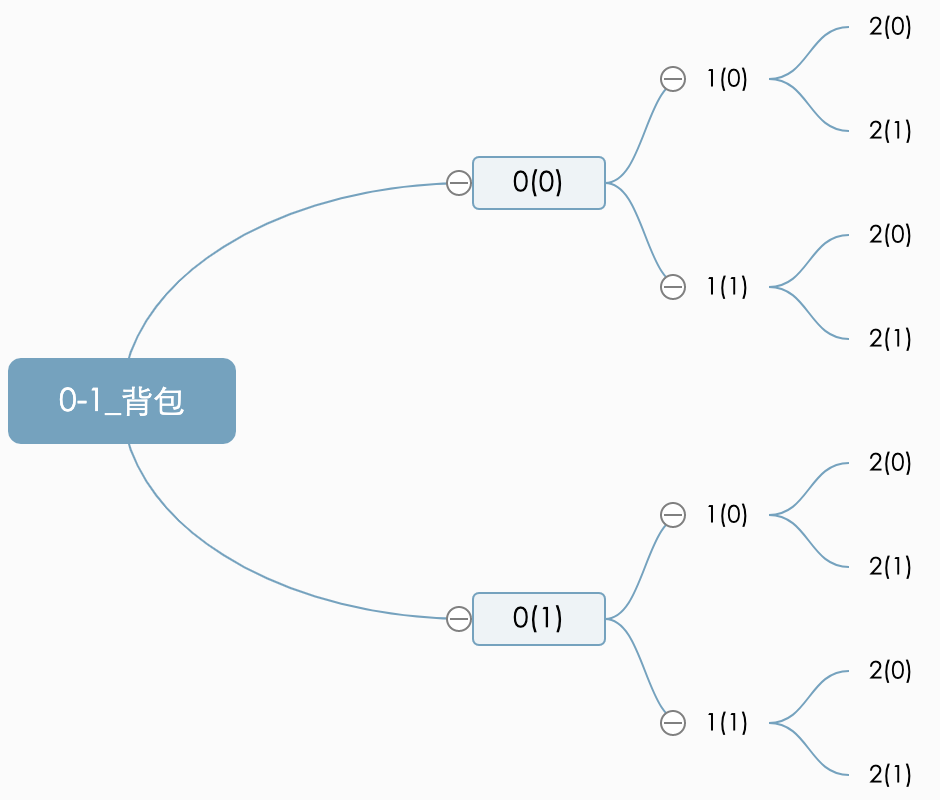
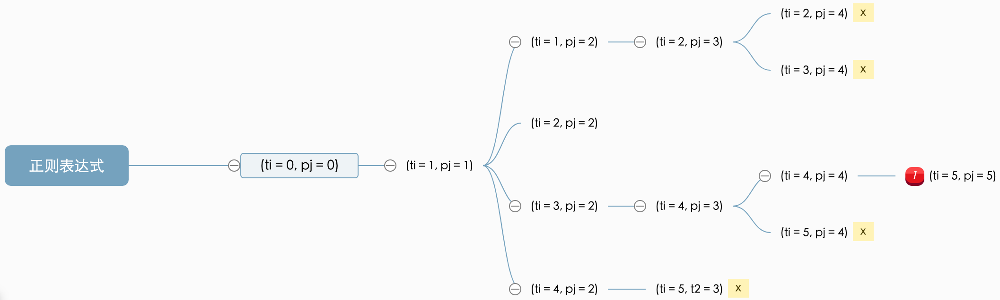
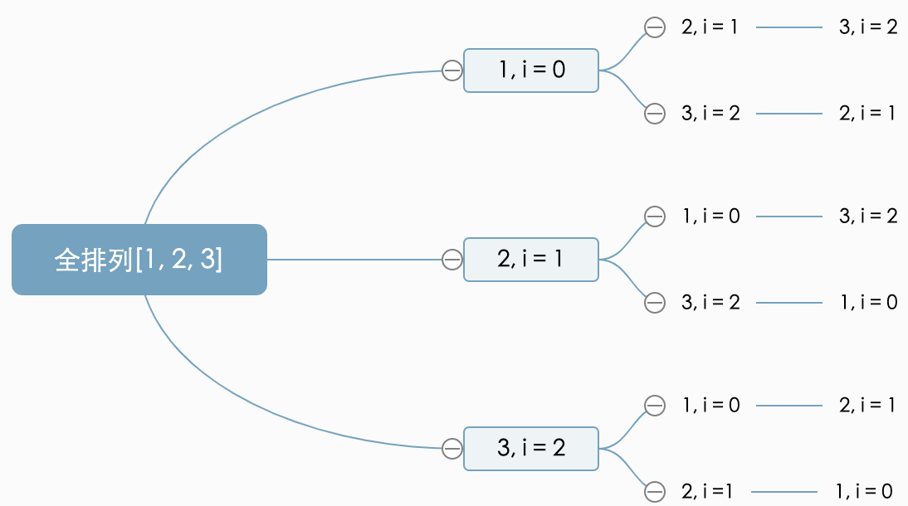

#### 回溯算法
- 核心思想
  - 类似于枚举搜索，枚举所有的解，找到满足期望的解
  - 为了有规律地枚举所有可能的解，避免遗漏和重复，把问题求解的过程分为多个阶段
  - 每个阶段，都会面对一个岔路口，先随意选一条路走，当发现路不同时候，就回退到上一个岔口，另选一种走法继续走
  - 递归是一种栈结果的形式，最后一个如栈的最先执行完，然后返回上一层栈桢继续执行

#### 0-1背包回溯法
- 以demo_0-1_bag_1.c为例子
- 回溯图
  - 
- 我们可以把物品依次排列，整个问题就分解为了n个阶段，每个阶段对应一个物品怎么选择
- 先对第一个物品进行处理，选择装进去或者不装进去，然后再递归处理剩下的物品
  
#### 正则表达式
- 以 demo_regular_expression_1.cpp, test_case_3为例子
- 回溯图
  - 

#### 全排列
- 以 demo_full_permutation_3.cpp 为例子
- 回溯图
  - 
#### 参考资料
- [漫画：什么是八皇后问题？](https://blog.csdn.net/bjweimengshu/article/details/79386101)