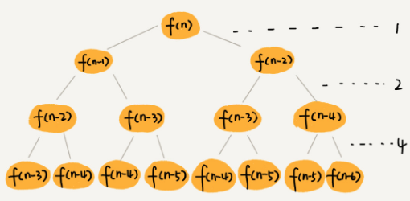

#### 斐波那契数列的时间复杂度
```
int f(int n) { 
    if (n == 1) return 1; 
    if (n == 2) return 2; 
    return f(n-1) + f(n-2);
}
```
- 时间复杂度
  - 
  - 递归树高度
    - f(n)分解为f(n - 1)和f(n - 2), 每次规模都是 -1 或者 -2，叶子节点的数据规模1 或者 2
    - 所以，从根节点走到叶子节点，每条路径是长短不一的，如果每次都是-1，那最长路径大约就是n，每次都是-2，那最短路径大约就是 n / 2
    - 每次分解之后的合并操作只需要一次加法运算，我们把这次加法运算的时间消耗记作1.所以，从上往下，第一层的总时间消耗是1，第二层的总时间消耗是2，第三层的总时间消耗就是 2 ^ 2,依次类推，第k层的时间消耗就是 2 ^ (k - 1),那整个算法的总的时间消耗就是每一层时间消耗之和
    - 如果路径长度都为n ,那这个总和就是 2 ^ n - 1
    - 如果路径长度都是 n / 2,那整个算法的总的时间消耗就是 2 ^ (n / 2) - 1
    - 所以，这个算法的时间复杂度就介于O(2 ^ n)和 O(n ^ (n / 2))