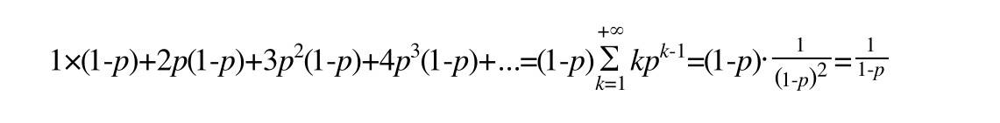

#### 跳表
- 基本实现
  - 每次插入数据的时候，随机产生的level，决定了新节点的层数
  - 数组update的作用，用于存储新节点所有层数上，各自的前一个节点的信息
  - 节点内的forwards数组，用以存储该节点所有层的下一节点的信息
  - 当所有节点的最大层数变量maxlevel = 1的时候，跳表退化成一个普通的链表
- 时间复杂度
  - 时间复杂度：O(logn)
  - 例子说明
    - 一
      - 如每两个结点抽出一个结点作为上级索引的结点，那么第一级索引的结点个数大约是 n / 2
      - 第二级索引的结点个数大约是 n / 4, 第三级索引的结点个数大约是 n / 8
      - 依此类推，也就说，第k级索引的结点个数是第 k - 1级索引的结点个数的 1 / 2， 那第k级索引结点的个数就是 n / (2 ^ k)
    - 二
      - 假设索引有h级，最高的索引有 2 个结点。通过上面的公式，我们可以得到 n / (2 ^ h) = 2, 从而求得 h = log2n -1
      - 如果包含原始链表这一层，整个跳表的高度就是 log2n
    - 三 : n / (2 ^ h) = 2求解
      - n / (2 ^ h) = 2
      - n = 2 ^ (h + 1)
      - log2n = h + 1
      - log2n - 1 = h
- 空间复杂度
  - 空间复杂度: O(n)
  - 例子说明
    - 原始链表大小为n，每2个结点抽1个，那第一级索引大约有 n / 2 个结点， 第二个索引大约有 n / 4个结点
    - 以此类推，每上升一级就减少一半，直到剩下2个结点
    - 如果我们把每层索引的结点数写出来，就是一个等比数列：n / 2, n / 4, n / 8, .... , 8, 4, 2
    - 这几级索引的结点总和就是 n/2+n/4+n/8…+8+4+2=n-2。所以，跳表的空间复杂度是 O(n)
#### randomlevel
- 流程演示
  -    
- 计算过程
  - 首先，每个节点肯定都有第1层指针（每个节点都在第1层链表里）
  - 如果一个节点有第i层(i>=1)指针（即节点已经在第1层到第i层链表中），那么它有第(i+1)层指针的概率为p
  - 节点最大的层数不允许超过一个最大值，记为MaxLevel
  - 伪代码
    ```
    // p = 1/4 , MaxLevel = 32
    randomLevel()
        level := 1
        // random()返回一个[0...1)的随机数
        while random() < p and level < MaxLevel do
            level := level + 1
        return level
    ``` 
  - 算法性能分析
    - 根据前面randomLevel()的伪码，我们很容易看出，产生越高的节点层数，概率越低.定量的分析如下
      - 节点层数至少为1。而大于1的节点层数，满足一个概率分布。
      - 节点层数恰好等于1的概率为1-p。
      - 节点层数大于等于2的概率为p，而节点层数恰好等于2的概率为p(1-p)。
      - 节点层数大于等于3的概率为p2，而节点层数恰好等于3的概率为p2(1-p)。
      - 节点层数大于等于4的概率为p3，而节点层数恰好等于4的概率为p3(1-p)。
    - 因此，一个节点的平均层数（也即包含的平均指针数目），计算如下
      -    
    - 现在很容易计算出：
      - 当p=1/2时，每个节点所包含的平均指针数目为2；
      - 当p=1/4时，每个节点所包含的平均指针数目为1.33。这也是Redis里的skiplist实现在空间上的开销。

#### 参考资料
- [Redis为什么用跳表而不用平衡树？](https://mp.weixin.qq.com/s?__biz=MzA4NTg1MjM0Mg==&mid=2657261425&idx=1&sn=d840079ea35875a8c8e02d9b3e44cf95&scene=21#wechat_redirect)
- [Redis源码学习之跳表](https://cloud.tencent.com/developer/article/1353762)