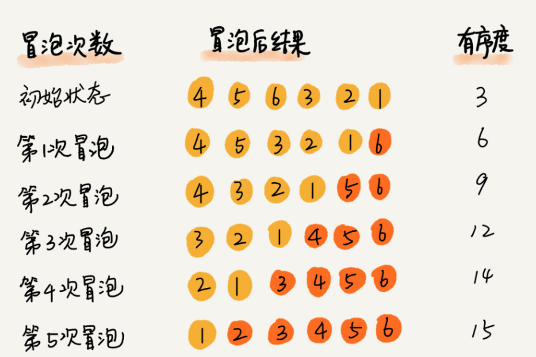

#### 冒泡排序(Bubble Sort)
```
int bubbleSort(int A[], int N) {
    int sw = 0;
    bool flag = 1;
    for (int i = 0; flag; i++) {
        flag = 0;
        for (int j = N - 1; j >= i + 1; j--) {
            if (A[j] < A[j - 1]) {
                // 交换相邻的元素
                swap(A[j], A[j - 1]);
                flag = 1;
                sw++;
            }
        }
    }
    return sw;
}
```
- 冒泡排序是原地排序吗？
  - 是的。并没有花费额外的内存空间去存储数据
  - 它只涉及相邻数据的交换
- 冒泡排序是稳定算法吗?
  - 是的。数据相等时候并进行交换
- 冒泡排序的时间复杂度?
  - 最好时间复杂度: O(n)
  - 最坏时间复杂度: O(n ^ 2)
  - 平均时间复杂度:
    - 以要排序的数组[4, 5, 6, 3, 2, 1] 为例子
    - 其中有序对为(4, 6) (4, 6) (5, 6). 初始有序度为 3, 满有序度: 15, 逆有序度(交换次数): 12
    - 
    - 最坏情况，初始有序度为0, 交换次数为 n * (n - 1) / 2
    - 最好情况，初始有序度为n * (n - 1) / 2，交换次数: 0
    - 平均情况, 取中间值 n * (n - 1) / 4, 交换次数就是 n * (n - 1) / 4. 所有时间复杂度 O(n ^ 2)