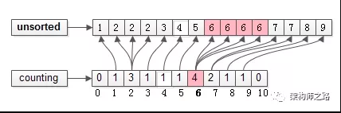

#### 计数排序
##### 原理
- 根据数据范围，分成若干个数据段的桶，通过遍历数据放到对应的桶中
- 每个桶里都进行快排或归并
##### 时间复杂度
- 最好O(n)，最坏O(nlogn),平均O(n)
- 当待排序元素个数很多，但值域范围很窄时，计数排序是很节省空间的
  
##### 空间复杂度
- 计数排序需要一个辅助空间，空间大小为O(MAX - MIN), 用来存储所有元素出现次数("计数")
- 计算排序的核心，空间换时间
- 空间复杂度为: O(n)
##### 稳定性
- 稳定，只要整理最后结果时，从后开始遍历即可
##### 适用场景
- 数据范围不大，如年龄排序

##### 例子([来源](https://mp.weixin.qq.com/s/KU-AUGOnLeRtE_hivl2uSA))
- 假设待排序的数组
  - arr = {5, 3, 7, 1, 8, 2, 9, 4, 7, 2, 6, 6, 2, 6, 6}
  - 很容易发现，待排序的元素在[0, 10]之间，可以用counting[0, 10]来存储计数
- 第一步：统计计数
  - 
  - 扫描未排序的数组arr[N], 对每个出现的元素进行计数
  - 扫描完毕后，计数数组 counting[0, 10]会变成上图中的样子，如粉红示意，6这个元素在arr[N]中出现了4次，在counting[0, 10]中，下标为6的位置计数是4
- 第二步：还原数组
  - 
  - 扫描计数数组counting[0, 10], 通过每个元素的计数，还原arr[N]
  - 如上图粉红色示意，count[0, 10]下标为6的位置计数4，排完序是4个连续的6
  - 从counting 下标MIN到MAX，逐个还原，填满arr[N]时，排序结束
