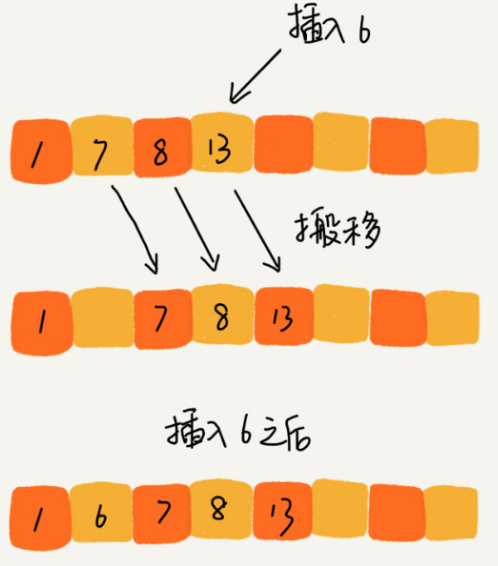
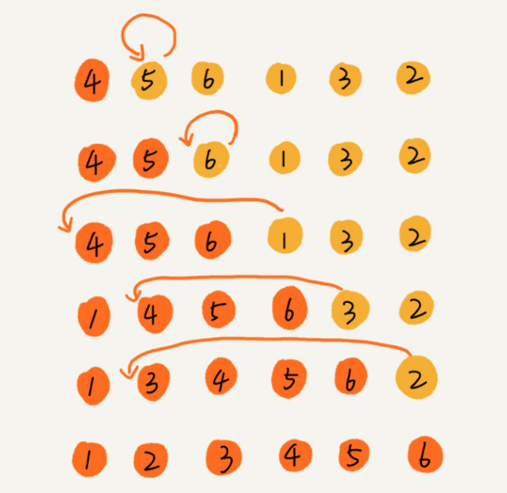
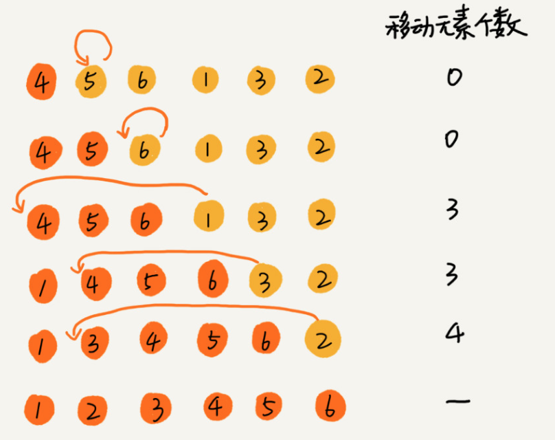

#### 插入排序(Insertion Sort)
- 插入排序算法说明
  - 
  - 把数据分为两个区间, `已排序区间` 和 `未排序区间`
  - 初始已排序区间只有一个元素，就是数组的第一个元素
  - 插入算法的核心思想
    - 取未排序区间中的元素，在已排序的区间中找到合适测插入位置将其插
    - 并保证已排序区间的数据一直是有序的。重复这个过程，直到未排序区间中元素为空，算法结束
- 以 数组[4, 5, 6, 1, 3, 2]为例
  - 
  - 左侧为`已排序区间`, 右边为`未排序区间`
  - 插入排序基本操作
    - `元素的比较` 和 `元素的移动`
    - 解释
      - 若将一个数据a，插入到已排序的区间，需要a与已排序区间一一比较大小来找到合适的插入点
      - 找到插入点之后，还需要将插入点的元素顺序往后移动一位，这样才有位置给a插入
  - 移动次数(逆序度)
    - 
    - 满有序度: n * (n - 1) / 2 = 15
    - 初始有序度: 5
    - 逆序度: 10
    - 所以数据移动的最终次数：3 + 3 + 4 = 10
- 插入排序是原地排序算法吗?
  - 是的。并未使用额外的内存空间
- 插入排序是稳定的排序算法吗?
  - 是的。对于值相同的元素，会选择后面出现的元素，插入到前面出现元素的后面，这样就会保持原有前后顺序不变
- 插入排序的时间复杂度?
  - 最好时间: O(n)
  - 最坏时间: O(n ^ 2)
  - 平均时间: O(n ^ 2)
- 为什么插入排序比冒泡排序受欢迎?
  - 因为，冒泡排序的数据交换过程比插入排序复杂。冒泡排序需要3个赋值操作，插入排序只需要一个