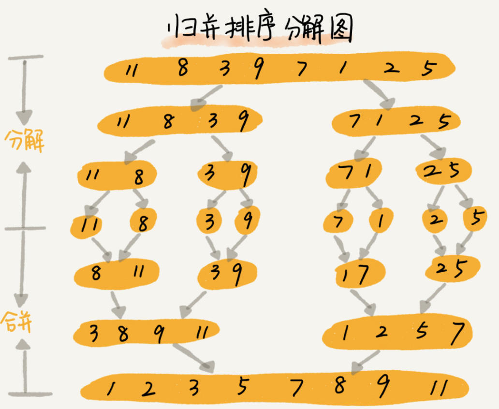

#### 归并排序(Merge Sort)
- 概述
  - 
  - 归并排序使用的就是`分治思想`
  - 简而言之，就是`分而治之`，将一个大问题分解成小的子问题来解决
  - 小的问题解决了，大问题也就解决了
- 递推公式
    ```
    递推公式：merge_sort(p…r) = merge(merge_sort(p…q), merge_sort(q+1…r))
    终止条件：p >= r 不用再继续分解
    ```
    - merge_sort(p…r) 表示，给下标从 p 到 r 之间的数组排序
      - 将这个问题排序问题转化为了两个子问题，merge_sort(p...q)和merge_sort(q + 1 ... r)
      - 其下标q等于p和r的中间位置，也就是(p + r) / 2
      - 当下标从p到q和从 q + 1到r这两个子数组都排好序之后，再将两个有序的子数组合并在一起，这样下标从p到r之间的数据就也排好序了
- 数据比较和移动
  - 
  - 申请一个临时数组tmp, 大小与A[p...r]相同，可以用两个游标i 和 j,分别指向A[p...r]和A[q+1...r]的第一个元素
  - 比较这两个元素A[i]和A[j],如果A[i] <= A[j],就把A[i]放入tmp,并且i后移一位
  - 否则将A[j]放入到数组tmp, j 后移一位
  - 继续上述过程。直到其中一个子数组中的所有数据都放入临时数组中，再把另一个数组中数据依次假如到临时数组的末尾
  - 这个时候，临时数组中存储的就是两个子数组合并之后的结果
  - 最后再把临时数组tmp中的数组拷贝到原数组A[p...r]中
- 归并排序是稳定的排序算法吗？
  - 是。合并过程中，如果A[p...q]和[q+1...r]之间有相同的值，先把A[p...q]中的元素放入tmp数组
  - 这样就保证了值相同的元素，在合并前后的先后顺序不变
- 归并排序是原地排序算法吗？
  - 不是。空间复杂度：O(n)
  - 因为合并函数无法原地执行, 每次合并操作都需要申请额外的内存空间
- 归并排序的时间复杂度？
  -  在递归那一节说过，递归的适用场景是，一个问题a可以分解为多子问题a,b,c，那求解问题a就可以分解问题b，c
  -  问题b，c解决之后，我们再把b, c的结果合并成a的结果
  -  如果我们定义求解问题a的时间是T(a),求解问题b,c的时间分别是T(b), T(c)，那我们就可以得到这样的递推关系式
        ```
        T(a) = T(b) + T(c) + K
        ```
       - 其中K等于将两个子问题b, c的结果合并成问题a的结果所消耗的时间

  - 从刚刚的分析，我们可以得到一个重要的结论：不仅递归求解的问题可以写成递推公式，递归代码的时间复杂度也可以写成递推公式
  - 套用这个公式，我们来分析一下归并排序的时间复杂度
  - 我们假设n个元素进行归并排序需要的时间是T(n)，那分解成两个子数组排序时间都是T(n/2)
  - 我们知道，merege()函数合并两个有序子数组的时间复杂度O(n)
  - 所以，套用前面的公式，归并排序的时间复杂度的计算公式就是
        ```
        T(1) = C；   n=1 时，只需要常量级的执行时间，所以表示为 C。
        T(n) = 2*T(n/2) + n； n>1
        ```
      - 通过这个公式，如何来求解T(n)呢？还不够直观？那我们再进一步分解计算过程
        ```
        T(n) = 2*T(n/2) + n
            = 2*(2*T(n/4) + n/2) + n = 4*T(n/4) + 2*n
            = 4*(2*T(n/8) + n/4) + 2*n = 8*T(n/8) + 3*n
            = 8*(2*T(n/16) + n/8) + 3*n = 16*T(n/16) + 4*n
            ......
            = 2^k * T(n/2^k) + k * n
            ......
        ```
      - 通过这样一步一步分解推导，我们可以得到T(n) = 2^k * T(n/2^k) + k * n
      - 当 T(n/2^k) = T(1)时，也就是 n/2^k = 1, 我们得到 k = log2n
      - 我们将k值代入上面的公式，得到T(n) = Cn + nlog2n
      - 如果我们用大O标记法来表示的话,T(n)就等于O(nlogn)
      - 所以归并排序的时间复杂度是O(nlogn)