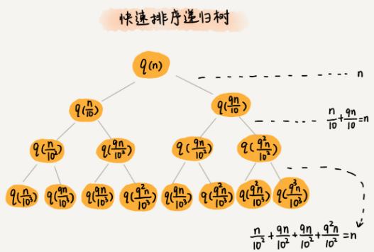
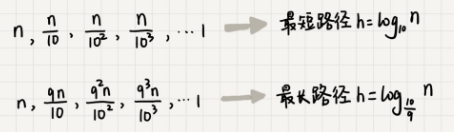

#### 快速排序一般情况下时间复杂度分析
- 假设平均情况下，每次分区之后，两个分区的大小比例1 : k
  - 当 k = 9时，用递推公式的方法来求解时间复杂度的话,递推公式就写成T(n) = T(n / 10) + T(9n / 10) + n
  - 使用递归树来分析
    - 
    - 每次分区都很不平均，一个分区是另一个分区的9倍
    - 每次分区都要遍历待分区区间的所有数据，所以，每一层分区操作所遍历的数据的个数之和就是n
    - 现在只要求出递归树的高度h，这个快排过程遍历的数据个数就是 h * n, 也就是说，时间复杂度就是O(h * n)
    - 快速排序结束的条件就是待排序的小区间，大小为1，也就是叶子节点数据规模是1
    - 从根节点n到叶子节点1，递归树最短的一个路径每次都乘以1 / 10， 最长的一个路径每次都乘以 9 / 10
    - 通过计算，从根节点到叶子节点的最短路径是 1og10n, 最长的路径是log(10/9)n
      - 
      - 遍历数据的个数总和就介于nlog10n 和 nlog(10/9)n之间
      - 所以，当分区大小比例是 1:9,快排时间复杂度仍然是O(nlogn)
  - k = 99的情况
    - 树的最短路径就是log100n ，最长路径是log(100/99)n,所以总遍历数据个数介于nlog100n和nlog(100/99)n之间