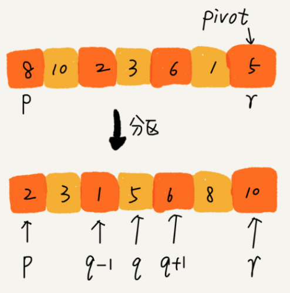
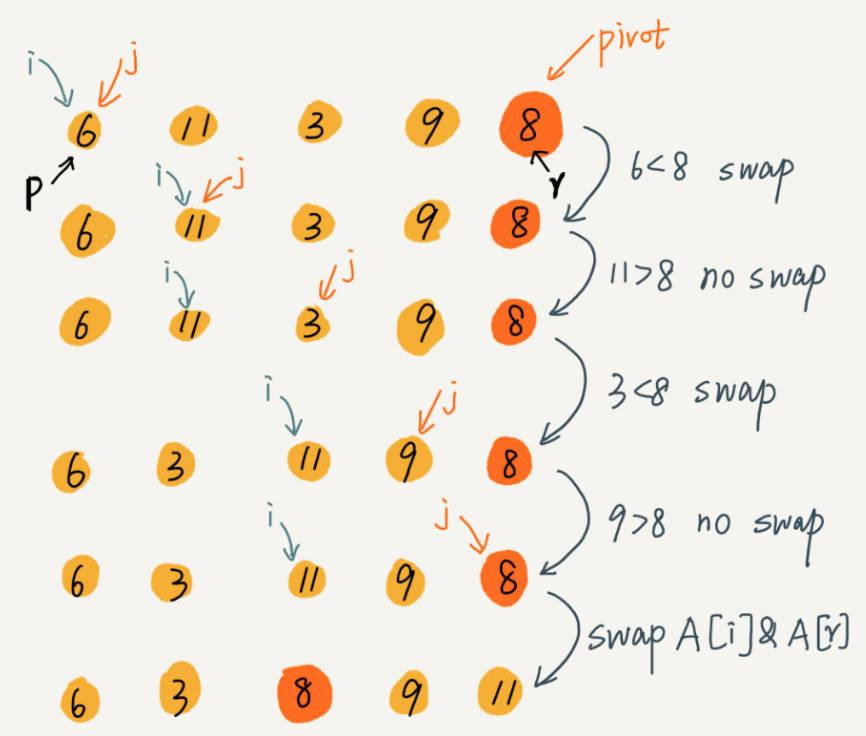
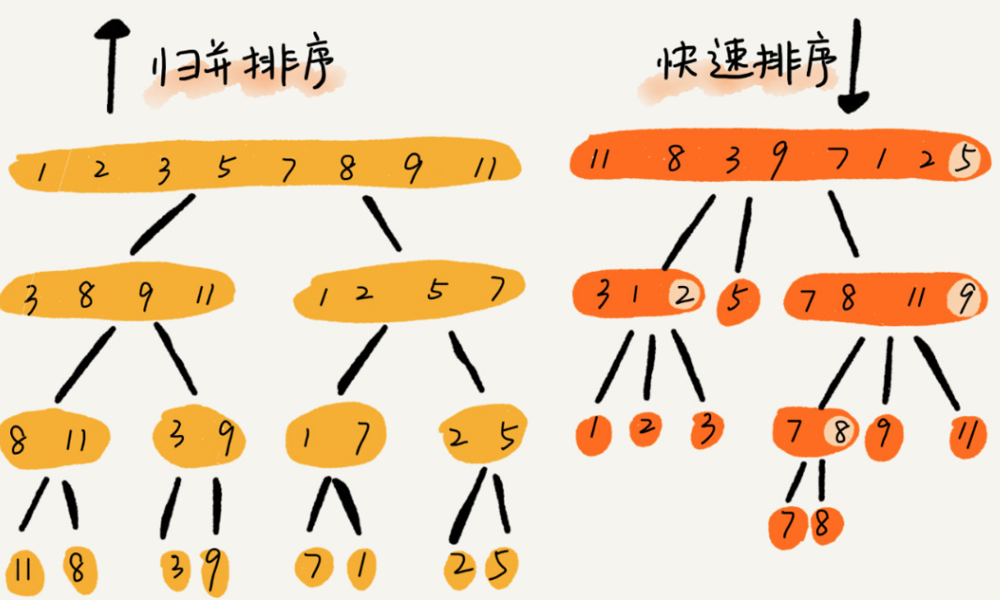

#### 快速排序(Quick Sort)
- 快速排序如何体现分区分治思想
  - 快速排序的思想，选择一个基准元素，比基准元素大的放到基准元素后面，比基准元素小的放在基准元素前，这就叫做分区
  - 
    - 如在要排序数组中下标从p到r之间的一组数据，选择p到r之间的任意一个数据作为pivot(`分区点`)
    - 遍历p到r之间的数据，将小于pivot的放到左边，将大于pivot的放到右边，将pivot放到中间
    - 每次分区都使得一个元素有序，进行多次分区后(直到区间缩小为1)，数组就是有序数组
    - 
  - 分治的思想体现
    - 把大问题分解成小问题(每次使得一位元素有序，分区操作可以做到)
    - 解决小问题(进行分区操作，每次使得一位元素有序)
    - 所有子问题解决了那么最大的问题也解决了
- 归并排序和快速排序的区别
  - 
  - 归并排序的处理过程是`由下而上`，先处理子问题，然后合并
  - 快速排序的处理过程是`由上而下`, 先分区，然后再处理子问题
- 快速排序是稳定的排序算法吗？
  - 是的。两个相等的值没有进行处理
- 快速排序是原地排序吗？
  - 是的。因为使用分区函数，设置了分区点。没有使用额外的内存空间
- 快速排序的时间复杂度？
  - 快排也是用递归实现的。对于递归代码的时间复杂度，前面总结的公式，这里也是适用的
  - 如果每次分区操作，都能正好把数组分成大小接近相等的两个小区间，那快排的时间复杂度递归求解公式跟归并排序是相同的，所以快排的时间复杂度也是O(nlogn)
    ```
    T(1) = C；   n=1 时，只需要常量级的执行时间，所以表示为 C。
    T(n) = 2*T(n/2) + n； n>1
    ```
  - 但是，公式成立的前提是每次分区操作，我们选择的pivot都很合适，正好能将大区间对等地一分为二。但实际这种情况是很难实现的
  - 举一个极端的例子。如果数组中的数据原来已经是有序的，比如1，3，5，6，8。
  - 如果我们每次选择最后一个元素作为pivot，那每次分区得到的两个区间都是不均等的
  - 我们需要进行大约n次分区操作，才能完成快排的整个过程。每次分区我们平均要扫描大约n / 2个元素，这种情况下，快排的时间复杂度就从O(nlogn)退化成了O(n ^ 2)
  - 我们刚刚讲了两个极端下的时间复杂度，一个是分区及其均衡，一个是分区极其不均衡。它们分别对应快排的最好时间复杂度和最坏情况时间复杂度。那快排的平均情况时间是多少呢？
    - 我们假设每次分区操作都将分区分成大小为9:1的两个小分区。我们继续套用递归时间复杂度的递推公式，就会变成这样
      ```
      T(1) = C；   n=1 时，只需要常量级的执行时间，所以表示为 C。

      T(n) = T(n/10) + T(9*n/10) + n； n>1
      ```

- 快速排序一般情况下时间复杂度分析
  - 假设平均情况下，每次分区之后，两个分区的大小比例1 : k
    - 当 k = 9时，用递推公式的方法来求解时间复杂度的话,递推公式就写成T(n) = T(n / 10) + T(9n / 10) + n
    - 使用递归树来分析
      - 
      - 每次分区都很不平均，一个分区是另一个分区的9倍
      - 每次分区都要遍历待分区区间的所有数据，所以，每一层分区操作所遍历的数据的个数之和就是n
      - 现在只要求出递归树的高度h，这个快排过程遍历的数据个数就是 h * n, 也就是说，时间复杂度就是O(h * n)
      - 快速排序结束的条件就是待排序的小区间，大小为1，也就是叶子节点数据规模是1
      - 从根节点n到叶子节点1，递归树最短的一个路径每次都乘以1 / 10， 最长的一个路径每次都乘以 9 / 10
      - 通过计算，从根节点到叶子节点的最短路径是 1og10n, 最长的路径是log(10/9)n
        - 
        - 遍历数据的个数总和就介于nlog10n 和 nlog(10/9)n之间
        - 所以，当分区大小比例是 1:9,快排时间复杂度仍然是O(nlogn)
    - k = 99的情况
      - 树的最短路径就是log100n ，最长路径是log(100/99)n,所以总遍历数据个数介于nlog100n和nlog(100/99)n之间