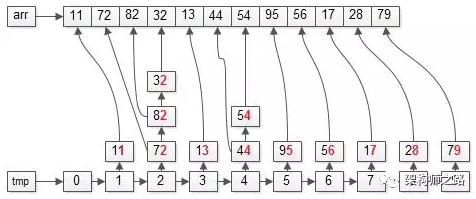
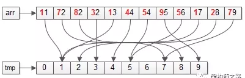
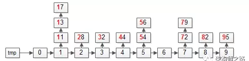

#### 基数排序
##### 原理
- 对数据的每一位进行桶排序或计数排序，对每位排序后结果就是有序的
##### 时间复杂度
-  时间复杂度: 最好O(n)，最坏O(nlogn),平均O(n)
-  基数排序对要排序的数据是有要求的，需要可以分割出独立“位”来比较，而且，位之间有递进关系，如果a数据的高位比b数据大，那剩下的低位就不用比较来。
-  除以之外，每一位的数据访问不能太大，要可以用线性排序算法来排序，否则，基数排序的时间复杂度就无法做到O(n)
##### 空间复杂度
- 空间复杂度: O(n)
##### 稳定性
- 稳定。否则就排不成
##### 适用场景
- 是在桶排序和计数排序基础上进行的，保证每位数据范围不大，并且位数也不是很多

##### 例子([来源](https://mp.weixin.qq.com/s?__biz=MjM5ODYxMDA5OQ==&mid=2651961634&idx=1&sn=1e9617d6f6bd2790eabedca22ea49879&chksm=bd2d0cfe8a5a85e8dd52dd0453abe7118932f3dd0068682c6829c37d69e197acfe0efff051e7&scene=21#wechat_redirect))
- 假设待排序的数组arr={72, 11, 82, 32, 44, 13, 17, 95, 54, 28, 79, 56}
  - 
- 基数排序的两个关键点
  - 基：被排序的元素的“个位”，“十位”， “百位”，暂且叫“基”。例子中“基”的个数是2（个位和十位）
  - 桶：”基“的每一位，都有一个取值范围，例子中”基“的取值反问是0-9共10种，所有需要10个桶(bucket)，来存放被排序的元素
- 基数排序的算法步骤为
    ```
    FOR (每一个基) {
    // 循环内
    第一步：遍历数据arr，将元素放入对应的桶bucket
    第二步：遍历桶bucket，将元素放回数据集arr
    }
    ```
- 更具体，对应上面的例子，“基”有个位和十位，所以，FOR循环会执行两次
  - 第一次：以“个位”为依据
    -    
    - 第一步，遍历数据集arr，将元素放入对应的桶bucket
      - 
      - 操作完成之后，各个桶会变成上面这个样子，即：个数相同的元素，会在一个桶里
    - 第二步：遍历桶bucket，将元素放回数据集arr
      - 
      - 操作完成之后，数据集会变成上面这个样子：即：整体按照个数排序
  - 第二次： 以“十位”为依据
    - 
    - 第一步：依然遍历数据集arr，将元素放入对应的桶bucket
      - 
      - 操作完成之后，各个桶会变成上面这个样子：即：十位数相同的元素，会在同一个桶里
    - 第二步：依然遍历桶bucket，将元素放回数据集arr
      - 
      - 操作完成之后，数据集会变成上面这个样子，即：整体按照十位数也排序里
- 首次按照个位从小到大，第二个按照十位从小到大，即：排序结束