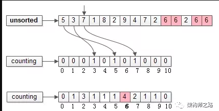
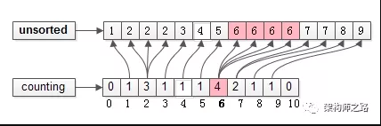
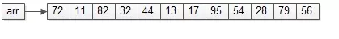
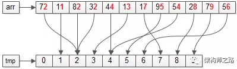
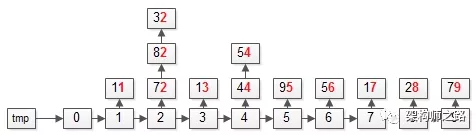
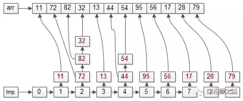
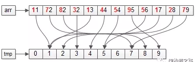
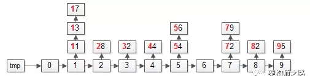
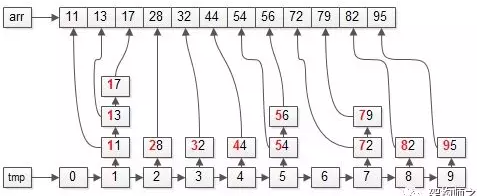

#### 有序度
- 有序度是数组中具有有序关系的元素对的个数
- 数学表达式：有序元素对：a[i] <= a[j], 如果 i < j
- 例子
  - 一个数据. 2, 4, 3, 1, 5, 6
  - 这组数据的有序度为11， 因其有序元素对为11 个
    - (2, 4), (2, 3), (2, 5), (2, 6)
    - (4, 5), (4, 5), (3, 5), (3, 6)
    - (1, 5), (1, 6), (5, 6)
#### 满有序度
- 同理，对于一个倒序排列的数组，比如 6, 5, 4, 3, 2, 1 有序度为0
- 对于一个完全有序的数组，比如1, 2, 3, 4, 5, 6 有序度就是 (n * (n - 1)) / 2， 就是15
#### 逆序度
- 逆序度的定义正好跟有序度相反(默认从小到大排序)
- 逆序元素对：a[i] > a[j], 如果 i < j
- 公式： 逆序对：= 满有序度 - 有序度
#### 链表排序注意点
- 一般而言，考虑只能改变节点位置，冒泡排序相比于数据实现，比较次数一致，但交换时操作更复杂
- 插入排序，不需要再有后移操作，找到位置直接插入，但排序完毕后可能需要倒置链表
- 选择排序比较次数一致，交换操作同样比较麻烦
- 综上，时间复杂度和空间复杂度并无明显变化，若追求极致性能，冒泡排序的时间复杂度系数会变大，插入排序系统会减小，选择排序无明显变化

#### 归并排序
##### 时间复杂度
-  在递归那一节说过，递归的适用场景是，一个问题a可以分解为多子问题a,b,c，那求解问题a就可以分解问题b，c
-  问题b，c解决之后，我们再把b, c的结果合并成a的结果
-  如果我们定义求解问题a的时间是T(a),求解问题b,c的时间分别是T(b), T(c)，那我们就可以得到这样的递推关系式
    ```
    T(a) = T(b) + T(c) + K
    ```
    - 其中K等于将两个子问题b, c的结果合并成问题a的结果所消耗的时间

- 从刚刚的分析，我们可以得到一个重要的结论：不仅递归求解的问题可以写成递推公式，递归代码的时间复杂度也可以写成递推公式
- 套用这个公式，我们来分析一下归并排序的时间复杂度
- 我们假设n个元素进行归并排序需要的时间是T(n)，那分解成两个子数组排序时间都是T(n/2)
- 我们知道，merege()函数合并两个有序子数组的时间复杂度O(n)
- 所以，套用前面的公式，归并排序的时间复杂度的计算公式就是
    ```
    T(1) = C；   n=1 时，只需要常量级的执行时间，所以表示为 C。
    T(n) = 2*T(n/2) + n； n>1
    ```
    - 通过这个公式，如何来求解T(n)呢？还不够直观？那我们再进一步分解计算过程
    ```
    T(n) = 2*T(n/2) + n
        = 2*(2*T(n/4) + n/2) + n = 4*T(n/4) + 2*n
        = 4*(2*T(n/8) + n/4) + 2*n = 8*T(n/8) + 3*n
        = 8*(2*T(n/16) + n/8) + 3*n = 16*T(n/16) + 4*n
        ......
        = 2^k * T(n/2^k) + k * n
        ......
    ```
    - 通过这样一步一步分解推导，我们可以得到T(n) = 2^k * T(n/2^k) + k * n
    - 当 T(n/2^k) = T(1)时，也就是 n/2^k = 1, 我们得到 k=log2n
    - 我们将k值代入上面的公式，得到T(n)=Cn+nlog2n
    - 如果我们用大O标记法来表示的话,T(n)就等于O(nlogn)
    - 所以归并排序的时间复杂度是O(nlogn)

#### 快速排序
##### 时间复杂度
- 快排也是用递归实现的。对于递归代码的时间复杂度，前面总结的公式，这里也是适用的
- 如果每次分区操作，都能正好把数组分成大小接近相等的两个小区间，那快排的时间复杂度递归求解公式跟归并排序是相同的，所以快排的时间复杂度也是O(nlogn)
    ```
    T(1) = C；   n=1 时，只需要常量级的执行时间，所以表示为 C。
    T(n) = 2*T(n/2) + n； n>1
    ```
- 但是，公式成立的前提是每次分区操作，我们选择的pivot都很合适，正好能将大区间对等地一分为二。但实际这种情况是很难实现的
- 举一个极端的例子。如果数组中的数据原来已经是有序的，比如1，3，5，6，8。
- 如果我们每次选择最后一个元素作为pivot，那每次分区得到的两个区间都是不均等的
- 我们需要进行大约n次分区操作，才能完成快排的整个过程。每次分区我们平均要扫描大约n / 2个元素，这种情况下，快排的时间复杂度就从O(nlogn)退化成了O(n ^ 2)
- 我们刚刚讲了两个极端下的时间复杂度，一个是分区及其均衡，一个是分区极其不均衡。它们分别对应快排的最好时间复杂度和最坏情况时间复杂度。那快排的平均情况时间是多少呢？
  - 我们假设每次分区操作都将分区分成大小为9:1的两个小分区。我们继续套用递归时间复杂度的递推公式，就会变成这样
    ```
    T(1) = C；   n=1 时，只需要常量级的执行时间，所以表示为 C。

    T(n) = T(n/10) + T(9*n/10) + n； n>1
    ```

#### 桶排序
##### 原理
- 根据数据范围，分成若干个数据段，通过遍历数据放到对应的桶中
- 每个桶都进行快排或归并
##### 时间复杂度
- 时间复杂度解释
  - 如果排序的数据  有n个，我们把它们均匀地划分到m个桶内，每个桶里就有 k = n / m 个元素 
  - 每个桶内使用快速排序，时间复杂度为 O(k * logk)
  - m 个桶排序的时间复杂度就是 O(m * k * logk)，因为 k = n / m, 所以整个桶排序的时间复杂度就是 O(n *log(n / m))
  - 当桶的个数m接近数据个数n时，log(n / m)就是一个非常小的常量，这个时候桶排序的时间复杂度接近O(n)
- 最好O(n), 最坏o(nlogn), 平均O(n)， 一般桶分越细越多复杂度就会越好
##### 空间复杂度
- 空间复杂度：O(n)
##### 稳定性
- 取决于每个桶的排序方式，快排就不稳定，归并就稳定
##### 适用场景
- 数据范围不大，内存紧张的情况。如磁盘的读写可以分成多个小文件并对小文件排序
- 然后直接写到大文件里，这个时候，内存消耗不再是O(n)


#### 计数排序
##### 原理
- 根据数据范围，分成若干个数据段的桶，通过遍历数据放到对应的桶中
- 每个桶里都进行快排或归并
##### 时间复杂度
- 最好O(n)，最坏O(nlogn),平均O(n)
- 当待排序元素个数很多，但值域范围很窄时，计数排序是很节省空间的
  
##### 空间复杂度
- 计数排序需要一个辅助空间，空间大小为O(MAX - MIN), 用来存储所有元素出现次数("计数")
- 计算排序的核心，空间换时间
- 空间复杂度为: O(n)
##### 稳定性
- 稳定，只要整理最后结果时，从后开始遍历即可
##### 适用场景
- 数据范围不大，如年龄排序

##### 例子([来源](https://mp.weixin.qq.com/s/KU-AUGOnLeRtE_hivl2uSA))
- 假设待排序的数组
  - arr = {5, 3, 7, 1, 8, 2, 9, 4, 7, 2, 6, 6, 2, 6, 6}
  - 很容易发现，待排序的元素在[0, 10]之间，可以用counting[0, 10]来存储计数
- 第一步：统计计数
  - 
  - 扫描未排序的数组arr[N], 对每个出现的元素进行计数
  - 扫描完毕后，计数数组 counting[0, 10]会变成上图中的样子，如粉红示意，6这个元素在arr[N]中出现了4次，在counting[0, 10]中，下标为6的位置计数是4
- 第二步：还原数组
  - 
  - 扫描计数数组counting[0, 10], 通过每个元素的计数，还原arr[N]
  - 如上图粉红色示意，count[0, 10]下标为6的位置计数4，排完序是4个连续的6
  - 从counting 下标MIN到MAX，逐个还原，填满arr[N]时，排序结束


#### 基数排序
##### 原理
- 对数据的每一位进行桶排序或计数排序，对每位排序后结果就是有序的
##### 时间复杂度
-  时间复杂度: 最好O(n)，最坏O(nlogn),平均O(n)
-  基数排序对要排序的数据是有要求的，需要可以分割出独立“位”来比较，而且，位之间有递进关系，如果a数据的高位比b数据大，那剩下的低位就不用比较来。
-  除以之外，每一位的数据访问不能太大，要可以用线性排序算法来排序，否则，基数排序的时间复杂度就无法做到O(n)
##### 空间复杂度
- 空间复杂度: O(n)
##### 稳定性
- 稳定。否则就排不成
##### 适用场景
- 是在桶排序和计数排序基础上进行的，保证每位数据范围不大，并且位数也不是很多

##### 例子([来源](https://mp.weixin.qq.com/s?__biz=MjM5ODYxMDA5OQ==&mid=2651961634&idx=1&sn=1e9617d6f6bd2790eabedca22ea49879&chksm=bd2d0cfe8a5a85e8dd52dd0453abe7118932f3dd0068682c6829c37d69e197acfe0efff051e7&scene=21#wechat_redirect))
- 假设待排序的数组arr={72, 11, 82, 32, 44, 13, 17, 95, 54, 28, 79, 56}
  - 
- 基数排序的两个关键点
  - 基：被排序的元素的“个位”，“十位”， “百位”，暂且叫“基”。例子中“基”的个数是2（个位和十位）
  - 桶：”基“的每一位，都有一个取值范围，例子中”基“的取值反问是0-9共10种，所有需要10个桶(bucket)，来存放被排序的元素
- 基数排序的算法步骤为
    ```
    FOR (每一个基) {
    // 循环内
    第一步：遍历数据arr，将元素放入对应的桶bucket
    第二步：遍历桶bucket，将元素放回数据集arr
    }
    ```
- 更具体，对应上面的例子，“基”有个位和十位，所以，FOR循环会执行两次
  - 第一次：以“个位”为依据
    -    
    - 第一步，遍历数据集arr，将元素放入对应的桶bucket
      - 
      - 操作完成之后，各个桶会变成上面这个样子，即：个数相同的元素，会在一个桶里
    - 第二步：遍历桶bucket，将元素放回数据集arr
      - 
      - 操作完成之后，数据集会变成上面这个样子：即：整体按照个数排序
  - 第二次： 以“十位”为依据
    - 
    - 第一步：依然遍历数据集arr，将元素放入对应的桶bucket
      - 
      - 操作完成之后，各个桶会变成上面这个样子：即：十位数相同的元素，会在同一个桶里
    - 第二步：依然遍历桶bucket，将元素放回数据集arr
      - 
      - 操作完成之后，数据集会变成上面这个样子，即：整体按照十位数也排序里
- 首次按照个位从小到大，第二个按照十位从小到大，即：排序结束
    