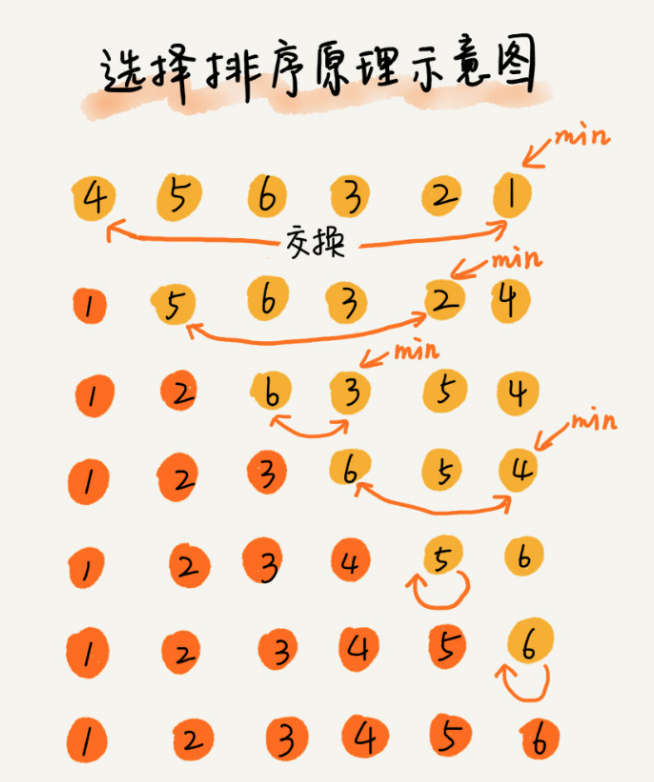

#### 选择排序(Selection Sort)
- 
- 选择排序法是一种非常直观的算法，它会在每个计算步骤中选出一个最小值，进而完成排序
- 选择排序是原地排序算法吗?
  - 是的。并没有使用额外的内存空间
- 选择排序是稳定的排序算法吗?
  - 不是。选择排序每次都要找剩余未排序元素中的最小值，并和前面的元素交换位置
- 选择排序的时间复杂度？
  - 最好时间: O(n)
  - 最坏时间: O(n ^ 2)
  - 平均时间: O(n ^ 2)