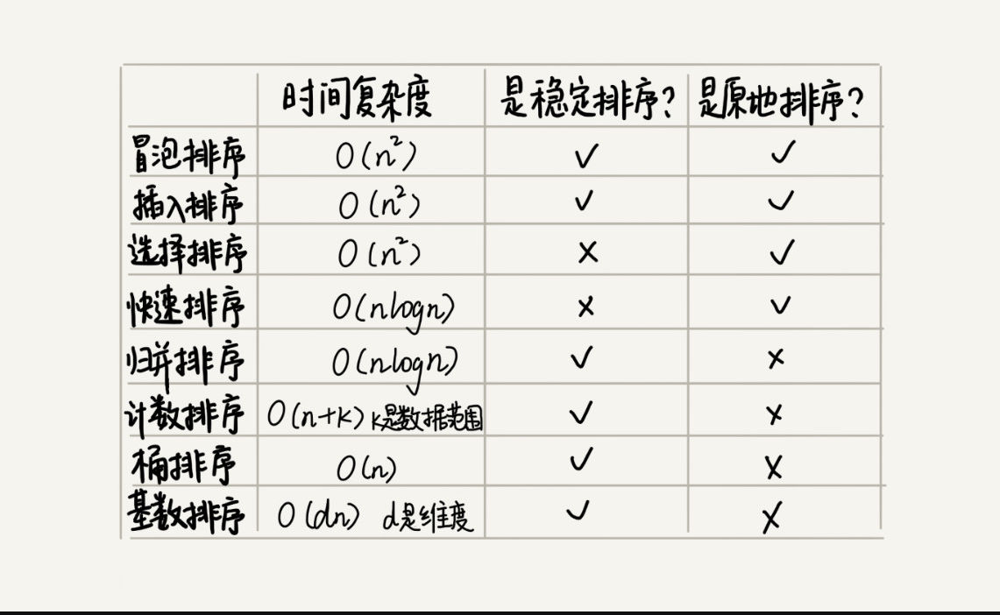

#### 排序算法比较

#### 如何优化快速排序
##### 最坏时间复杂度
- 如果数据原来就是很有序的或者接近有序的，每次分区点都选择最后一个数据，那快速排序就会变得非常糟糕，时间复杂度就会退化为O(n^2)
- 实际上，这种O(n ^ 2)时间复杂度出现的主要原因还是因为我们的分区点选的不够合理
- 理想的分区点：被分区点分开的两个分区中，数据的数量差不多
##### 三处取中法
- 我们从区间的首，尾，中间，分别取出一个数，然后对比大小，取这3个数的中间值作为分区点
- 这样每间隔某个固定的长度，取数据出来比较，将中间值作为分区点的分区算法，肯定要比单纯取某一个数据更好
- 但是，如果要排序的数组比较大，那“三数取中”可能就不够了，可能要“五数取中”或者“十数取中”
##### 随机法
- 随机法就是每次从要排序的区间中，随机选择一个元素作为分区点
- 这种方法并不能保证每次分区点都选的比价好，从概率的角度来看，也不大可能会出现每次分区点都选的很差的情况，所以平均情况下，这样选的分区点是比较好的
- 时间复杂度退化为最糟糕的O(n ^ 2)的情况，出现的可能不大