#### BM算法
- BM(Boyer-Moore) 算法，它是一种非常高效的字符串匹配算法
- 坏字符规则(bad character rule)
  - BM算法匹配顺序比较特别，它是按照模式串下标从大到小的顺序，倒着匹配
    - 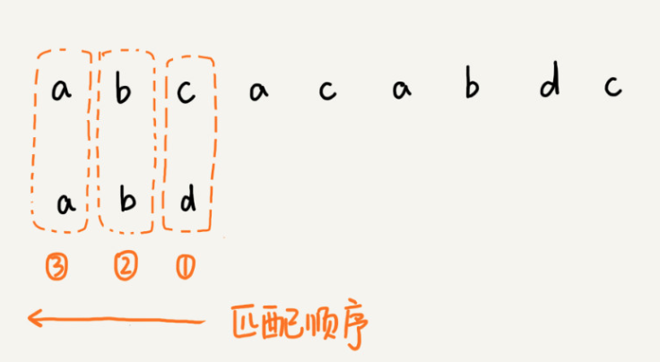
  - 从模式串的末尾往前倒着匹配，当发现到某个字符没法匹配的时候，就可以把这个不可以匹配的字符叫做`坏字符`(主串中的字符)
    - 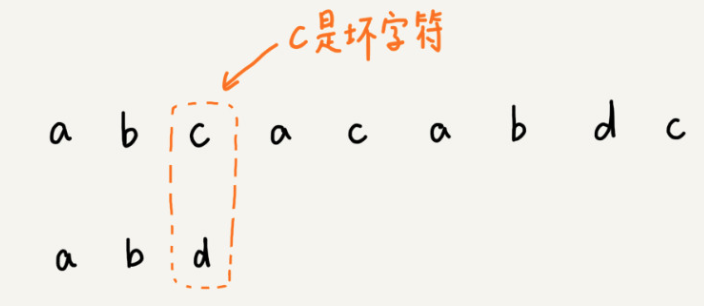
  - 移动规则
    - `一`. 拿着坏字符c在模式串中查找，发现模式串中不存在这个字符。那么就可以直接将模式串往后移动三位，移动到c后。然后再从模式串的末尾字符开始比较
      - 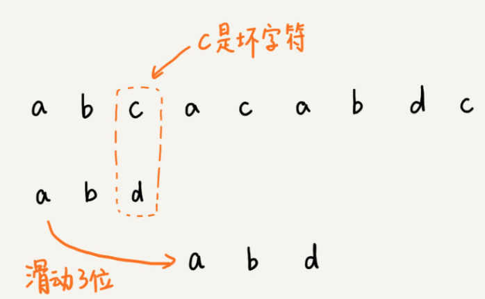
    - `二`. 模式串中最后一个字符d，无法与主串中的a匹配。这个时候却不能移动三位，因为坏字符a在模式串还是存在的，模式串中下标为0的也是a。这种情况，可以把模式串往后滑动两位，然后两个2a对齐。然后再从模式串末尾字符开始，重新匹配
      - 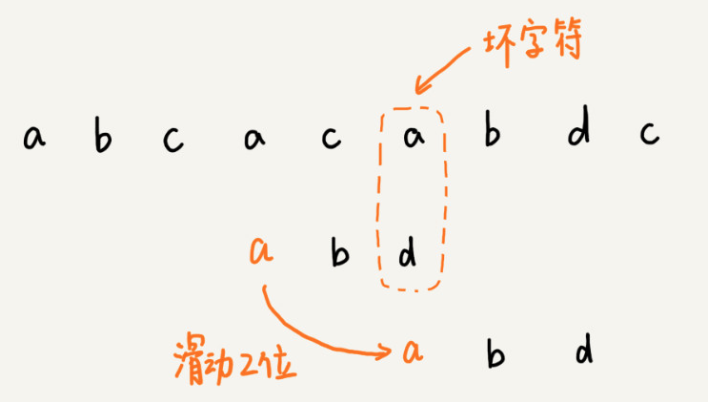
  - 规则总结
    - 当发生不匹配，可以把坏字符对应的模式串中的字符下标记作`si`
    - 如果坏字符在模式串中存在，可以把这个坏字符在模式串的下标记作`xi`
    - 如果不存在，把`xi` 记作 -1
    - 那么，模式串往后移动的位数等于 `si - xi`
    - 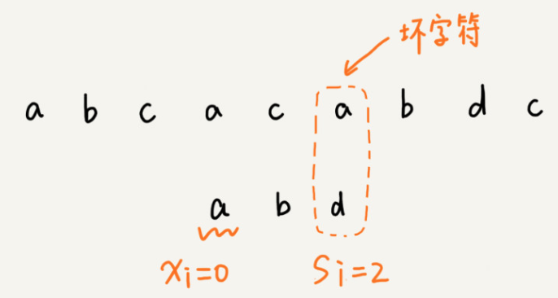
  - 坏字符规则的缺点
    - si - xi 可能会计算出负数。
    - 例如
      - 主串：aaaaaaaaaaaaaaaa
      - 模式串: baaa
      - 不但不会向后滑动模式串，还有可能倒退
  - 坏字符规则表的创建
    - 可以通过散列表的方式，将模式串中的每个字符及其下标都存到散列表中
    - 坏字符表，怎么处理多个相同字母的hash值
      - 相同的字母取最后一个
      - 为什么取最后一个？
        - 最小限度的移动，为了不错误完全匹配的机会
  - 坏字符规则时间复杂度
    - O(n / m)
- 好后缀规则(good suffix shift)
  - 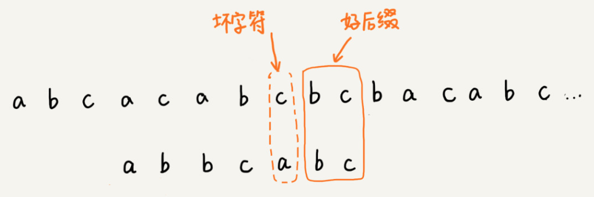
  - 移动规则
    - `一`. 把已经匹配的bc叫做`好后缀`,记作{u}.然后拿它在模式串中查找，如果找到另一个跟{u}相匹配的子串{u*},那么就将模式串滑动到子串{u*}与主串中{u}对齐的位置
      - 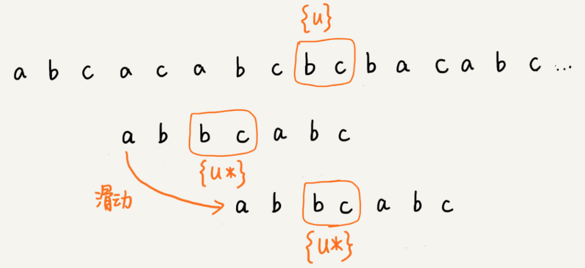
    - `二`. 当模式串不存在等于{u}的子串时，直接将模式串滑动到主串{u}后面？，
      - 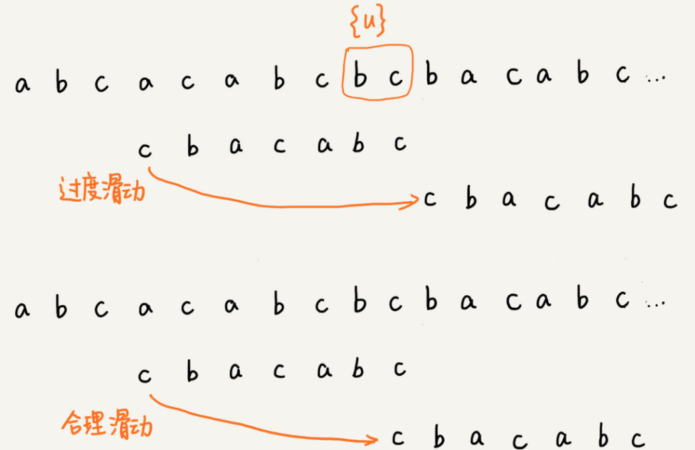
      - 如果好后缀在模式串不存在可匹配的子串，那在一步一步往后滑动模式串的过程中，只要主串中的{u}与模式串有重合，那肯定就无法完全匹配
      - 但是当模式串滑动到前缀与主串中{u}的后缀有部分重合的时候，并且重合的部分相等的时候，就有可能会存在完全匹配的情况
        - 
        - 所以，针对这种情况，不仅仅要看好后缀在模式串中，是否存在另一个匹配的子串，所以要考察好后缀子串，是否存在跟模式串的前缀子串匹配
        - 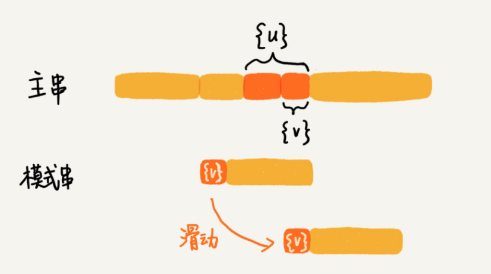
  - 实现
    - 如果表示模式串不同的后缀子串?
      - 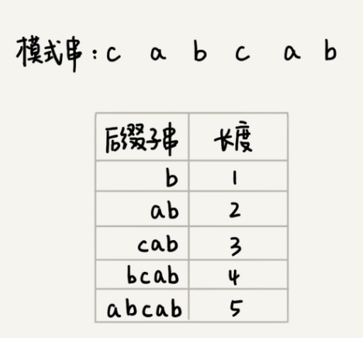
      - 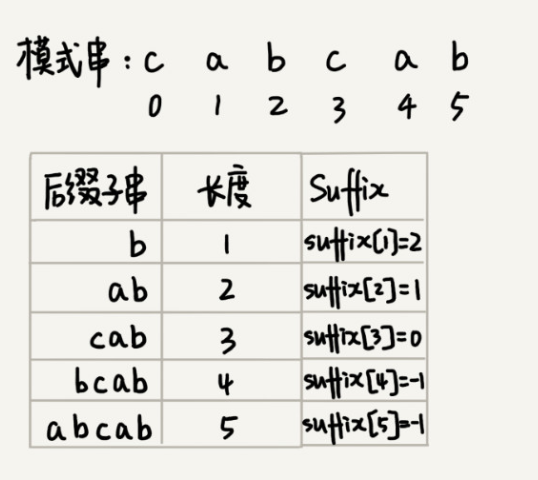
        - suffix 数组下标k，表示后缀字符串的长度
        - 下标对应的数组值存储的是。好后缀{u}相匹配子串{u*}的起始下标值
        - 例子
          - cabcab 模式串，拆分前缀子串和后缀子串，求公共子串？
            - 前缀
              - c, ca, cab, cabc, cabca
            - 后缀
              - b, ba, bac, cbacb, bacba
            - 前后缀访问顺序
              - 前缀：从右往左遍历
              - 后缀：从左往右遍历
            - 公共子串
              - 因为 cab == bac. 所以，取前缀中的 cab
              - 然后按好后缀{u}的模式拆分子串
                - b = 2
                - ab = 1
                - cab = 0
        - 为什么要求公共子串?
          - 因为好后缀是主串与模式串的最长匹配子串，所以好后缀也是模式串的后缀子串
          - 而公共子子串，则是好后缀的最长的可匹配子串
        - 为什么要把公共子串拆分为N个小的子串？
          - 为了划分出N个可让好后缀匹配的子串（把整个好后缀拆分开，一一与公共子串N个子串匹配）
          - 模式串的前缀子串：模式串与主串匹配时，坏字符位置以前的模式串长度
          - 例如
            ```
            igfqoofimcab
                 cabicab
            ```    
            - 好后缀：cab
            - 坏字符: m
            - 模式串的前缀子串: cab
            - 好后缀的后缀子串：b, ab, cab
            - 与好后缀的后缀子串能跟模式串前缀子串匹配的后缀子串：b, ab, cab
    - 不仅仅要在模式串中，查找跟好后缀匹配的另一个子串，还要在好后缀子串中，查找最长的能跟模式串前缀子串匹配的后缀子串(概念上文已述)
      - 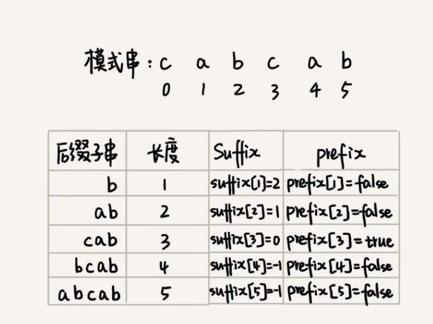
      - 模式串前缀子串匹配的后缀子串的作用？
        - 查询可匹配子串的起始位置，也就是最长可匹配地址，用于移动位置
      - prefix数组的作用？
        - 用来记录模式串的后缀子串是否能匹配模式串的前缀子串。可参考上文的`cabcab 模式串，拆分前缀子串和后缀子串`的例子
        - 这样就可以从好后缀子串中，找一个最长的并且能跟模式串的前缀子串匹配的
        - 
    <!-- - suffix 和 prefix 值填充
      - 求公共后缀子串
      - 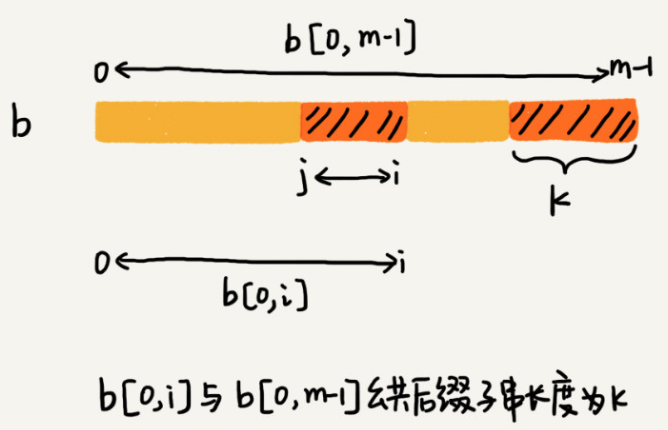 -->
    - 匹配移动规则
      - `一`. suffix 存在值
        - 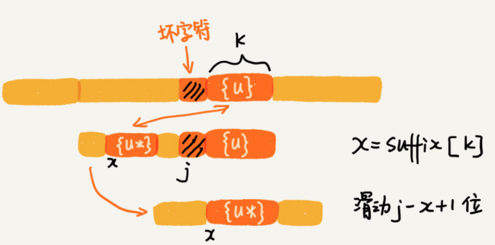
        - 好后缀能与模式串子串匹配
      - `二`. 查找好后缀的最长字符串是否和prefix的前缀子串匹配
        - 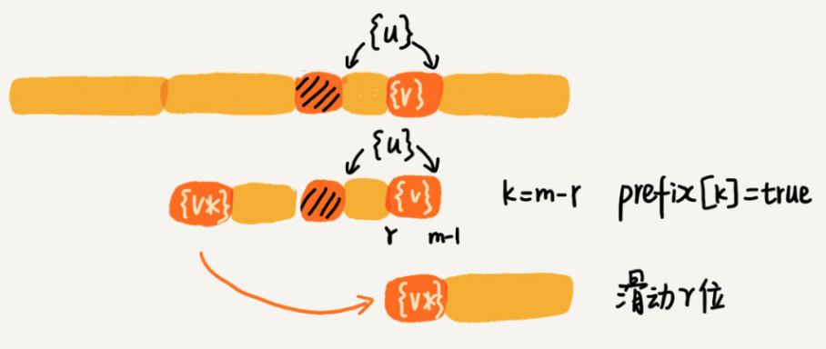
        - 好后缀的子串能与模式串前缀子串匹配
      - `三`. 什么情况都没有匹配.返回模式串的长度
        -  
- BM算法时间复杂度
  - 预处理时间：O(m ^ 2)