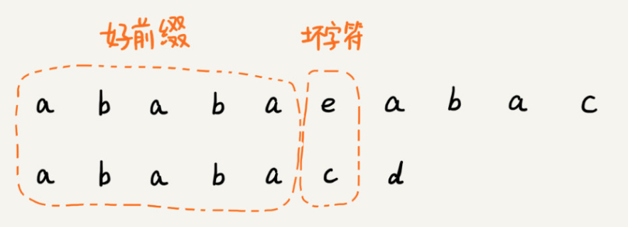
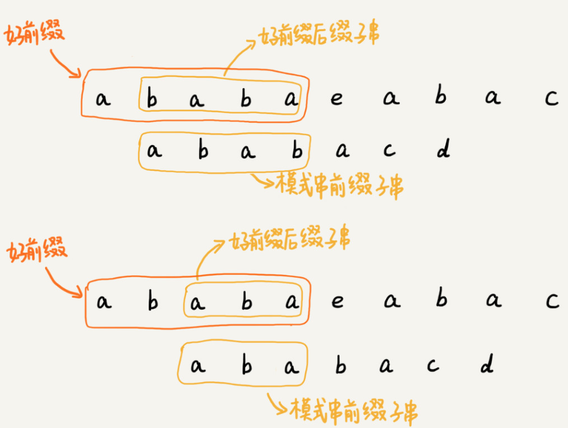
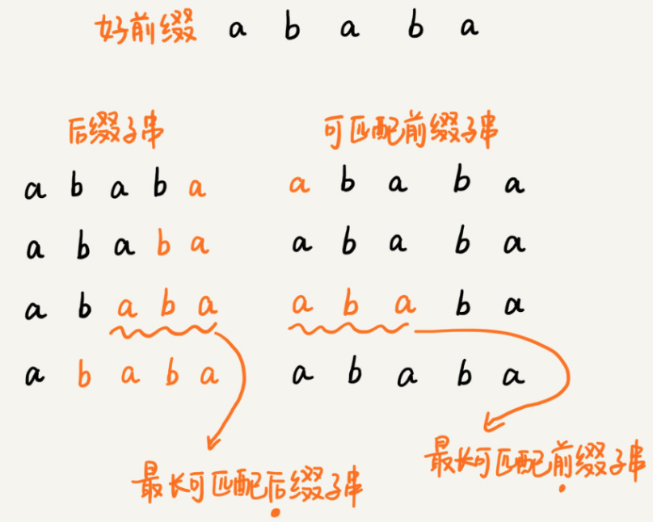
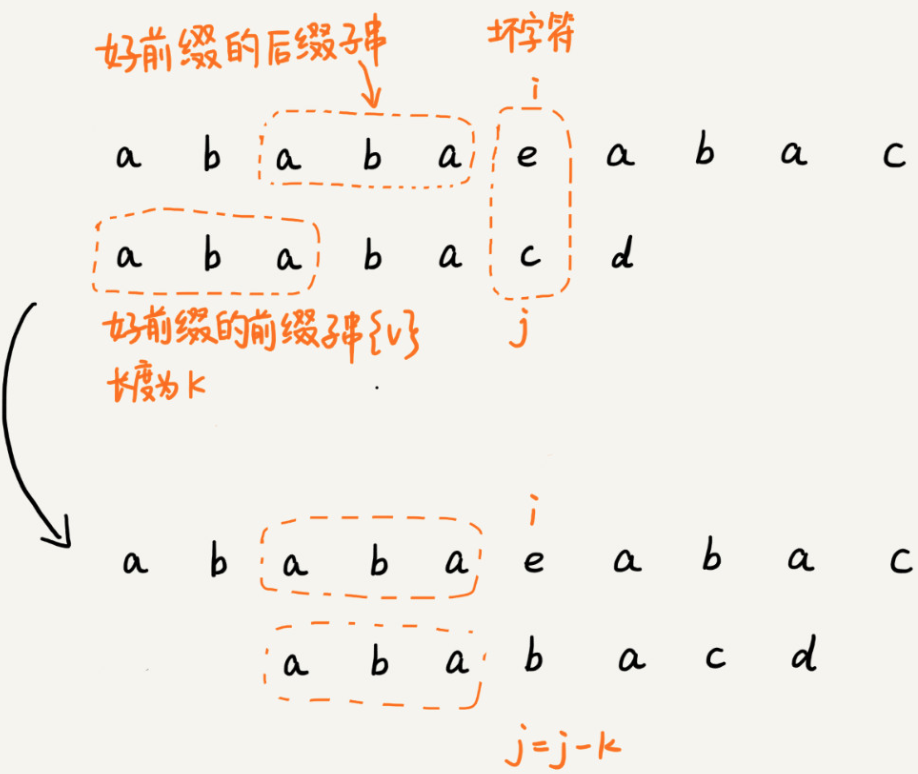
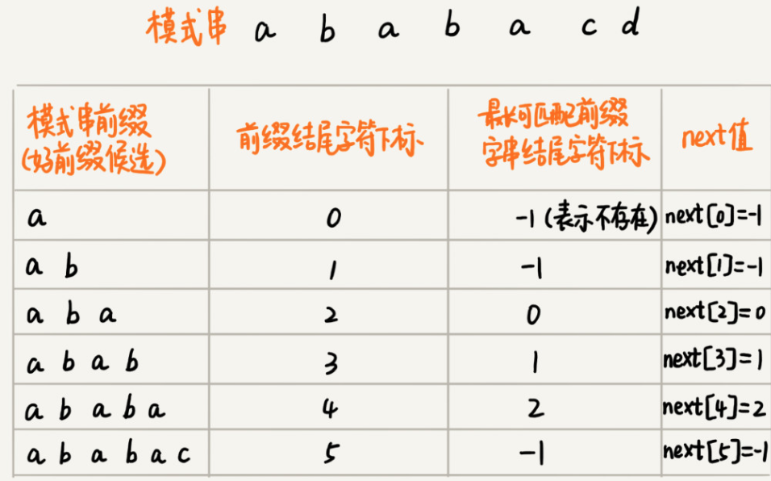
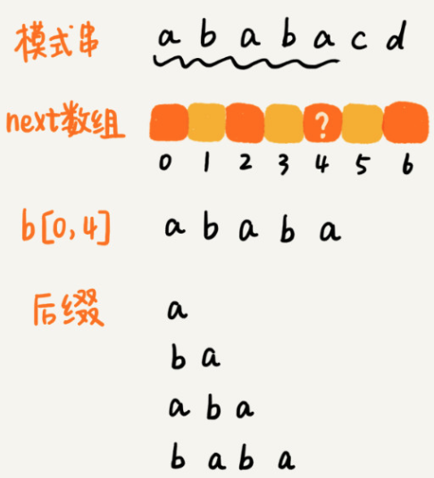
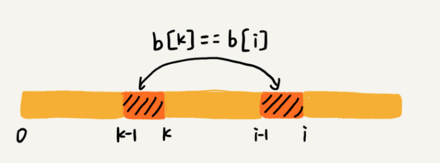
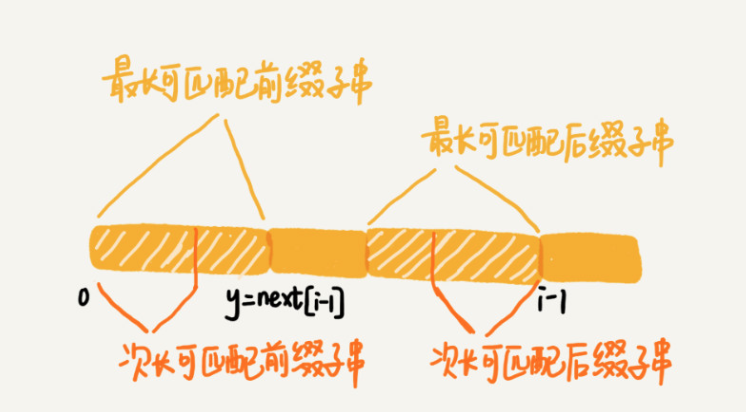
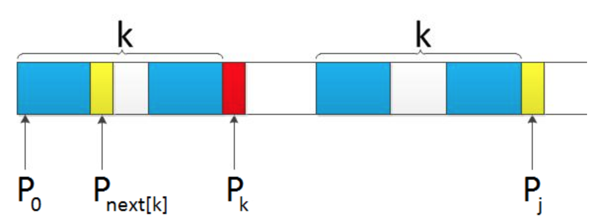

#### KMP算法
- KMP算法，全称Knuth Morris Pratt算法
- 核心思想
  - 假设主串是a，模式串是b
  - 在模式串与主串匹配的过程中，当遇到不可匹配的字符的时候，对已经对比过的字符，是否能找到一种规律，将模式串一次性滑动多位，跳过那些肯定不会匹配的情况？
  - 
  - 这里可以类比一下，在模式串和主串匹配的过程中,把不能匹配的那个字符仍然叫做`坏字符`，把已经匹配的那段字符串叫做`好前缀`
  - 
  - 当遇到坏字符的时候，就要把模式串往后滑动，在滑动的过程中，只要模式串和好前缀有上下重合，前面几个字符比较，就相当于拿好前缀的后缀子串，跟模式串的前缀子串在比较
- 最长可匹配后缀子串 && 最长可匹配前缀子串
  - 把好前缀的所有后缀子串中，最长的可匹配前缀子串的那个后缀子串，叫作`最长可匹配后缀子串`
  - 对应的前缀子串，叫作`最长可匹配前缀子串`
  - 
- KMP目的
  - 
  - 只需要拿`好前缀`本身，在它的`后缀子串`中，查找最长的那个可以跟好前缀匹的`前缀子串`匹配
  - 假设最长的可匹配的那部分`前缀子串{v}`, 长度为k
  - 可以把模式串一次性往后滑动`j - k`位，相当于，每次遇到坏字符的时候，就把j 更新为k。i不变。然后比较

- 失效函数(next 数组)
  - 
  - 例子：ababacd
    - 过程
      ```
      1. a: 0
      2. ab: 0
      3. aba
          a ab
          ba a
      4. abab
          a ab aba
          bab ab b
      5. ababa
          a ab aba abab
          baba aba ab a
      6. ababac
          a ab aba abab ababa
          babac abac bac ac c
      7. ababacd
          a ab aba abab ababa ababac
          babacd abacd bacd acd cd c
      ```
  - 图表
    |模式串 | a | b | a | b | a | c | d |
    |-|-|-|-|-|-|-|-|
    |前后缀最大公共元素|0|0|1|2|3|0|0|
    |next数组|-1|0|0|1|2|3|0|
  - 移位位数: 已匹配的字符数 - 对应的部分匹配值
- next数组的计算
  - 暴力计算方法
    - 暴力求解子串，效率低
    - 
    - 把所有后缀子串从长到短找出来，依次看能否匹配前缀
  - 类动态规划方法(k：最长前后缀子串)
    - 若p[k] == p[i]
      - 则next[i] = next[i - 1] + 1 = k
      - 
      ```
        如果 next[i - 1] = k - 1.
        b[0, k - 1] 是b[0, i - 1]最长可匹配前缀子串
        if 下一个字符
          b[k] == b[i]
        则 next[i] = k // 最长前后缀子串
      ```
    - 若p[k] ≠ p[i]
      - 假设最长可匹配前缀 k
      - 如果 p[k] ≠ p[i]。则需要次最大匹配前缀 p[next[k]].
      - 如果 p[next[k]] != p[i]. 则需要次次最大匹配前缀。直到匹配成功，或者匹配失败
      - 
      - 
      - 如果此时p[ next[k] ] == p[i]，则next[i] =  next[k] + 1，否则继续递归前缀索引k = next[k]，而后重复此过程
- 时间复杂度
  - 构建next数组
    ```
      void getNext(char *p, int p_len, int *next) {
        next[0] = -1;
        int k = -1;
        int i;

        for (i = 1; i < p_len; ++i) {
            while (k != -1 && p[k + 1] != p[i]) {
                k = next[k];
            }
            if (p[k + 1] == p[i]) {
                ++k;
            }
            next[i] = k;
        }
      }
    ```
    - i 从1开始一直增加到p_len,而k并不是每次for循环都增加，所以，k累积增加的值肯定小于 p_len
    - 而while循环中的 k = next[k],实际上是在减小k的值，k累积都没有增加超过p_len.所以while循环总数也不会超过p_len
    - 这部分时间复杂度: O(p_len)
  - 借助next数组匹配
    ```
    int kmp(char *s, int s_len, char *p, int p_len) {
        int next[p_len];
        getNext(p, p_len, next);
        int j = 0;
        int i;

        for (i = 0; i < s_len; ++i) {
            while (j > 0 && s[i] != p[j]) { // 一直找到s[i] 和 p[j]
                j = next[j - 1] + 1;
            }

            if (s[i] == p[j]) ++j;
            
            if (j == p_len) {   // 找到匹配模式串
                return i - p_len + 1;
            }
        }

        return -1;
    }
    ```
    - i 从0循环增加到 s_len - 1, j的增长量不可能超过i，所以肯定小于s_len
    - 而while 循环中的那条 j = next[j - 1] + 1; 不会让 j增长
    - 所以，这部分的时间复杂度为O(s_len)
  - 总时间复杂度: O(s_len + p_len)
- 空间复杂度
  - KMP只需要一个额外的next数组，数组的大小跟模式串相同
  - 空间复杂度:O(p_len), p_len表示模式串长度