#### BF 算法
- BF 算法中的BF 是Brute Force的缩写，中文叫做暴力匹配法，也叫朴素匹配算法
- 
- 作为最简单，最暴力的字符串匹配算法，BF算法的思想可以用一句话来概括，那么就是`在主串中，检查起始位置分别是0, 1, 2 ... n - m 且长度为m的n - m + 1个子串，看有没有跟模式串匹配` 
- 时间复杂度
  - O(n * m)

#### RK 算法
- RK 叫做 Rabin-Karp算法，BF的升级版算法
- BF 算法的缺陷
  - BF算法。如果模式长度为m,主串长度为n,那么主串中，就会有 n - m + 1个长度为m的子串
  - 每次检查主串与子串是否匹配，需要依次对比每个字符，所以BF算法的时间复杂度比较高, `O(n * m)`
- RK算法思路
  - 通过哈希算法对主串的 n - m + 1个子串分别求哈希值，然后逐个与模式串的哈希值比较大小
  - 如果某个子串的哈希值与模式串相等，那就说明对应的子串和模式匹配了
  - 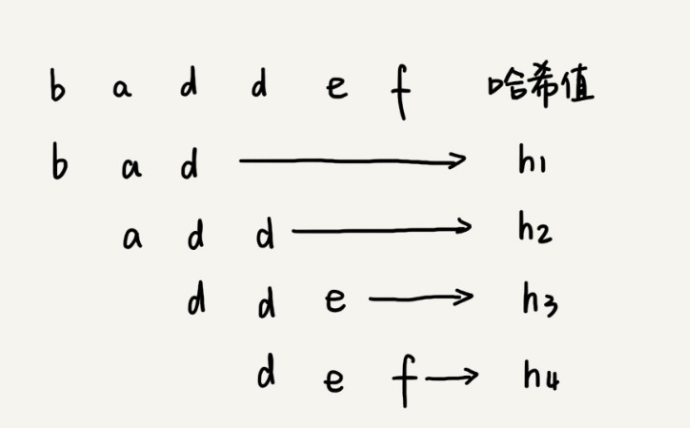
  - 不过，通过哈希算法计算子串的哈希值的时候，需要遍历子串中的每个字符。尽管模式串与子串比较的效率提高了，但是算法整体效率没有提升
  - 假设要匹配的字符串的字符集中包含K个字符，可以用一个K进制来表示一个子串，这个K进制转化成十进制，作为子串的哈希值
    - 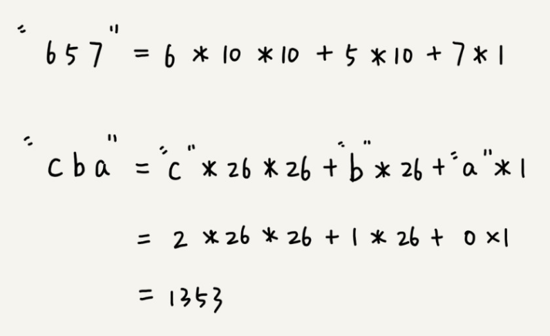
    - 比如要处理的字符串只包含 a ~ z这26个小写字母，那我们就用26进制来表示一个字符串
    - 在十进制的表示法中，一个数字的值是通过下面的方式计算出来的。对应二十六进制，一个包含a到z这个26个字符的字符串，计算哈希的时候，只需要把进位从10改成26
  - 这种哈希算法有一个特点，在主串中，相邻两个子串的哈希值的计算公式有一定关系
    - 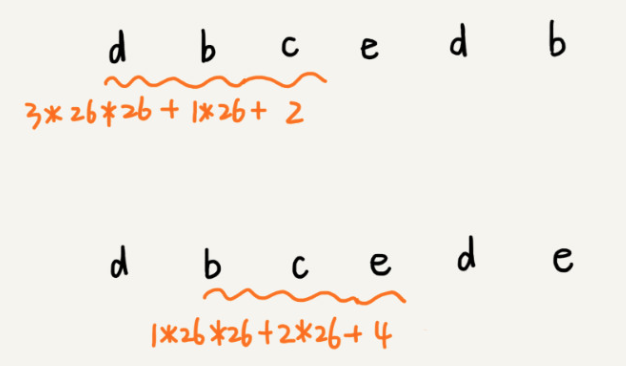
    - 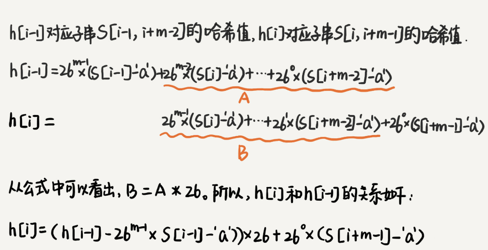
    - 相邻两个子串`s[i - 1]` 和 `s[i]` (子串长度都是m), 对应的哈希值计算公式有交集，也就是说，可以使用s[i - 1]的哈希值很快的计算出s[i]的哈希值
  - 时间复杂度
    - 计算子串哈希值
      - 通过设计特殊的哈希算法，只需要扫描一遍主串就能计算出所有子串的哈希值，这部分的时间复杂度`O(n)`
    - 模式串哈希值与子串哈希值之间比较
      - 模式串与单个子串哈希值之间的比较的时间复杂是`O(1)`
      - 有 n - m + 1 个子串需要比较，所以时间复杂度为`O(n)`
    - 总体时间复杂度: `O(n)`
    - 极端情况
      - 如果存在大量的冲突，就会导致RK算法时间复杂度退化，效率下降
      - 时间复杂度为`O(n * m)`

#### BM算法
- BM(Boyer-Moore) 算法，它是一种非常高效的字符串匹配算法
- 坏字符规则(bad character rule)
  - BM算法匹配顺序比较特别，它是按照模式串下标从大到小的顺序，倒着匹配
    - 
  - 从模式串的末尾往前倒着匹配，当发现到某个字符没法匹配的时候，就可以把这个不可以匹配的字符叫做`坏字符`(主串中的字符)
    - 
  - 移动规则
    - `一`. 拿着坏字符c在模式串中查找，发现模式串中不存在这个字符。那么就可以直接将模式串往后移动三位，移动到c后。然后再从模式串的末尾字符开始比较
      - 
    - `二`. 模式串中最后一个字符d，无法与主串中的a匹配。这个时候却不能移动三位，因为坏字符a在模式串还是存在的，模式串中下标为0的也是a。这种情况，可以把模式串往后滑动两位，然后两个2a对齐。然后再从模式串末尾字符开始，重新匹配
      - 
  - 规则总结
    - 当发生不匹配，可以把坏字符对应的模式串中的字符下标记作`si`
    - 如果坏字符在模式串中存在，可以把这个坏字符在模式串的下标记作`xi`
    - 如果不存在，把`xi` 记作 -1
    - 那么，模式串往后移动的位数等于 `si - xi`
    - 
  - 坏字符规则的缺点
    - si - xi 可能会计算出负数。
    - 例如
      - 主串：aaaaaaaaaaaaaaaa
      - 模式串: baaa
      - 不但不会向后滑动模式串，还有可能倒退
  - 坏字符规则时间复杂度
    - O(n / m)
- 好后缀规则(good suffix shift)
  - 
  - 移动规则
    - `一`. 把已经匹配的bc叫做`好后缀`,记作{u}.然后拿它在模式串中查找，如果找到另一个跟{u}相匹配的子串{u*},那么就将模式串滑动到子串{u*}与主串中{u}对齐的位置
      - 
    - `二`. 当模式串不存在等于{u}的子串时，直接将模式串滑动到主串{u}后面？，
      - 
      - 如果好后缀在模式串不存在可匹配的子串，那在一步一步往后滑动模式串的过程中，只要主串中的{u}与模式串有重合，那肯定就无法完全匹配
      - 但是当模式串滑动到前缀与主串中{u}的后缀有部分重合的时候，并且重合的时候，并且重合的部分相等的时候，就有可能会存在完全匹配的情况
        - 
        - 所以，针对这种情况，不仅仅要看好后缀在模式串中，是否存在另一个匹配的子串，所以要考察好后缀子串，是否存在跟模式串的前缀子串匹配
        - 
  - 实现
    - 如果表示模式串不同的后缀子串
      - 
      - 
    - 不仅仅要在模式串中，查找跟好后缀匹配的另一个子串，还要在好后缀子串中，查找最长的能跟模式串前缀子串匹配的后缀子串
      - 
    - suffix 和 prefix 值填充
      - 求公共后缀子串
      - 
    - 移动规则
      - `一`. suffix 存在值
        - 
      - `二`. 查找好后缀的最长字符串是否和prefix的前缀子串匹配
        - 
      - `三`. 什么情况都没有匹配.返回模式串的长度
        -  
- BM算法时间复杂度
  - 预处理时间：O(m ^ 2)

#### KMP算法
- KMP算法，全称Knuth Morris Pratt算法
- 核心思想
  - 假设主串是a，模式串是b
  - 在模式串与主串匹配的过程中，当遇到不可匹配的字符的时候，对已经对比过的字符，是否能找到一种规律，将模式串一次性滑动多位，跳过那些肯定不会匹配的情况？
  - 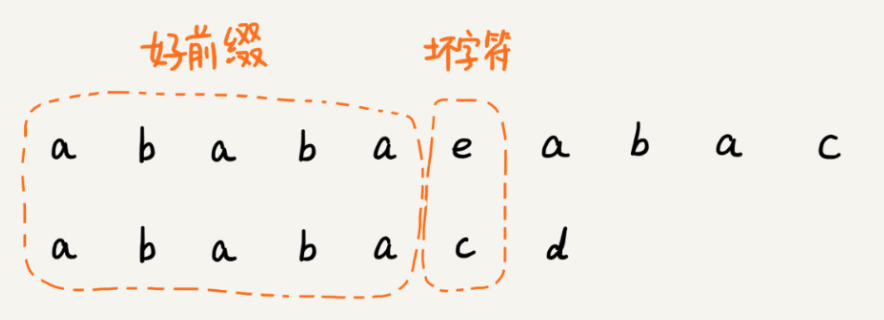
  - 这里可以类比一下，在模式串和主串匹配的过程中,把不能匹配的那个字符仍然叫做`坏字符`，把已经匹配的那段字符串叫做`好前缀`
  - 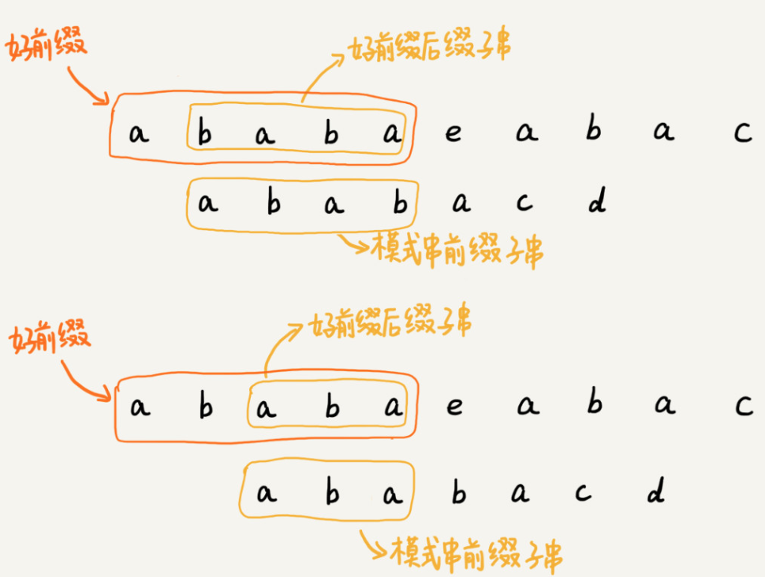
  - 当遇到坏字符的时候，就要把模式串往后滑动，在滑动的过程中，只要模式串和好前缀有上下重合，前面几个字符比较，就相当于拿好前缀的后缀子串，跟模式串的前缀子串在比较
- 最长可匹配后缀子串 && 最长可匹配前缀子串
  - 把好前缀的所有后缀子串中，最长的可匹配前缀子串的那个后缀子串，叫作`最长可匹配后缀子串`
  - 对应的前缀子串，叫作`最长可匹配前缀子串`
  - 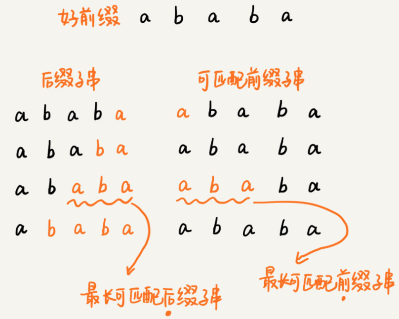
- KMP目的
  - 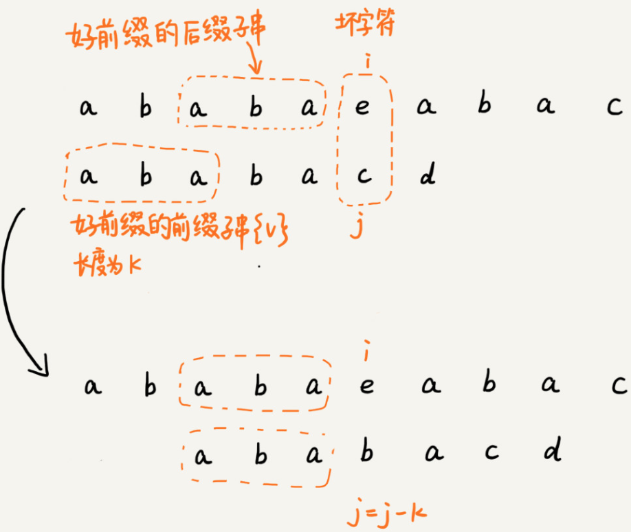
  - 只需要拿`好前缀`本身，在它的`后缀子串`中，查找最长的那个可以跟好前缀匹的`前缀子串`匹配
  - 假设最长的可匹配的那部分`前缀子串{v}`, 长度为k
  - 可以把模式串一次性往后滑动`j - k`位，相当于，每次遇到坏字符的时候，就把j 更新为k。i不变。然后比较

- 最长长度表
  - 例子：ababacd
  - 过程
    ```
    1. a: 0
    2. ab: 0
    3. aba
        a ab
        ba a
    4. abab
        a ab aba
        bab ab b
    5. ababa
        a ab aba abab
        baba aba ab a
    6. ababac
        a ab aba abab ababa
        babac abac bac ac c
    7. ababacd
        a ab aba abab ababa ababac
        babacd abacd bacd acd cd c
    ```
  - 图表
    |模式串 | a | b | a | b | a | c | d |
    |-|-|-|-|-|-|-|-|
    |前后缀最大公共元素|0|0|1|2|3|0|0|
    |next数组|-1|0|0|1|2|3|0|
  - 移位位数: 已匹配的字符数 - 对应的部分匹配值
- 失效函数(next 数组)
  - 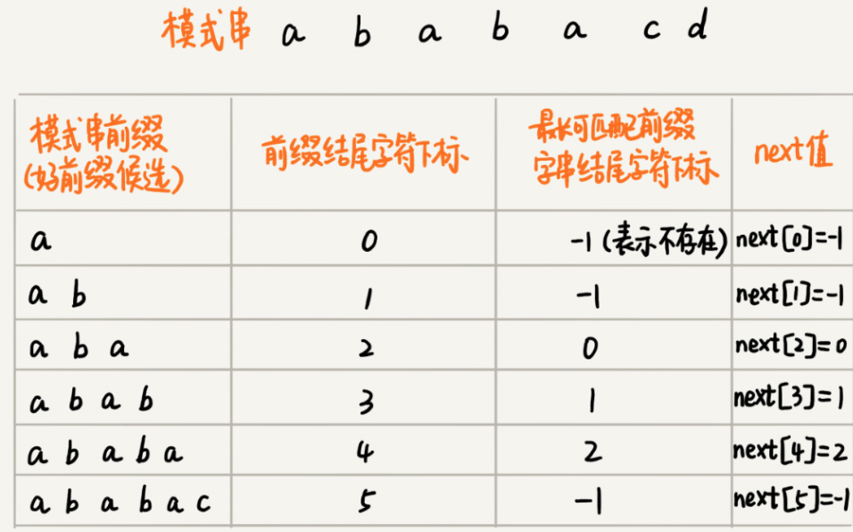
- next数组的计算
  - 暴力计算方法
    - 暴力求解子串，效率低
    - 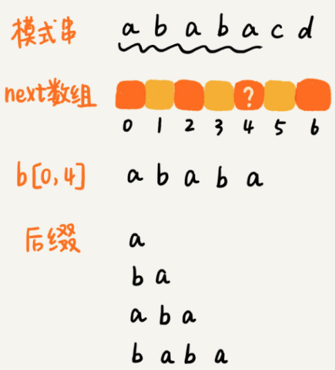
  - 类动态规划方法(k：最长前后缀子串)
    - 若p[k] == p[i]
      - 则next[i + 1] = next [i] + 1 = k + 1
      - 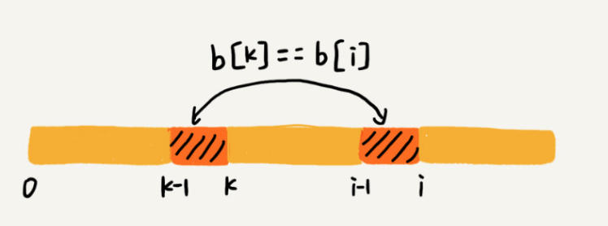
      ```
        如果 next[i - 1] = k - 1.
        b[0, k - 1] 是b[0, i - 1]最长可匹配前缀子串
        if 下一个字符
          b[k] == b[i]
        则 next[i] = k // 最长前后缀子串
      ```
    - 若p[k] ≠ p[i]
      - 获得最大可匹配前缀 k. 如果 p[k] ≠ p[i]。则需要次最大匹配前缀 p[next[k]]. 如果 p[next[k]] != p[i]. 则需要次次最大匹配前缀。直到匹配成功，或者匹配失败
      - 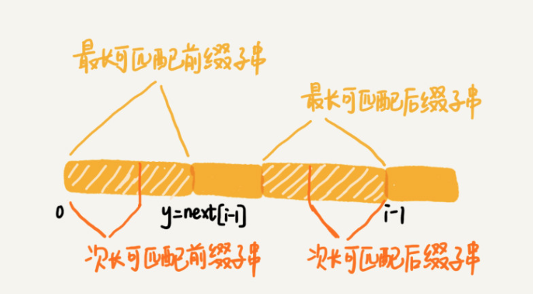
      - 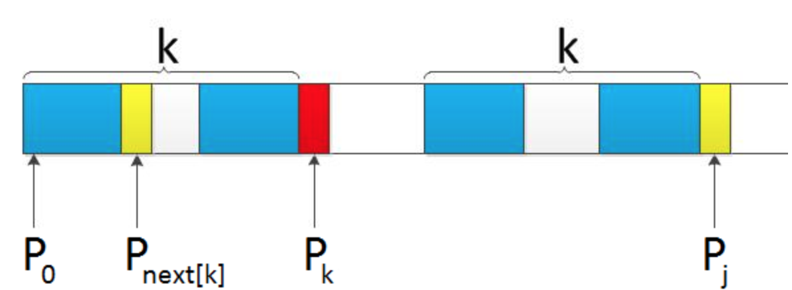
      - 如果此时p[ next[k] ] == p[i]，则next[i] =  next[k] + 1，否则继续递归前缀索引k = next[k]，而后重复此过程
- 时间复杂度
  - 构建next数组
    ```
      void getNext(char *p, int p_len, int *next) {
        next[0] = -1;
        int k = -1;
        int i;

        for (i = 1; i < p_len; ++i) {
            while (k != -1 && p[k + 1] != p[i]) {
                k = next[k];
            }
            if (p[k + 1] == p[i]) {
                ++k;
            }
            next[i] = k;
        }
      }
    ```
    - i 从1开始一直增加到p_len,而k并不是每次for循环都增加，所以，k累积增加的值肯定小于 p_len
    - 而while循环中的 k = next[k],实际上是在减小k的值，k累积都没有增加超过p_len.所以while循环总数也不会超过p_len
    - 这部分时间复杂度: O(p_len)
  - 借助next数组匹配
    ```
    int kmp(char *s, int s_len, char *p, int p_len) {
        int next[p_len];
        getNext(p, p_len, next);
        int j = 0;
        int i;

        for (i = 0; i < s_len; ++i) {
            while (j > 0 && s[i] != p[j]) { // 一直找到s[i] 和 p[j]
                j = next[j - 1] + 1;
            }

            if (s[i] == p[j]) ++j;
            
            if (j == p_len) {   // 找到匹配模式串
                return i - p_len + 1;
            }
        }

        return -1;
    }
    ```
    - i 从0循环增加到 s_len - 1, j的增长量不可能超过i，所以肯定小于s_len
    - 而while 循环中的那条 j = next[j - 1] + 1; 不会让 j增长
    - 所以，这部分的时间复杂度为O(s_len)
  - 总时间复杂度: O(s_len + p_len)
- 空间复杂度
  - KMP只需要一个额外的next数组，数组的大小跟模式串相同
  - 空间复杂度:O(p_len), p_len表示模式串长度

#### 参考资料
- [BF算法（串模式匹配算法）C语言详解](http://data.biancheng.net/view/179.html)
- [字符串匹配算法（BF & RK）](https://blog.csdn.net/qq_21201267/article/details/92695636)
- [字符串匹配的KMP算法](http://www.ruanyifeng.com/blog/2013/05/Knuth%E2%80%93Morris%E2%80%93Pratt_algorithm.html)
- [从头到尾彻底理解KMP](https://blog.csdn.net/v_july_v/article/details/7041827)
- [The Knuth-Morris-Pratt Algorithm in my own words](http://jakeboxer.com/blog/2009/12/13/the-knuth-morris-pratt-algorithm-in-my-own-words/)
- [如何更好的理解和掌握 KMP 算法?](https://www.zhihu.com/question/21923021)
- [字符串匹配算法（KMP）](https://blog.csdn.net/qq_21201267/article/details/93306528)