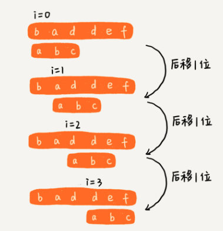
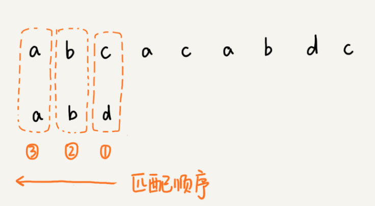
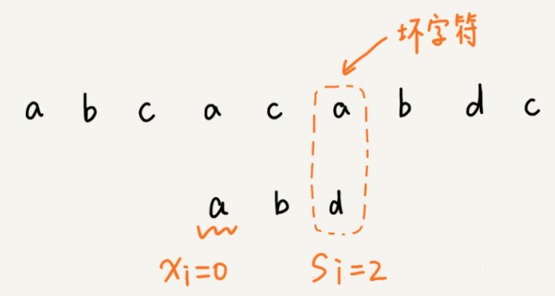
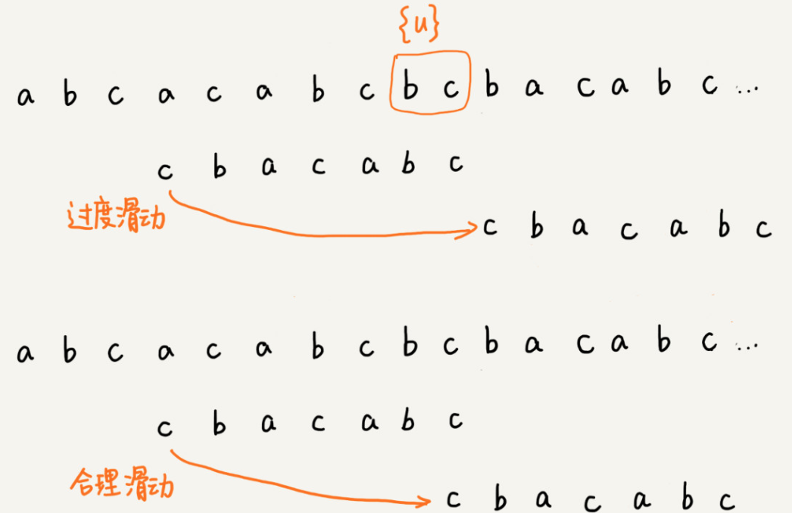
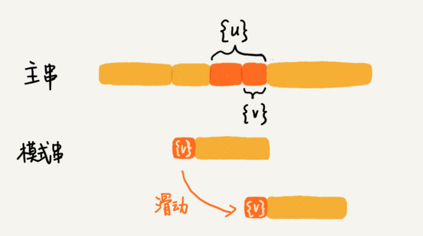
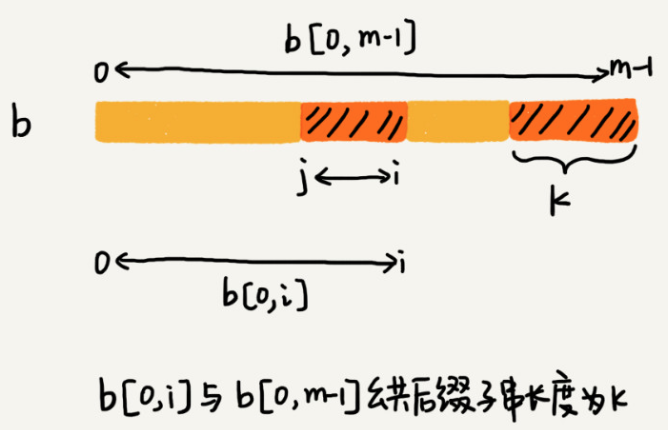
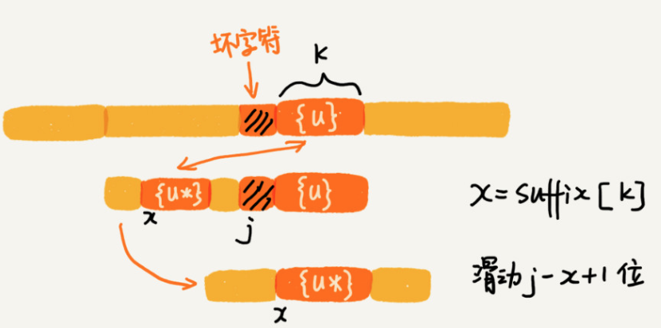
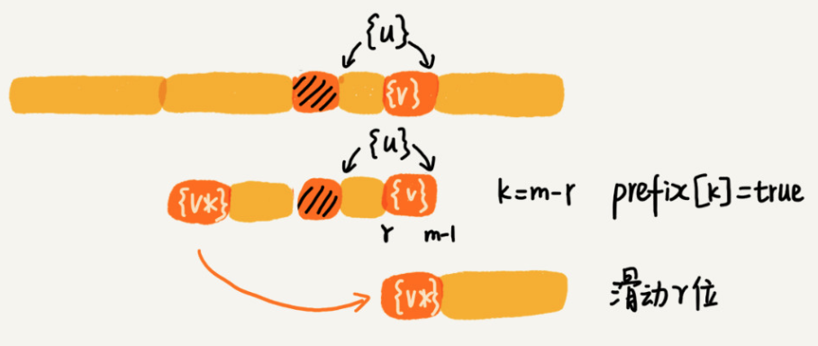

#### BF 算法
- BF 算法中的BF 是Brute Force的缩写，中文叫做暴力匹配法，也叫朴素匹配算法
- 
- 作为最简单，最暴力的字符串匹配算法，BF算法的思想可以用一句话来概括，那么就是`在主串中，检查起始位置分别是0, 1, 2 ... n - m 且长度为m的n - m + 1个子串，看有没有跟模式串匹配` 
- 时间复杂度
  - O(n * m)

#### RK 算法
- RK 叫做 Rabin-Karp算法，BF的升级版算法
- BF 算法的缺陷
  - BF算法。如果模式长度为m,主串长度为n,那么主串中，就会有 n - m + 1个长度为m的子串
  - 每次检查主串与子串是否匹配，需要依次对比每个字符，所以BF算法的时间复杂度比较高, `O(n * m)`
- RK算法思路
  - 通过哈希算法对主串的 n - m + 1个子串分别求哈希值，然后逐个与模式串的哈希值比较大小
  - 如果某个子串的哈希值与模式串相等，那就说明对应的子串和模式匹配了
  - 
  - 不过，通过哈希算法计算子串的哈希值的时候，需要遍历子串中的每个字符。尽管模式串与子串比较的效率提高了，但是算法整体效率没有提升
  - 假设要匹配的字符串的字符集中包含K个字符，可以用一个K进制来表示一个子串，这个K进制转化成十进制，作为子串的哈希值
    - 
    - 比如要处理的字符串只包含 a ~ z这26个小写字母，那我们就用26进制来表示一个字符串
    - 在十进制的表示法中，一个数字的值是通过下面的方式计算出来的。对应二十六进制，一个包含a到z这个26个字符的字符串，计算哈希的时候，只需要把进位从10改成26
  - 这种哈希算法有一个特点，在主串中，相邻两个子串的哈希值的计算公式有一定关系
    - 
    - 
    - 相邻两个子串`s[i - 1]` 和 `s[i]` (子串长度都是m), 对应的哈希值计算公式有交集，也就是说，可以使用s[i - 1]的哈希值很快的计算出s[i]的哈希值
  - 时间复杂度
    - 计算子串哈希值
      - 通过设计特殊的哈希算法，只需要扫描一遍主串就能计算出所有子串的哈希值，这部分的时间复杂度`O(n)`
    - 模式串哈希值与子串哈希值之间比较
      - 模式串与单个子串哈希值之间的比较的时间复杂是`O(1)`
      - 有 n - m + 1 个子串需要比较，所以时间复杂度为`O(n)`
    - 总体时间复杂度: `O(n)`
    - 极端情况
      - 如果存在大量的冲突，就会导致RK算法时间复杂度退化，效率下降
      - 时间复杂度为`O(n * m)`

#### BM算法
- BM(Boyer-Moore) 算法，它是一种非常高效的字符串匹配算法
- 坏字符规则(bad character rule)
  - BM算法匹配顺序比较特别，它是按照模式串下标从大到小的顺序，倒着匹配
    - 
  - 从模式串的末尾往前倒着匹配，当发现到某个字符没法匹配的时候，就可以把这个不可以匹配的字符叫做`坏字符`(主串中的字符)
    - 
  - 移动规则
    - `一`. 拿着坏字符c在模式串中查找，发现模式串中不存在这个字符。那么就可以直接将模式串往后移动三位，移动到c后。然后再从模式串的末尾字符开始比较
      - 
    - `二`. 模式串中最后一个字符d，无法与主串中的a匹配。这个时候却不能移动三位，因为坏字符a在模式串还是存在的，模式串中下标为0的也是a。这种情况，可以把模式串往后滑动两位，然后两个2a对齐。然后再从模式串末尾字符开始，重新匹配
      - 
  - 规则总结
    - 当发生不匹配，可以把坏字符对应的模式串中的字符下标记作`si`
    - 如果坏字符在模式串中存在，可以把这个坏字符在模式串的下标记作`xi`
    - 如果不存在，把`xi` 记作 -1
    - 那么，模式串往后移动的位数等于 `si - xi`
    - 
  - 坏字符规则的缺点
    - si - xi 可能会计算出负数。
    - 例如
      - 主串：aaaaaaaaaaaaaaaa
      - 模式串: baaa
      - 不但不会向后滑动模式串，还有可能倒退
  - 坏字符规则时间复杂度
    - O(n / m)
- 好后缀规则(good suffix shift)
  - 
  - 移动规则
    - `一`. 把已经匹配的bc叫做`好后缀`,记作{u}.然后拿它在模式串中查找，如果找到另一个跟{u}相匹配的子串{u*},那么就将模式串滑动到子串{u*}与主串中{u}对齐的位置
      - 
    - `二`. 当模式串不存在等于{u}的子串时，直接将模式串滑动到主串{u}后面？，
      - 
      - 如果好后缀在模式串不存在可匹配的子串，那在一步一步往后滑动模式串的过程中，只要主串中的{u}与模式串有重合，那肯定就无法完全匹配
      - 但是当模式串滑动到前缀与主串中{u}的后缀有部分重合的时候，并且重合的时候，并且重合的部分相等的时候，就有可能会存在完全匹配的情况
        - 
        - 所以，针对这种情况，不仅仅要看好后缀在模式串中，是否存在另一个匹配的子串，所以要考察好后缀子串，是否存在跟模式串的前缀子串匹配
        - 
  - 实现
    - 如果表示模式串不同的后缀子串
      - 
      - 
    - 不仅仅要在模式串中，查找跟好后缀匹配的另一个子串，还要在好后缀子串中，查找最长的能跟模式串前缀子串匹配的后缀子串
      - 
    - suffix 和 prefix 值填充
      - 求公共后缀子串
      - 
    - 移动规则
      - `一`. suffix 存在值
        - 
      - `二`. 查找好后缀的最长字符串是否和prefix的前缀子串匹配
        - 
      - `三`. 什么情况都没有匹配.返回模式串的长度
        -  
- BM算法时间复杂度
  - 预处理时间：O(m ^ 2)

#### 参考资料
- [BF算法（串模式匹配算法）C语言详解](http://data.biancheng.net/view/179.html)
- [字符串匹配算法（BF & RK）](https://blog.csdn.net/qq_21201267/article/details/92695636)