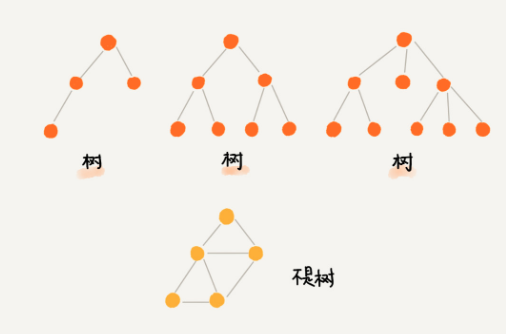
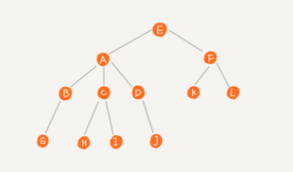
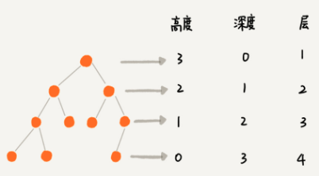
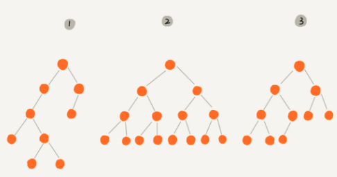
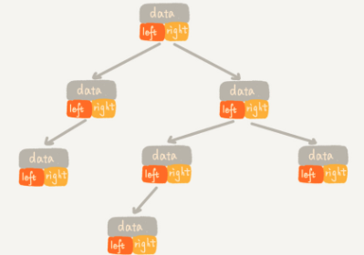
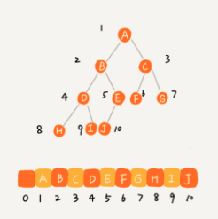
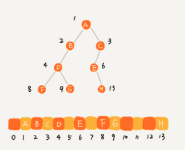
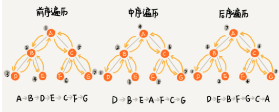
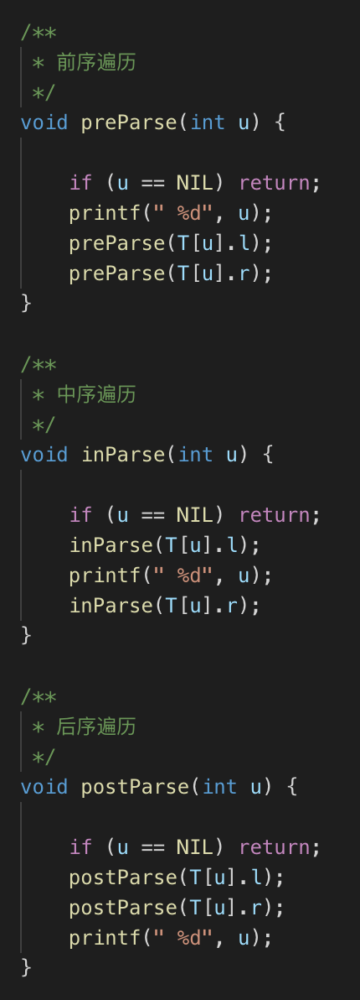

#### 树(Tree)
- 
  - "树"这种数据很像现实生活中的“树”， 这里的每个元素我们叫做“节点”
  - 用来连线相邻节点之间的关系，我们叫做“父子关系”
- 
  - A节点就是B节点的父节点，B节点是A节点的‘子节点’
  - B，C，D这三个节点的父节点是同一个节点，所以它们是`兄弟节点`
  - 把没有父节点的节点叫做`根节点`，也图中的E
  - 把没有子节点的节点叫做`叶子节点`或者`叶节点`，比如图中的G,H, I, J, K, L
- 高度(Height)，深度(Depth)，层(Level)
  - 概述
    - 节点的高度：节点到叶子节点的`最长路径`（边数）
    - 节点的深度：根节点到这个节点所经历的`边的个数`
    - 节点的层数：节点的深度 + 1
    - 树的高度： 根节点的高度
    - 
  - 高度
    - 其实就是从下往上度量，比如我们要度量第10层楼的高度，第13层楼的高度，起点都是地面
    - 所以，树这种数据结构的高度也是一样，从最底层开始计数，并且计数的起点都是0
  - 深度
    - 从上往下度量。比如水中与的深度，是从水平面开始度量
    - 所有，树这种数据结构的深度也是类似的，从根节点开始度量，并且计数起点也是0
  - 层数
    - 与`深度`类似,不过，计数起点是1，也就是根节点的位于第1层

#### 二叉树(Binary Tree)
- 概述
  - 每个节点最多有两个“叉”，也就是两个子节点，分别是左子节点和右子节点
  - 
  - 满二叉树
    - 图中编号2的二叉树。叶子节点全都在最底层
    - 除了叶子节点之外，每个节点都有左右两个子节点，这种二叉树叫做`满二叉树`
  - 完全二叉树
    - 编号3的二叉树，叶子节点都在最底下两层，最后一层的叶子节点都靠左
    - 并且除了最后一层，其他层的节点个数都要达到最大，这种二叉树叫做`完全二叉树`
- 二叉树存储方式
  - 链表存储法
    - 
    - 每个节点都有三个字段，其中一个存储数据，另外两个是指向左右子节点指针
    - 我们只要拎住根节点，就可以通过左右子节点的指针，把整棵树都串起来
    - 大部分二叉树代码都是通过这种结构实现的
  - 顺序存储法
    - 
    - 把根节点存储在下标i = 1的位置，那左子节点存储在下标 2 * i = 2 的位置，右子节点存储在 2 * i + 1 = 3 的位置
    - 以此类推，B节点的左子节点存储在 2 * i = 2 * 2 = 4的位置，右子节点存储在 2 * i + 1 = 2 * 2 + 1 = 5的位置
  - 为什么偏偏把最后一层的叶子节点靠左排列的叫做完全二叉树？
    - 从上图看出，一颗完全二叉树，仅仅“浪费”了一个下标为0的存储位置，如果非完全二叉树，则会浪费比较多的数组存储空间
    - 
  
#### 二叉树遍历
- 前序遍历
  - 对于树中任意节点来说，先打印这个节点，然后再打印它的左子树，最后打印它的左子树
- 中序遍历
  - 对于树中任意节点来说，先打印它的左子树，然后再打印它本省，最后打印它的右子树
- 后序遍历
  - 对于树中任意节点来说，先打印它的左子树，然后再打印它的右子树，最后打印这个节点本身
- 
- 代码展示
  - 