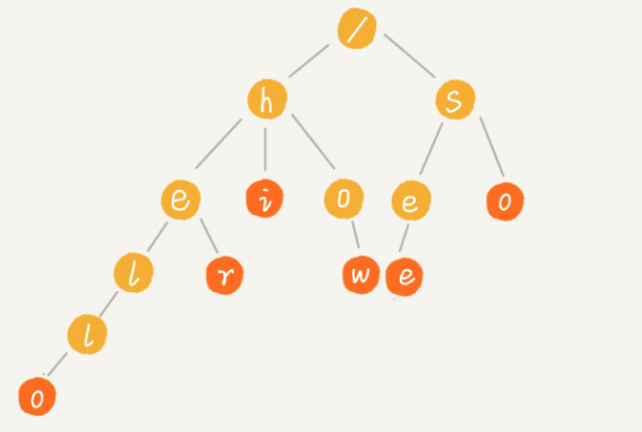
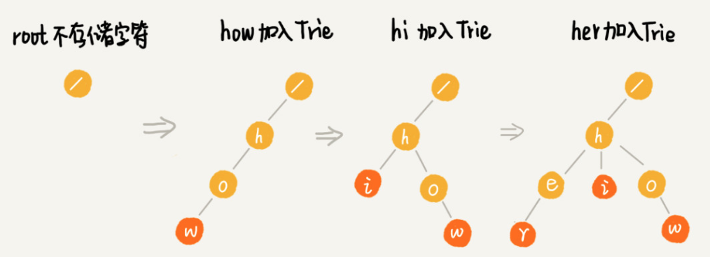
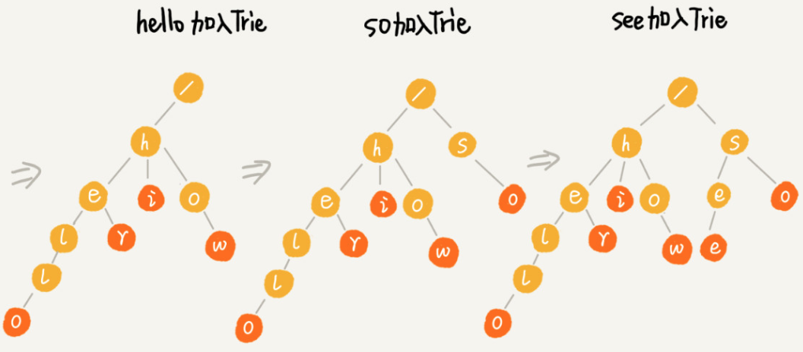

#### Trie 树
- Trie树的本质，就是利用字符串之间的公共前缀，将重复的前缀合并在一起
- 例子
  - 插入how, hi, her, hello，so, see 字符
  - 
  - 
  - 
- 时间复杂度
  - 构建Trie树的时间复杂度
    - 构建Trie树需要扫描所有字符串，时间复杂度O(n), n表示所有字符串之和
  - 查找某个字符串的时间复杂度
    - 如果要查询的字符串长度为k，那么只需要对比大约k个节点，就能完成查询操作
    - 时间复杂度:O(k), k为要查找的字符串长度
  - 空间复杂度
    - Trie树的实现. 每个节点需要存储从 a - z这26个字符。那每个节点都要存储一个长度为26的数组，并且每个数组存储一个8字节指针(或者4字节)
    - 而且，即便一个节点只有很少的子节点，远小于26个。比如3，4个，我们也要维护一个长度为26的数组
    - 如果字符串不仅仅包含小写字母，还包含大写字母，数字，甚至中文，那需要的存储空间就更多了
- Trie 树与散列表，红黑树的比较
  - 字符串中包含的字符集不能太大。如果字符集太大，那存储空间可能就会浪费更多。即便可以优化，但也要付出牺牲的查询，插入效率的代价
  - 要求字符串的前缀重合比较多，不然空间消耗会变大很多
  - 如果要用Trie树解决问题，就要自己从零开始实现一个Trie树，还要保证没有bug。这个工程上是将简单问题复杂化，除非必须，一般不建议这样做
  - 通过指针串起来的数据块是不连续的，而Trie树中用到了指针，所有，对缓存并不友好，性能上会打折扣
  

#### 参考资料
- [How to Write a Spelling Corrector](https://norvig.com/spell-correct.html)
- [游戏中的敏感词过滤是如何实现的 | 什么是字典树（Trie）](https://mp.weixin.qq.com/s/O2NcwO3HUqz5pdwCJa3bqQ)