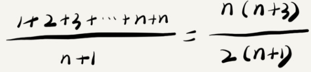
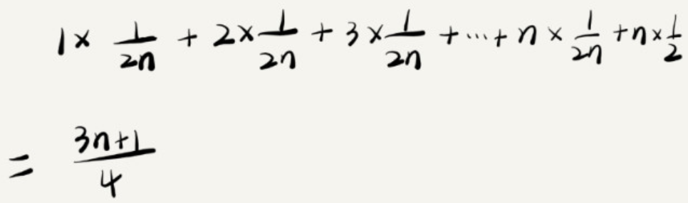
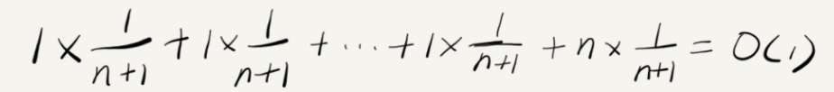

# 最好、最坏情况时间复杂度
## 例子
```
// n表示数组array的长度
int find(int[] array, int n, int x) {
  int i = 0;
  int pos = -1;
  for (; i < n; ++i) {
    if (array[i] == x) {
       pos = i;
       break;
    }
  }
  return pos;
}
```
- 在数组中查找一个数据，并不需要每次都把整个数据都遍历一次，因为有可能中途找到就可以提前结束循环
- 这段代码时间复杂度是O(n)?
  - 因为，要查找的变量x可能出现在数组的任意位置
  - 如果数组中第一元素正好是要查找的变量x，那就不需要继续变流剩下的n - 1个数据了，那时间复杂度就是O(1)
  - 但如果数据中不存在变量，那么就需要把整个数组都遍历一遍，时间复杂度就成了O(n)
  - 所以，不同的情况下，这段代码的时间复杂度是不一样的

## 最好情况时间复杂度
- 在最理想的情况下，执行这段代码的时间复杂度
- 就像刚才讲到的，在最理想的情况下，要查找的变量x正好是数组的第一个元素，这个时候对应的时间复杂度就是最好情况时间复杂度

## 最坏情况时间复杂度
- 在最糟糕的情况下，执行这段代码的时间复杂度
- 就像刚刚举的哪个例子，如果数组中没有要查找的变量x，需要把整个数组都遍历一遍才行，所以这种最糟糕情况下对应的时间复杂度就是最坏情况时间复杂度

# 平均情况时间复杂度

- 要查找的变量x在数组中的位置，有n + 1种情况
  - 在数组的 0 ~ n - 1位置中和不在数组中
  - 我们把每种情况下，查找需要遍历的元素个数累加起来，然后再除以 n + 1，就可以得到需要遍历元素个数的平均值
  - 时间复杂度的大O标记法中，可以省略系数、低阶、常量，所以，把刚刚这个公式简化，得到平均时间复杂度就是O(n)

- 我们知道，要查找的变量x，要么在数组里，要么就不在数组里
  - 假设在数组中与不在数组中的概率都为1/2
  - 另外，要查找的数据出现在 0 ~ n - 1这个n个位置的概率也是一样的，为 1 / n 
  - 所以，根据概率乘法则，要查找的数据出现在 0 ~ n - 1中任意位置的概率就是1/2n
  - 因此，前面的推导过程中存在的最大问题就是，没有将各种情况发生的概率考虑进去。如果我们把每种情况发生的概率也考虑进去，那平均时间复杂度的计算过程就变成了上图
  - 这个值就是概率论中的`加权平均值`也叫作`期望值`，所以平均时间复杂度的全称叫做`加权平均时间复杂度`或者`期望时间复杂度`

# 均摊时间复杂度
## 例子
```
// array表示一个长度为n的数组
// 代码中的array.length就等于n
int[] array = new int[n];
int count = 0;

void insert(int val) {
    if (count == array.length) {
        int sum = 0;
        for (int i = 0; i < array.length; ++i) {
            sum = sum + array[i];
        }
        array[0] = sum;
        count = 1;
    }

    array[count] = val;
    ++count;
}
```
  - 这段代码实现了一个往数组中插入数据的功能
  - 当数组满了之后，也就是代码中的 count == array.length 时，我们用 for 循环遍历数组求和，并清空数组，将求和之后的 sum 值放到数组的第一个位置，然后再将新的数据插入
  - 但如果数组一开始就有空闲空间，则直接将数据插入数组
- 那这段代码的时间复杂度是多少呢？
  - 最理想的情况下
    - 数组中有空闲空间，我们只需要将数据插入到数组下标为 count 的位置就可以了，所以最好情况时间复杂度为 O(1)
  - 最坏的情况下
    - 数组中没有空闲空间了，我们需要先做一次数组的遍历求和，然后再将数据插入，所以最坏情况时间复杂度为 O(n)
  - 那平均时间复杂度是多少呢？
    - 答案是 O(1)
    - 假设数组的长度是 n，根据数据插入的位置的不同，我们可以分为 n 种情况，每种情况的时间复杂度是 O(1)
    - 除此之外，还有一种“额外”的情况，就是在数组没有空闲空间时插入一个数据，这个时候的时间复杂度是 O(n)
    - 而且，这 n+1 种情况发生的概率一样，都是 1/(n+1)。所以，根据加权平均的计算方法，我们求得的平均时间复杂度就是
      - 
- 针对这样一种特殊场景的复杂度分析，我们并不需要像之前讲平均复杂度分析方法那样，找出所有的输入情况及相应的发生概率，然后再计算加权平均值
- 针对这种特殊的场景，我们引入了一种更加简单的分析方法：`摊还分析法`，通过摊还分析得到的时间复杂度我们起了一个名字，叫`均摊时间复杂度`

## 如何使用摊还分析法来分析算法的均摊时间复杂度呢？
- 还是继续看在数组中插入数据的这个例子
- 每一次 O(n) 的插入操作，都会跟着 n-1 次 O(1) 的插入操作，所以把耗时多的那次操作均摊到接下来的 n-1 次耗时少的操作上，均摊下来，这一组连续的操作的均摊时间复杂度就是 O(1)